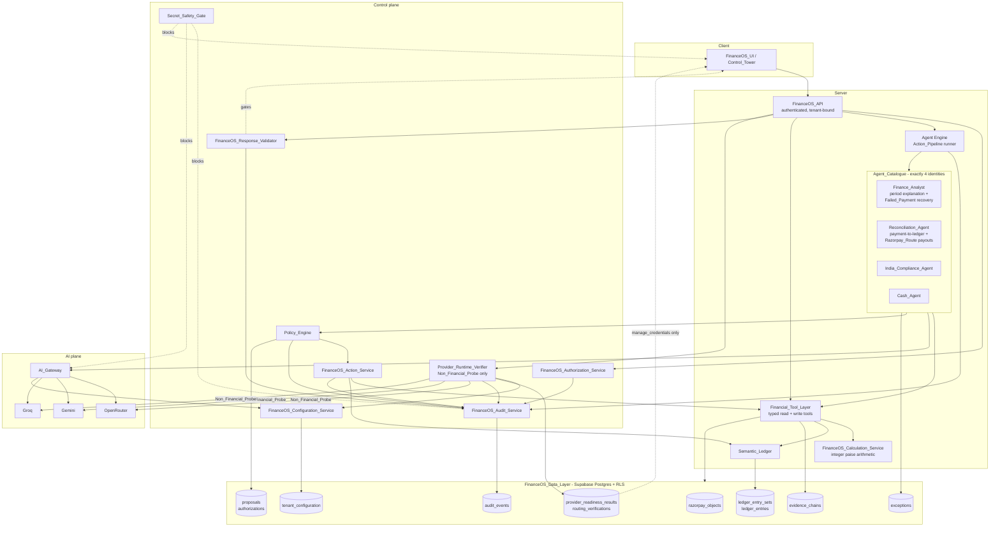
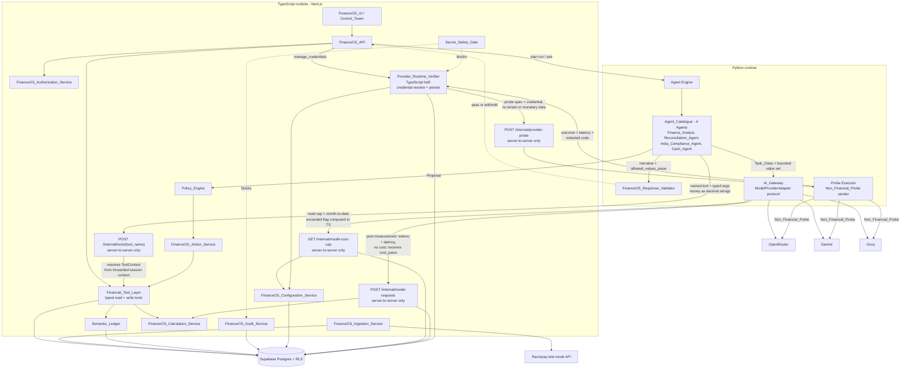
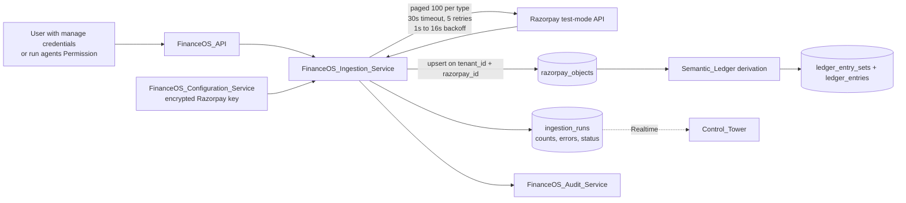
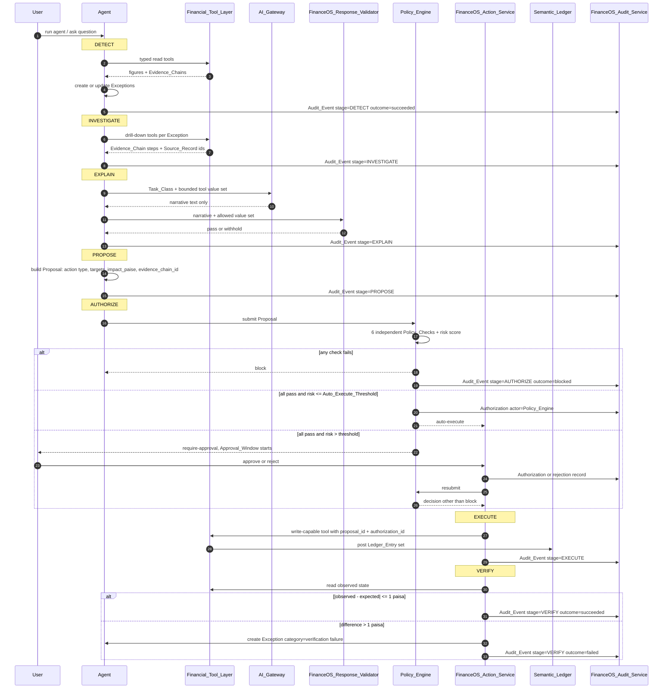
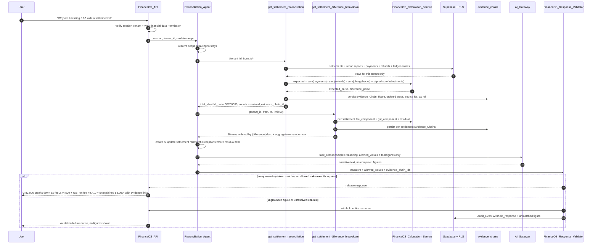
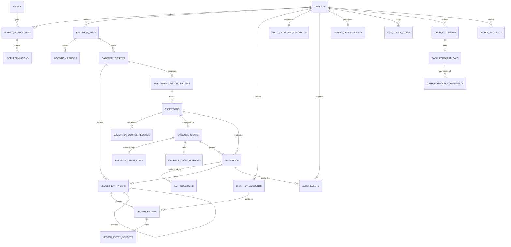
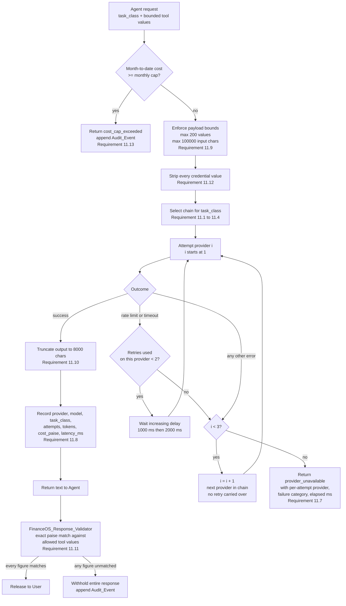
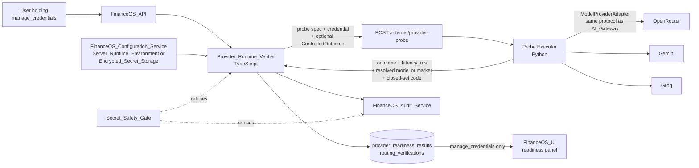

# Design Document

## Overview

FinanceOS is an AI Financial Control Tower layered on top of Razorpay test-mode data, an internal double-entry Semantic Ledger, and a policy-gated action pipeline. The design follows one mental model:

> Razorpay moves the money. Supabase stores the financial state. The Semantic Ledger understands the accounting state. AI explains what is happening. Agents investigate problems. The Policy Engine controls what AI is allowed to do. The Audit Log proves what happened.

Six structural decisions shape everything below.

**1. Money is always an integer number of paise.** Every monetary column is `BIGINT`. No `NUMERIC`, no `REAL`, no `DOUBLE PRECISION`, no JavaScript `number` arithmetic on money. The application-level money type is `bigint`. This satisfies Requirement 15.1, 15.8 and Requirement 1.7, and it is the precondition for the exactness properties in Requirement 4.3, 7.11 and 12.8.

**2. Models never compute.** Model_Providers produce narrative and classification text only. Every figure that reaches a User originates from a Financial_Tool over stored records and carries an Evidence_Chain. FinanceOS_Response_Validator gates the boundary and withholds any response containing a monetary figure that is not an exact paise match against the tool output value set supplied for that request (Requirement 11.10, 11.11, 12.6).

**3. Tenant isolation lives in the database, not the application.** Row-level security policies bound to the session Tenant identifier are the enforcement boundary. Application-level tenant filters are defence in depth, never the primary control (Requirement 14.2, 14.7, 14.10).

**4. Two tables are append-only at the privilege level.** `ledger_entries` and `audit_events` have `UPDATE` and `DELETE` revoked from every application role, plus a rejecting trigger as a second barrier (Requirement 2.7, 13.5, 13.10).

**5. Determinism over cleverness in reconciliation.** Matching uses stored Razorpay identifier links only — no amount-based or date-based inference (Requirement 4.1). All result ordering is total, with explicit tie-breakers, so that repeating a run over an unchanged dataset reproduces the identical Exception set in identical order (Requirement 15.7).

**6. Money crosses the runtime boundary as a decimal string, never as a JSON number.** JSON has no bigint type, and `JSON.parse` coerces every integer literal to an IEEE-754 double, so any integer above 2^53 loses precision silently — no error, no warning, just a wrong figure. Python's `int` is arbitrary-precision, so nothing is at risk once a value is inside the Python process; the hazard is entirely at the wire, in the serialize and parse step. Stringifying at the boundary removes it (Requirement 15.1, 15.8). See the money wire contract for why this holds even though the specified paise range sits below 2^53.

**7. The Agent catalogue is closed at exactly four identities.** Finance_Analyst, Reconciliation_Agent, India_Compliance_Agent, and Cash_Agent. There is no fifth identity, and there is no separate identity for marketplace seller payout reconciliation or for failed-payment recovery: Razorpay_Route reconciliation is a Reconciliation_Agent capability, and Failed_Payment recovery is a Finance_Analyst capability. The set is closed at three enforcement points, not merely documented — the FinanceOS_API rejects any other agent identifier before creating a run, the FinanceOS_UI renders only the four display names, and `audit_events.actor_id` accepts only these four values when `actor_kind = 'agent'` (Requirement 16.1–16.4). Capability ownership is an identity decision, not a code-organisation decision: the Route algorithms and the recovery algorithms are unchanged by this, only the Agent that owns them.

The system runs on two languages, split along one line. **TypeScript, on Next.js,** owns everything that touches money or writes to the database: the web client, FinanceOS_API, FinanceOS_Ingestion_Service, Semantic_Ledger, FinanceOS_Calculation_Service, Financial_Tool_Layer, Policy_Engine, FinanceOS_Action_Service, FinanceOS_Audit_Service, FinanceOS_Configuration_Service, FinanceOS_Authorization_Service, Secret_Safety_Gate, and FinanceOS_UI. **Python** owns everything that talks to a Model: the Agent Engine, the four Agents, the AI_Gateway with its OpenRouter, Gemini and Groq adapters, FinanceOS_Response_Validator, and the provider-call half of the Provider_Runtime_Verifier.

The rule that decides which side a component lands on is one sentence: **money arithmetic and database writes live in TypeScript; Model interaction and agent reasoning live in Python.** Every allocation above follows from it, and a component that would need both is split rather than duplicated.

Supabase Postgres is the data layer for both runtimes, though only TypeScript connects to it. Supabase Auth issues sessions carrying the Tenant claim, and Supabase Realtime pushes Exception and Ingestion_Run state changes to the Control_Tower.

## Architecture

### Layered view



The Agent Engine can reach data only through the Financial_Tool_Layer. The AI_Gateway can reach neither the Data Layer nor the Financial_Tool_Layer; it receives an already-bounded value set from the calling Agent (Requirement 11.9). The Provider_Runtime_Verifier reaches the Model_Providers directly, but only ever with a Non_Financial_Probe — it has no path to the Financial_Tool_Layer and no path to any Tenant financial table, so there is no route by which Tenant data could enter a diagnostic request (Requirement 17.4). The Secret_Safety_Gate is drawn as a blocking edge rather than a data edge: it does not transform payloads, it refuses them.

### Runtime boundary

The layered view above is language-agnostic. Overlaid on it is a two-runtime split: TypeScript on Next.js for money and persistence, Python for Model interaction and agent reasoning.



Python never opens a connection to Postgres. Its only data path is the internal tool endpoint on the TypeScript side, and its only outbound path beyond that is to the three Model_Providers. The Probe Executor is the one Python component with no Tenant data path at all, not even the internal tool endpoint — it receives a fixed probe specification and a credential, sends it, and returns an outcome, a latency, and a redacted code.

| Component | Runtime | Reason |
|---|---|---|
| FinanceOS_UI / Control_Tower | TypeScript | Next.js web client; renders `bigint` paise through `formatInr` with no float step |
| FinanceOS_API | TypeScript | Owns session resolution, Tenant binding, and Permission checks before any data path |
| FinanceOS_Ingestion_Service | TypeScript | Writes `razorpay_objects`; stores retrieved monetary values verbatim as integer paise |
| Semantic_Ledger | TypeScript | Writes `ledger_entry_sets` and `ledger_entries` inside the deferred balance constraint |
| FinanceOS_Calculation_Service | TypeScript | The single place monetary arithmetic happens; `bigint`-only |
| Financial_Tool_Layer | TypeScript | Sole data access path; owns Zod validation, RLS-bound connections, and Evidence_Chain construction |
| Policy_Engine | TypeScript | Reads and writes `proposals` and `authorizations`; computes the risk score over paise |
| FinanceOS_Action_Service | TypeScript | Executes authorized Proposals, posts reversals, compares observed against expected in paise |
| FinanceOS_Audit_Service | TypeScript | Appends `audit_events` inside the per-Tenant serialized sequence transaction |
| FinanceOS_Configuration_Service | TypeScript | Owns encrypted credentials and the database-backed configuration read path |
| FinanceOS_Authorization_Service | TypeScript | Evaluates Permissions against `user_permissions` before any handler runs |
| Secret_Safety_Gate | TypeScript | Owns the build, bundle, log, and write-path enforcement points, all of which are TypeScript-side; the prompt and fixture scanners run in both runtimes but are driven from the TypeScript build |
| Provider_Runtime_Verifier — credential resolution and result persistence | TypeScript | Resolves credentials from the Server_Runtime_Environment or Encrypted_Secret_Storage and writes `provider_readiness_results` and `routing_verifications`; both are credential handling and database writes |
| Provider_Runtime_Verifier — probe execution | Python | Sends the Non_Financial_Probe through the same `ModelProviderAdapter` protocol the AI_Gateway uses, so the verified path is the production path rather than a parallel one |
| Agent Engine | Python | Runs the Action_Pipeline and orchestrates Model interaction; no money arithmetic of its own |
| The four Agents — Finance_Analyst, Reconciliation_Agent, India_Compliance_Agent, Cash_Agent | Python | Reasoning and narrative orchestration; every figure they hold came from a tool. This is the complete Agent_Catalogue; there is no fifth entry (Requirement 16.1) |
| AI_Gateway | Python | The only component that talks to a Model_Provider on the request path and the only one positioned to observe token counts and latency; adapters are Python. Pricing those measurements and persisting the `model_requests` row stay in TypeScript, reached through `GET /internal/model-cost-cap` and `POST /internal/model-requests` |
| FinanceOS_Response_Validator | Python | Gates Model output, so it sits next to the Model interaction it validates |

The containment rule from the Layered view is preserved unchanged by the split. A Python Agent still cannot construct a query. The only data path it has is a named tool invocation carrying a typed argument object, and that object is validated by Zod with `.strict()` on the TypeScript side before any connection is opened (Requirement 12.9). Crossing a process boundary does not widen the argument surface — there is still no argument that expresses a query.

**The Financial_Tool_Layer is not reimplemented in Python.** A Python copy would fork the Evidence_Chain construction logic, and two implementations drift: a step ordering difference, a rounding call in a different place, a source ref sorted differently. That would make property P6 (replay determinism) unprovable, because "the chain replays to the figure" would depend on which implementation produced the chain. One implementation, invoked over HTTP, keeps P6 a statement about the system rather than about one of its two halves.

### The money wire contract

This is the load-bearing part of the two-runtime split. Everything else is organisation; this is correctness.

**Every monetary value crossing TypeScript↔Python is a JSON string of the integer paise value.** `"84260000"`, not `84260000`. JSON has no bigint, and `JSON.parse` produces an IEEE-754 double for every numeric literal, so any integer above 2^53 = 9007199254740992 round-trips to a neighbouring value with no error raised (Requirement 15.1, 15.8).

Being precise about the margin, because the honest version of this argument is stronger than the overstated one: the signed paise range tops out at 99999999999999, which is about 1.0 × 10^14, and 2^53 is about 9.0 × 10^15. Every in-range paise value would in fact survive `JSON.parse` exactly today. The margin is roughly 90×. Four reasons the string rule stands anyway:

1. **`JSON.stringify` throws on a `bigint`.** Something has to be decided at every boundary, and `Number(v)` is the tempting wrong answer — it compiles, it looks right, and it is a silent precision hazard the moment any of the below applies. Making the string the only sanctioned path removes the decision from the author of each new field.
2. **Intermediate unrounded products are not in range.** `applyRate` multiplies a paise value by basis points before rounding: at the range maximum with a 30% rate that is 99999999999999 × 300000 ≈ 3 × 10^19, four orders of magnitude above 2^53. Any unrounded intermediate that crosses the wire — a rate calculation split across runtimes, a cost accumulation, an aggregate before division — is outside the safe window immediately.
3. **A 90× margin is one unit change wide.** A widened range, a millipaise sub-unit, or a summed aggregate over enough rows crosses it. The rule should not depend on a constant nobody will re-derive when the range changes.
4. **The failure is undetectable rather than merely unlikely.** Once a value is a double, no downstream check distinguishes a correct value from a rounded one — the range check passes, the type check passes, the Evidence_Chain replays against the same rounded value. That asymmetry is what justifies a rule stricter than the current numbers require.

**Field naming.** Every monetary field on the wire carries a `_paise` suffix and is typed `string` in the transport schema. The suffix is what makes the rule mechanically checkable: the transport schema tests can enumerate every `_paise` field in every payload shape and assert its declared type is `string`.

**TypeScript side.**

```ts
/** A monetary value in transit. Always the decimal digits of an integer paise value. */
type PaiseWire = string;

/** bigint -> wire. The only sanctioned way a Paise leaves the TypeScript process. */
function toWire(v: Paise): PaiseWire {
  calc.assertInRange(v);
  return v.toString();               // exact, no float anywhere in the path
}

/** wire -> bigint. Throws on a non-integer string, then range-checks. */
function fromWire(s: PaiseWire): Paise {
  if (!/^-?[0-9]+$/.test(s)) {
    throw new WireError(`monetary field is not an integer string: ${JSON.stringify(s)}`);
  }
  const v = BigInt(s);               // exact for any digit length
  calc.assertInRange(v);             // -99999999999999 .. 99999999999999
  return v;
}
```

**Python side.**

```python
PaiseWire = str          # the decimal digits of an integer paise value

PAISE_MIN = -99_999_999_999_999   # -99999999999999, the signed paise floor
PAISE_MAX =  99_999_999_999_999   #  99999999999999, the signed paise ceiling


def to_wire(v: int) -> PaiseWire:
    assert_in_range(v)
    return str(v)                    # int is arbitrary-precision, so this is exact


def from_wire(s: PaiseWire) -> int:
    if not isinstance(s, str) or not _INTEGER_RE.fullmatch(s):
        raise WireError(f"monetary field is not an integer string: {s!r}")
    v = int(s)                       # exact for any digit length
    assert_in_range(v)
    return v


def assert_in_range(v: int) -> None:
    if not isinstance(v, int) or isinstance(v, bool):
        raise WireError(f"monetary value is not an int: {v!r}")
    if not (PAISE_MIN <= v <= PAISE_MAX):
        raise WireError(f"monetary value out of paise range: {v}")
```

**Rejection, not coercion.** The transport schema on the TypeScript side declares every `_paise` field as `z.string().regex(/^-?[0-9]+$/)`. It does **not** accept a number and coerce it. `z.coerce.string()` would turn `84260000` into `"84260000"` and, worse, would turn a value that had already lost precision in `JSON.parse` into a confident-looking string. Rejecting means a serialization mistake fails loudly at the boundary with a schema violation, rather than silently rounding a figure a User will later read as fact.

The same rule applies at both of the other places money crosses:

- The `allowed_values_paise` set an Agent passes to FinanceOS_Response_Validator is a list of decimal strings on the wire, parsed to `int` on the Python side before any set-membership comparison. The validator's zero-tolerance exact match (Requirement 11.11) is only meaningful if the allowed set arrived exactly; a coerced double in that set would silently widen or narrow what counts as grounded.
- `figure_paise` inside a returned Evidence_Chain, and `result_paise` on every `EvidenceStep`, are decimal strings on the wire. A chain whose figure lost precision in transit would replay to a different value than it presents, which is exactly the failure P6 exists to catch — except it would be caught in the wrong runtime, with no way to tell a transport bug from a logic bug.

This contract is asserted by property **P15**.

### Razorpay ingestion path



Ingestion is a separate flow with no Agent and no Model involvement. It writes raw payloads verbatim and never scales, rounds, or truncates a retrieved monetary value (Requirement 1.2, 1.7). Ledger derivation is a downstream, idempotent read of `razorpay_objects` (Requirement 2.8).

### Action_Pipeline sequence



Stage ownership: the Agent owns DETECT, INVESTIGATE, EXPLAIN and PROPOSE; the Policy_Engine owns AUTHORIZE; FinanceOS_Action_Service owns EXECUTE and VERIFY. Exactly one Audit_Event is appended per completed stage, within 5 seconds of stage completion (Requirement 5.2, 13.7).

### Winning_Demo, part 1: the Demo_Settlement_Investigation

The question "Why am I missing ₹3.82 lakh in settlements?" opens the Winning_Demo. It is one continuous scenario, not a tour: this sequence answers the question with evidence, and part 2 below carries the same Exception through to a verified cash impact without switching scenarios (Requirement 18.1). Every Razorpay read and write on this path uses test-mode credentials, records, and endpoints (Requirement 18.8).



Nothing reaches the User without passing the validator. The narrative is decorative; the figures and their Evidence_Chains are the product (Requirement 12.4, 12.5, 12.6). The aggregate figure the Reconciliation_Agent reports here is `38200000n` paise, rendered as ₹3,82,000.00 with the ₹3.82 lakh secondary line, and it carries a resolvable `evidence_chain_id` — the figure and the chain are the handoff to part 2 (Requirement 18.2).

### Winning_Demo, part 2: propose, authorize, execute, verify, cash impact

The demo does not end at the explanation. **The investigation is the setup; the verified correction is the payoff.** The same `settlement_mismatch` Exception the sequence above created is carried through the remaining Action_Pipeline stages under the same Tenant session, and the outcome the User sees last is a cash figure, not a narrative (Requirement 18.1, 18.3–18.7).

```mermaid
sequenceDiagram
    autonumber
    participant U as User
    participant RA as Reconciliation_Agent
    participant PE as Policy_Engine
    participant AC as FinanceOS_Action_Service
    participant FT as Financial_Tool_Layer
    participant SL as Semantic_Ledger
    participant RZP as Razorpay test mode
    participant KA as Cash_Agent
    participant AU as FinanceOS_Audit_Service

    Note over RA: PROPOSE - continues from part 1
    RA->>RA: build Proposal from the settlement_mismatch Exception:<br/>action_type, target Source_Records,<br/>impact_paise, evidence_chain_id
    RA->>AU: Audit_Event stage=PROPOSE actor=Reconciliation_Agent
    Note right of RA: at least 1 Tool_Grounded correction Proposal<br/>linked to the investigated Exception (Requirement 18.3)

    Note over PE: AUTHORIZE
    RA->>PE: submit Proposal
    PE->>PE: evaluate all 6 Policy_Checks independently,<br/>compute risk score, read Auto_Execute_Threshold
    PE->>AU: Audit_Event stage=AUTHORIZE with all 6 results
    alt any check fails
        PE-->>U: block, showing all 6 check results
        Note right of PE: demo stops here only on a real gate failure;<br/>no Tenant state changed (Requirement 5.5)
    else all pass and risk <= threshold - Safe_Action
        PE->>AU: Authorization actor=Policy_Engine
        PE->>AC: auto-execute (Requirement 18.6)
    else all pass and risk > threshold - Sensitive_Action
        PE-->>U: require-approval, Approval_Window opens
        U->>AC: approve
        AC->>AU: Authorization actor=User
        AC->>PE: resubmit
        PE-->>AC: decision other than block (Requirement 18.5)
    end

    Note over AC: EXECUTE
    AC->>FT: post_reconciliation_adjustment<br/>with proposal_id + authorization_id
    FT->>SL: balanced Ledger_Entry set
    SL-->>FT: set_id, debit total = credit total
    AC->>AU: Audit_Event stage=EXECUTE

    Note over AC: VERIFY
    AC->>FT: read observed post-execution state
    AC->>RZP: confirm test-mode object state where the action touched Razorpay
    alt |observed - expected| <= 1 paisa
        AC->>AU: Audit_Event stage=VERIFY outcome=succeeded
        AC->>RA: mark the settlement_mismatch Exception resolved
    else difference > 1 paisa
        AC->>RA: create verification_failure Exception
        AC->>AU: Audit_Event stage=VERIFY outcome=failed
        Note right of AC: no further automatic change;<br/>executed change left for human review (Requirement 5.12)
    end

    Note over KA: post-correction cash impact
    AC->>KA: verified proposal_id
    KA->>FT: get_cash_forecast + affordability over the corrected ledger
    FT-->>KA: cash figures + Evidence_Chain with as_of
    KA-->>U: post-correction cash impact in integer paise,<br/>rendered in Indian_Number_Format,<br/>with a resolvable Evidence_Chain and its as_of (Requirement 18.7)
```

Four things about this half are worth stating, because they are where a demo would be tempted to cheat.

**The Proposal is derived from the Exception, not authored for the demo.** Its `evidence_chain_id` is the chain persisted in part 1, and its `impact_paise` is the residual the decomposition computed. A Proposal with a hand-written impact would pass the Policy_Engine and fail the `transaction_evidence` Policy_Check for the right reason — there would be no chain resolving to that figure (Requirement 18.3).

**Both authorization paths are real paths, and which one runs depends on configuration rather than on the script.** With the default Auto_Execute_Threshold of 0, every Proposal carrying any action type scores at least 5 and is therefore a Sensitive_Action requiring recorded human approval (Requirement 18.5). A Tenant that has deliberately raised the threshold gets the Safe_Action path, where the Policy_Engine itself is the recorded authorizing actor (Requirement 18.6). Either way an Authorization row exists before EXECUTE begins — that is property P8, and the demo is one instance of it rather than an exception to it.

**Verification can fail, and the demo does not hide that.** A difference above 1 paisa produces a `verification_failure` Exception in the Attention_Panel and stops automatic change (Requirement 5.12). The honest version of this demo is one where the verify step is a real comparison against observed state, because a verify step that always succeeds is not a control.

**The last figure the User sees comes from the Cash_Agent, and it is Tool_Grounded like every other figure.** The post-correction cash impact is integer paise from `get_cash_forecast` over the corrected ledger, carrying its own Evidence_Chain and as-of timestamp (Requirement 18.7). It is not a restatement of the Proposal impact and not a Model-generated summary; it is a fresh computation over a ledger that now contains the adjustment set posted at EXECUTE. That is what makes the demo a closed loop: the shortfall that opened it is answered by a cash position that reflects its correction.

Every Razorpay read and every Razorpay write on this path — including the confirmation read at VERIFY — uses Razorpay test-mode credentials and endpoints (Requirement 18.8). `initiate_payment_retry` is the only tool in the catalogue that calls a Razorpay write API, and it is not on the demo path; the correction here is a Semantic_Ledger adjustment.

## Components and Interfaces

Shared types used throughout:

```ts
type Paise = bigint;                 // always integer paise, never float
type TenantId = string;              // uuid
type SourceRecordType =
  | 'payment' | 'order' | 'refund' | 'settlement' | 'settlement_recon_report'
  | 'transfer' | 'transfer_reversal' | 'razorpay_invoice' | 'credit_note'
  | 'linked_account' | 'ledger_entry_set' | 'proposal' | 'forecast_component';

interface SourceRef { type: SourceRecordType; id: string; }

interface EvidenceStep {
  index: number;                     // 1-based, ordered
  operation: 'sum' | 'subtract' | 'add' | 'multiply' | 'divide' | 'round_half_up'
           | 'negate' | 'select' | 'compare';
  operands: Array<{ kind: 'source'; ref: SourceRef; field: string }
                | { kind: 'step'; index: number }
                | { kind: 'literal'; value: string }>;
  result_paise: Paise | null;        // null for non-monetary steps
  note?: string;
}

interface EvidenceChain {
  evidence_chain_id: string;
  figure_paise: Paise;
  sources: SourceRef[];              // paged at 500 per page on retrieval
  source_count: number;
  steps: EvidenceStep[];
  as_of: string;                     // ISO-8601 UTC, ms precision
}

type ToolResult<T> =
  | { ok: true; value: T; evidence: EvidenceChain }
  | { ok: false; kind: 'incomplete_evidence'; unavailable: Array<{ type: SourceRecordType; count: number }> }
  | { ok: false; kind: 'schema_violation'; violations: Array<{ argument: string; reason: string }> }
  | { ok: false; kind: 'tool_failure'; tool: string; cause: 'timeout' | 'execution_error' }
  | { ok: false; kind: 'unauthorized_write'; reason: 'missing_authorized_proposal' };
```

These are the TypeScript definitions. The Python side mirrors the same shapes as dataclasses or Pydantic models, with `int` for every paise field in memory and `str` for every paise field on the wire, per the money wire contract. There is no code generation step between the two: the definitions are kept in agreement by the transport schema tests, which assert that every field the TypeScript schema declares is present in the Python model and that every `_paise` field is `string` on the wire in both directions. Keeping them hand-written and test-verified is the deliberate choice — a generator would make the Python side a derivative of the TypeScript side and hide the wire contract inside a build step, where a `_paise` field typed as a number would stop being visible in review.

Each component below carries a **Runtime.** line naming the side it lives on.

### FinanceOS_Ingestion_Service

**Runtime.** TypeScript.

**Responsibility.** Retrieve Razorpay objects for a Tenant and store them verbatim, one row per object identifier per Tenant, with run-level accounting of counts, errors, and status.

```ts
interface IngestionService {
  startRun(tenantId: TenantId, actorUserId: string): Promise<IngestionRun>;
  // internal, per object type
  fetchPages(type: RazorpayObjectType, window: TimeWindow): AsyncIterable<RazorpayObject[]>;
  upsertObject(tenantId: TenantId, runId: string, obj: RazorpayObject): Promise<void>;
}

interface IngestionRun {
  id: string; tenant_id: TenantId;
  started_at: string; ended_at: string | null;
  status: 'in_progress' | 'completed' | 'partially_completed' | 'failed';
  failure_kind: null | 'credential_rejected' | 'no_records_stored';
  per_type_stored: Record<RazorpayObjectType, number>;
  per_type_errors: Record<RazorpayObjectType, IngestionError[]>;
}
```

Behaviour: page size 100 per object type, stop when a page returns fewer than 100 (Requirement 1.1); 30 s per-request timeout; rate-limit and timeout retries with delays 1 s, 2 s, 4 s, 8 s, 16 s to a maximum of 5 retries (Requirement 1.5); non-credential errors recorded and ingestion continues with remaining types (Requirement 1.4); credential rejection aborts the run, stores zero objects, leaves prior objects untouched (Requirement 1.10). Window selection: 365 days back on first run, otherwise since the start timestamp of the most recent `completed` run (Requirement 1.8, 1.9). Upsert on `(tenant_id, razorpay_id)` replaces payload and refreshes `retrieved_at` (Requirement 1.3).

**Satisfies:** Requirement 1 in full.

### Semantic_Ledger

**Runtime.** TypeScript.

**Responsibility.** Derive and persist balanced double-entry Ledger_Entry sets from Source_Records, serve trial balances, reject imbalance, and correct only by reversal.

```ts
interface SemanticLedger {
  postFromSource(tenantId: TenantId, source: SourceRef): Promise<PostResult>;
  postSet(tenantId: TenantId, draft: LedgerEntrySetDraft): Promise<PostResult>;
  reverseSet(tenantId: TenantId, setId: string, actor: Actor): Promise<PostResult>;
  trialBalance(tenantId: TenantId, from: DateOnly, to: DateOnly): Promise<TrialBalance>;
}

interface LedgerEntrySetDraft {
  source_refs: SourceRef[];                 // at least 1
  entry_date: DateOnly;
  entries: Array<{ account_code: string; side: 'debit' | 'credit'; amount_paise: Paise }>; // 2..20, each > 0
  reverses_set_id?: string;
}

type PostResult =
  | { ok: true; set_id: string; created: boolean }   // created=false when idempotent no-op
  | { ok: false; kind: 'unbalanced'; imbalance_paise: Paise; source_refs: SourceRef[] };
```

`postFromSource` is idempotent: a unique constraint on `(tenant_id, source_record_type, source_record_id)` in `ledger_entry_sets` means a second derivation from the same Source_Record returns `{ created: false }` and writes nothing (Requirement 2.8). `postSet` validates `Σdebit − Σcredit = 0` before any insert and rejects the whole set atomically with the imbalance recorded (Requirement 2.1, 2.6). `reverseSet` builds a new set with per-account amounts equal and sides exchanged, linked by `reverses_set_id`, and never mutates the original (Requirement 2.4). Modification and deletion are impossible at the privilege level (Requirement 2.7).

**Satisfies:** Requirement 2 in full; supports Requirement 4.10, 5.17, 6.4, 10.7.

### FinanceOS_Calculation_Service

**Runtime.** TypeScript.

**Responsibility.** The only place monetary arithmetic happens. Pure, synchronous, `bigint`-only.

```ts
interface CalculationService {
  add(...v: Paise[]): Paise;
  subtract(a: Paise, b: Paise): Paise;
  sum(v: Paise[]): Paise;
  applyRate(value: Paise, rateBasisPoints: bigint): { result: Paise; rounding_adjustment_paise: Paise };
  roundHalfUpToPaisa(numerator: bigint, denominator: bigint): { result: Paise; rounding_adjustment_paise: Paise };
  toInrDisplay(v: Paise): string;               // Indian_Number_Format, 2 dp
  toLakhOrCrore(v: Paise): { unit: 'lakh' | 'crore' | 'none'; text: string | null };
  assertInRange(v: Paise): void;                // -99999999999999 .. 99999999999999
}
```

Every operand, intermediate, and result is checked against the paise range, and any out-of-range value raises rather than silently wrapping (Requirement 15.1, 15.8). Rate multiplication rounds half up to the nearest paisa and returns the rounding adjustment alongside the result (Requirement 15.9). Display conversion rounds half up to 2 decimal places and never mutates the stored integer (Requirement 15.2).

**Satisfies:** Requirement 15.1, 15.2, 15.8, 15.9; used by every other component that touches money.

### Financial_Tool_Layer

**Runtime.** TypeScript. Invoked from the Python Agent Engine over the internal endpoint described in the Financial Tool Catalogue, never reimplemented on the Python side.

**Responsibility.** The sole data access path for Agents. Each tool declares a typed input schema and a typed output schema, is marked read-only or write-capable, executes under the session Tenant scope, and returns an Evidence_Chain with every monetary figure.

```ts
interface FinancialTool<In, Out> {
  name: string;
  mode: 'read_only' | 'write_capable';
  inputSchema: ZodSchema<In>;         // rejects unknown keys and any free-form text/SQL argument
  outputSchema: ZodSchema<Out>;
  timeoutMs: 10_000;
  execute(ctx: ToolContext, input: In): Promise<ToolResult<Out>>;
}

interface ToolContext {
  tenant_id: TenantId;                // from the session, never from tool arguments
  user_id: string;
  permissions: Permission[];
  proposal_id?: string;               // required for write_capable
  authorization_id?: string;          // required for write_capable
  db: TenantScopedClient;             // RLS-bound connection
}
```

Enforcement: argument validation failure returns `schema_violation` without reading Tenant data and appends an Audit_Event (Requirement 12.9); a write-capable invocation without an authorized Proposal reference is rejected with Tenant state unchanged and audited (Requirement 12.10); a 10-second overrun or execution error terminates the invocation, leaves state unchanged, and returns `tool_failure` (Requirement 12.11); read-only tools execute on a connection whose role holds no write grants (Requirement 12.7).

**Satisfies:** Requirement 12 in full.

### Agent Engine

**Runtime.** Python. The four Agent sub-sections below inherit Python from the Agent Engine and are not labelled individually.

**Responsibility.** Run the Action_Pipeline for a domain Agent, enforce stage ordering and completion, emit stage Audit_Events, and enforce the wall-clock bounds.

`AgentName` is a closed union of exactly four values, and it is the same type the FinanceOS_API validates against and the same set `audit_events.actor_id` constrains when `actor_kind = 'agent'`. One declaration, three enforcement points (Requirement 16.1, 16.3, 16.4):

```ts
// The Agent_Catalogue. Exactly 4 members. Adding a fifth is a schema change,
// an API change, a UI change, and a database constraint change, in that order.
type AgentName =
  | 'Finance_Analyst'         // period explanation + Failed_Payment recovery
  | 'Reconciliation_Agent'    // payment-to-ledger + Razorpay_Route seller payouts
  | 'India_Compliance_Agent'  // India-native detection and review
  | 'Cash_Agent';             // forecast, affordability, post-correction cash impact

const AGENT_CATALOGUE = [
  'Finance_Analyst', 'Reconciliation_Agent', 'India_Compliance_Agent', 'Cash_Agent',
] as const satisfies readonly AgentName[];

/** The display names of Requirement 16.2. The UI renders exactly these strings. */
const AGENT_DISPLAY_NAME: Record<AgentName, string> = {
  Finance_Analyst:        'Finance Analyst',
  Reconciliation_Agent:   'Reconciliation Agent',
  India_Compliance_Agent: 'India Compliance Agent',
  Cash_Agent:             'Cash Agent',
};

interface AgentEngine {
  run(agent: AgentName, tenantId: TenantId, actor: Actor, input: AgentInput): Promise<AgentRunResult>;
}

type Stage = 'DETECT' | 'INVESTIGATE' | 'EXPLAIN' | 'PROPOSE' | 'AUTHORIZE' | 'EXECUTE' | 'VERIFY';

interface AgentRunResult {
  run_id: string;
  complete: boolean;
  unprocessed_source_types: SourceRecordType[];   // populated when incomplete
  exceptions_upserted: string[];
  proposals: string[];
  stage_outcomes: Array<{ stage: Stage; outcome: 'succeeded' | 'failed' | 'blocked'; at: string }>;
}
```

Stages execute strictly in order, each completing before the next begins, none omitted (Requirement 5.1). A run reaching 120 s stops, returns partial results, flags itself incomplete, and names the Source_Record types not fully processed (Requirement 15.6). First displayable content is streamed within 15 s (Requirement 15.4). Concurrency is capped at 5 Agent runs per Tenant, which is the precondition under which the performance bounds in Requirement 15.3–15.5 hold.

#### Reconciliation_Agent

Owns two capabilities under one identity: the payment-to-ledger lifecycle (Requirement 4) and Razorpay_Route seller payout reconciliation (Requirement 7). They are one Agent because they are one reconciliation: a Route split is a decomposition of the same Payment the settlement path already reconciles, they read overlapping Source_Records, and the conservation law of Requirement 7.11 is checked against the same Payment amount the Requirement 4.2 Expected Amount is built from. Splitting them across two identities would mean two Agents holding contradictory partial views of one Payment, and a User asking "where did this payment go" would have to know which Agent to ask.

**Payment-to-ledger lifecycle.** Matches Payment → Order → Razorpay_Invoice → Settlement → Ledger_Entries using stored identifier links only, with a not-matched marker per record type (Requirement 4.1). Computes Settlement Expected Amount, Difference, and the three-way decomposition (Requirement 4.2–4.5). Answers shortfall questions with 50 rows plus an aggregate remainder row (Requirement 4.6), reports scope and examined counts (Requirement 4.7), and detects possible duplicate Refunds, Unmatched_Credit_Notes, missing accruals, unsettled Payments, ambiguous matches, and unreconciled Settlements (Requirement 4.8–4.14). Exception upsert is fingerprint-based so a re-run updates rather than duplicates (Requirement 4.15).

**Razorpay_Route seller payout reconciliation.** Over a reconciliation date range of at most 366 days, maps each Payment to its Transfers, Transfer_Reversals, and retained platform commission in integer paise (Requirement 7.1). Computes expected Seller payout as Σtransfers − Σreversals, counting partial reversals at their own amount (Requirement 7.2), excludes on-hold Transfers from the expected payout while reporting them separately (Requirement 7.9), and raises seller settlement mismatch and over-allocated split Exceptions (Requirement 7.3, 7.7). Payout chain answers are ordered by Payment creation timestamp, then Payment id, then Transfer id, then Transfer_Reversal id, truncated at 200 rows with the total count reported (Requirement 7.4, 7.5). Linked_Account balances report the as-of timestamp and contributing Source_Record identifiers (Requirement 7.6). Zero-settlement Linked_Accounts are classified pending, not mismatched (Requirement 7.8). Route Exceptions upsert on the fingerprint scoped by reconciliation date range (Requirement 7.10).

Both capabilities run through the same Action_Pipeline under the same identity, so a Route Proposal passes the same Policy_Engine gate, records the same Authorization shape, and appends the same stage Audit_Events with `actor_id = 'Reconciliation_Agent'` (Requirement 16.5, 16.6). The tools each capability reaches for differ — `get_settlement_reconciliation` and `get_settlement_difference_breakdown` for the lifecycle, `get_seller_payout_chain` and `get_linked_account_balance` for Route — but the tool catalogue, the Evidence_Chain envelope, and the write-capable authorization requirement are identical.

**Satisfies:** Requirement 4 in full; Requirement 7 in full; Requirement 15.3, 15.7, 15.10; Requirement 16.5, 16.6.

#### India_Compliance_Agent

Examines Razorpay_Invoices, GSTIN values, HSN_SAC values, tax amounts, Credit_Notes and Payments in a range of at most 366 days, defaulting to the preceding 90 days, and reports per-type examined counts (Requirement 6.1). Produces Exceptions for missing GST information, structurally invalid GSTIN, ITC discrepancy, records needing review, unmatched credit notes, and GST rate anomalies (Requirement 6.2–6.6, 6.10); creates TDS_Review_Items with the rate-multiplied amount rounded half up to 2 decimal places (Requirement 6.7); attaches the review-only disclaimer to every presented finding (Requirement 6.8); produces no statutory output and no directive tax position (Requirement 6.9); upserts on re-run (Requirement 6.12).

GSTIN structural validation, exactly as specified in Requirement 6.3: length 15; chars 1–2 a state code 01–38; chars 3–12 five letters, four digits, one letter; char 14 the letter `Z`; char 15 alphanumeric.

**Satisfies:** Requirement 6 in full.

#### Cash_Agent

Produces a day-by-day Cash_Forecast over the Forecast_Horizon with per-component per-day amounts and Source_Record links (Requirement 8.1, 8.2), answers affordability with Headroom and a low/medium/high risk level (Requirement 8.3–8.5), ranks at most 5 recommended actions by improvement with the full tie-break chain (Requirement 8.6), simulates without writing (Requirement 8.7), and creates policy-gated Proposals on execution requests (Requirement 8.8). Reports partial-history windows (Requirement 8.9), computes or disclaims Runway (Requirement 8.10, 8.11), assigns settlement dates on a settlement-cycle or default-delay basis with the basis recorded (Requirement 8.12), rejects out-of-range dates (Requirement 8.13), and resolves the Safety_Buffer with the basis recorded (Requirement 8.14).

**Satisfies:** Requirement 8 in full; feeds the Control_Tower Runway metric (Requirement 3.4, 3.12); reports the post-correction cash impact of the Winning_Demo (Requirement 18.7).

#### Finance_Analyst

Owns two capabilities under one identity: period-over-period financial explanation (Requirement 10) and Failed_Payment recovery intelligence (Requirement 9). They are one Agent because both answer "what happened to revenue and what can be done about it" over the same Payment and Refund population — recoverable value is a revenue figure, and a Failed_Payment cohort is one of the contributors an analyst explanation would name. Keeping them together means the recoverable-value aggregate and the revenue change it belongs to are computed by the same Agent over the same period scope rather than by two Agents with independently resolved windows.

**Period-over-period explanation.** Compares a specified period against the immediately preceding equal-length period, reporting revenue, expense, margin, cash movement, and unusual transactions, with every figure from a Financial_Tool and Model content restricted to narrative (Requirement 10.1, 10.7). Percentage change is reported when the prior value is above 0 and as not applicable at 0 (Requirement 10.2, 10.3, 10.6). Unusual transactions use the Unusual_Multiple against a 180-day median, capped at 20 rows with the total count (Requirement 10.4). Top contributors are capped at 3 with tie-breaks (Requirement 10.5). Default period is the trailing 30 days with resolved dates echoed (Requirement 10.8); period lengths outside 1–366 days are rejected without figures and without state change (Requirement 10.9).

**Failed_Payment recovery.** Profiles a Failed_Payment with the Razorpay failure reason, prior payment count, most recent successful method, and lifetime value (Requirement 9.1, 9.2). Reports one integer recovery probability per channel from the 70/30 customer/tenant blend over the Lookback_Window (Requirement 9.3–9.5), falling back to Tenant-level rates only when the customer has no successful history (Requirement 9.9). Creates a single-channel retry Proposal only when the sample meets Minimum_Sample_Size (Requirement 9.6, 9.8), applies the documented tie-break order (Requirement 9.7), and suppresses Proposals for already-recovered, already-retried, or over-age Failed_Payments (Requirement 9.10, 9.11). Aggregates total recoverable value with the included count (Requirement 9.12).

The recovery capability is the one Finance_Analyst path that can write: a retry Proposal reaches `initiate_payment_retry`, which is write-capable and therefore requires an authorized Proposal in its `ToolContext`. It passes the same Policy_Engine gate and records the same Authorization and stage Audit_Events, with `actor_id = 'Finance_Analyst'` (Requirement 16.7, 16.8). The explanation capability is read-only and creates no Proposal.

Task_Class declaration differs per capability rather than per Agent: explanation narrative declares `complex_reasoning`, and failure-reason categorisation declares `fast_classification`. The Task_Class is a property of the request, not of the identity, so one Agent declaring two Task_Classes is the expected shape rather than an exception.

**Satisfies:** Requirement 9 in full; Requirement 10 in full; Requirement 16.7, 16.8.

### Policy_Engine

**Runtime.** TypeScript.

**Responsibility.** Evaluate all 6 Policy_Checks independently, compute the risk score, and return exactly one decision.

```ts
interface PolicyEngine {
  evaluate(tenantId: TenantId, proposal: Proposal, actor: Actor): Promise<PolicyDecision>;
}

type PolicyCheckId =
  | 'user_permission' | 'accounting_rule' | 'transaction_evidence'
  | 'duplicate_action' | 'risk_threshold' | 'approval_requirement';

interface PolicyDecision {
  checks: Array<{ id: PolicyCheckId; result: 'pass' | 'fail'; detail?: string }>;  // exactly 6
  risk_score: number;                       // integer 0..100
  auto_execute_threshold: number;           // integer 0..100, default 0
  decision: 'auto_execute' | 'require_approval' | 'block';
  authorization_id?: string;                // set when decision = auto_execute
  duplicate_proposal_id?: string;           // set when duplicate_action fails
}
```

All 6 checks are evaluated even after one fails, so the User sees the complete gate picture; the decision is derived afterwards (Requirement 5.3, 5.4). Any failure yields `block` with no Tenant state change (Requirement 5.5). Pass-all with `risk_score <= threshold` yields `auto_execute` plus an Authorization naming the Policy_Engine as actor (Requirement 5.6); pass-all above threshold yields `require_approval` (Requirement 5.7). Evaluation returns within 10 s. The duplicate_action check looks back 30 days over executed and awaiting-approval Proposals with the same action type and target Source_Record set (Requirement 5.13).

**Satisfies:** Requirement 5.3–5.7, 5.13, 5.15.

### FinanceOS_Action_Service

**Runtime.** TypeScript.

**Responsibility.** Hold Sensitive_Actions, record approvals and rejections, execute authorized Proposals, verify outcomes, expire stale approvals, and reverse partial changes on failure.

```ts
interface ActionService {
  approve(proposalId: string, userId: string): Promise<ExecutionOutcome>;
  reject(proposalId: string, userId: string): Promise<void>;
  executeAuthorized(proposalId: string, authorizationId: string): Promise<ExecutionOutcome>;
  verify(proposalId: string): Promise<VerificationOutcome>;
  expireOverdue(tenantId: TenantId): Promise<string[]>;   // scheduled sweep
}

interface VerificationOutcome {
  matched: boolean;
  observed_paise: Paise; expected_paise: Paise; difference_paise: Paise;  // |diff| <= 1 counts as matched
  exception_id?: string;
}
```

Withholds execution while `require_approval` stands (Requirement 5.8). Approval records the Authorization and resubmits to the Policy_Engine before executing (Requirement 5.9); rejection discards without state change (Requirement 5.10). Verification runs within 60 s of execution with a 1-paisa tolerance (Requirement 5.11) and raises a verification failure Exception otherwise (Requirement 5.12). Approval_Window expiry marks the Proposal expired, withholds execution permanently, and audits the elapsed wait (Requirement 5.16). EXECUTE failure reverses applied changes through `SemanticLedger.reverseSet`, raises an execution failure Exception, and requires a new Authorization for any retry (Requirement 5.17).

**Satisfies:** Requirement 5.8–5.12, 5.16, 5.17.

### FinanceOS_Audit_Service

**Runtime.** TypeScript.

**Responsibility.** Append Audit_Events with a Tenant-scoped gapless sequence and a chained tamper-evidence value; serve history and verification; refuse mutation.

```ts
interface AuditService {
  append(e: AuditEventDraft): Promise<AuditEvent>;             // sequence + chain_value assigned server-side
  sourceHistory(tenantId: TenantId, ref: SourceRef, page: Page<100>): Promise<Paged<AuditEvent>>;
  proposalHistory(tenantId: TenantId, proposalId: string): Promise<StageHistory>;  // 7 stages, absent = not completed
  verifyChain(tenantId: TenantId): Promise<ChainVerification>;
}

interface ChainVerification {
  intact: boolean;
  first_mismatched_sequence_number: number | null;
  first_absent_sequence_number: number | null;
}
```

Sequence allocation and chain computation happen inside one serialized transaction per Tenant (`SELECT ... FOR UPDATE` on a per-tenant counter row) so sequence numbers are gapless and strictly increasing (Requirement 13.1). Payloads exclude credential values and reference Source_Records by identifier only (Requirement 13.2), and payloads over 65536 bytes are truncated with a reduction indicator while Source_Record identifiers stay unreduced (Requirement 13.3). Update and delete attempts are rejected and themselves audited (Requirement 13.5). Retention is at least 2555 days (Requirement 13.9).

**Satisfies:** Requirement 13 in full.

### FinanceOS_Response_Validator

**Runtime.** Python. `allowed_values_paise` arrives as decimal strings and is parsed to `int` before any comparison, per the money wire contract.

**Responsibility.** The last gate before any Agent response reaches a User.

```ts
interface ResponseValidator {
  validate(input: {
    tenant_id: TenantId;
    narrative: string;
    allowed_values_paise: Paise[];          // exactly the Financial_Tool outputs supplied to the model
    evidence_chain_ids: string[];
  }): Promise<ValidationResult>;
}

type ValidationResult =
  | { ok: true; released: string }
  | { ok: false; kind: 'ungrounded_figure'; figure_text: string; parsed_paise: Paise | null }
  | { ok: false; kind: 'unresolved_evidence_chain'; evidence_chain_id: string };
```

Extraction scans the narrative for monetary tokens: `₹`-prefixed and bare Indian-grouped digit groups, decimal rupee amounts, and lakh/crore phrasings. Each token is normalised to integer paise and must match a member of `allowed_values_paise` exactly, zero tolerance (Requirement 11.11). Any figure lacking an Evidence_Chain identifier, or carrying one that does not resolve, withholds the entire response (Requirement 12.6). Every withholding appends an Audit_Event recording the withheld response and the offending figure.

**Satisfies:** Requirement 11.11, 12.6; supports Requirement 10.1.

### AI_Gateway

**Runtime.** Python. It holds no database connection: the monthly cost cap and the metering record are reached through the internal TypeScript endpoints `GET /internal/model-cost-cap` and `POST /internal/model-requests`, and the Gateway performs no monetary arithmetic of its own — it reports token counts and latency and receives a computed `cost_paise` back.

**Responsibility.** Route Model requests by Task_Class with retry and failover, observe and report token counts and latency, honour the monthly cost cap, and strip credentials from payloads. Detailed in the AI Gateway Design section.

```ts
interface AiGateway {
  complete(req: {
    tenant_id: TenantId; task_class: TaskClass;
    system: string; user: string;
    tool_values: Array<{ label: string; value_paise?: Paise; text?: string }>;   // max 200
  }): Promise<GatewayResult>;
  usage(tenantId: TenantId, from: DateOnly, to: DateOnly): Promise<UsageByProvider>;
}

type GatewayResult =
  | { ok: true; text: string; provider: ModelProvider; model: string; attempts: number;
      input_tokens: number; output_tokens: number;
      cost_paise: Paise;          // computed by POST /internal/model-requests and passed
                                  // through, never computed in the Gateway
      latency_ms: number }
  | { ok: false; kind: 'provider_unavailable'; attempts: AttemptRecord[] }
  | { ok: false; kind: 'cost_cap_exceeded'; month_to_date_paise: Paise; cap_paise: Paise };
```

**Satisfies:** Requirement 11 in full.

### FinanceOS_Configuration_Service

**Runtime.** TypeScript.

**Responsibility.** Store Tenant configuration and encrypted credentials, apply documented defaults and ranges, and never expose a credential value.

```ts
interface ConfigurationService {
  get(tenantId: TenantId): Promise<TenantConfiguration>;    // defaults applied for unset values
  put(tenantId: TenantId, patch: Partial<TenantConfiguration>, actor: Actor): Promise<TenantConfiguration>;
  putCredential(tenantId: TenantId, kind: CredentialKind, value: string, actor: Actor): Promise<MaskedCredential>;
  readCredentialForServerUse(tenantId: TenantId, kind: CredentialKind): Promise<string>; // server-only path
}

type CredentialKind = 'razorpay_test' | 'openrouter' | 'gemini' | 'groq';
```

The credential kinds are exactly these four: the Razorpay test-mode key plus one key per Model_Provider in the routing chains. Frontier reasoning models are reached through OpenRouter under the `openrouter` credential, so no additional vendor key is needed for them. `razorpay_live` is deliberately absent from the MVP set (see Security Considerations → Razorpay mode).

`readCredentialForServerUse` resolves in a fixed order — **Server_Runtime_Environment first, then Encrypted_Secret_Storage** — and reports which of the two supplied the value so a caller can record it without holding the value (Requirement 17.1):

```ts
type CredentialSource = 'server_runtime_environment' | 'encrypted_secret_storage' | 'none';

interface ResolvedCredential {
  /** Held in memory only. Never serialized, never logged, never returned over HTTP. */
  value: string;
  source: Exclude<CredentialSource, 'none'>;
}

interface ConfigurationServiceCredentials {
  /** Server-only. Returns null rather than throwing, so 'missing credential' is a value not an error. */
  resolveForServerUse(tenantId: TenantId, kind: CredentialKind): Promise<ResolvedCredential | null>;
  /** The only credential-shaped value any client ever receives (Requirement 17.1). */
  maskedReference(tenantId: TenantId, kind: CredentialKind): Promise<MaskedCredential>;
}

interface MaskedCredential {
  kind: CredentialKind;
  configured: boolean;
  source: CredentialSource;
  masked: '••••••••';        // fixed marker, not a prefix or suffix of the value
}
```

`masked` is a fixed constant rather than a truncation of the real value. A last-four-characters convention is common and is wrong here: a key suffix is still key material, it is enough to correlate a key across systems, and provider error bodies sometimes echo a prefix — so a masked reference that shows real characters and an error message that shows real characters can between them reconstruct more than either alone.

`resolveForServerUse` returning `null` rather than throwing is what lets the Provider_Runtime_Verifier report `missing_credential` as one of its six outcomes and send zero requests, instead of having to distinguish an absent credential from a failed lookup inside an exception handler (Requirement 17.5).

Configured values and defaults: Auto_Execute_Threshold 0–100 default 0, policy-permission gated (Requirement 5.15); Approval_Window 1–168 h default 24 h (Requirement 5.16); compliance review threshold ₹0–₹10,00,00,000 default ₹50,000 and per-category TDS rate 0.00–30.00 % default 10.00 % (Requirement 6.11); valid GST rate set default {0, 0.25, 3, 5, 12, 18, 28} % (Requirement 6.10); Forecast_Horizon 30–180 days default 90 (Requirement 8.1); Safety_Buffer 0–₹10 Crore in paise, default 10 % of the obligation (Requirement 8.14); Lookback_Window 30–730 days default 180 (Requirement 9.5); Minimum_Sample_Size 10–1000 default 50 (Requirement 9.6); Maximum_Retry_Age 1–30 days default 7 (Requirement 9.11); Unusual_Multiple 1.5–20.0 default 5.0 (Requirement 10.4); Model request timeout 1000–60000 ms default 30000 (Requirement 11.5); monthly Model cost cap ₹1–₹10,00,000 default ₹10,000 (Requirement 11.13); audit retention ≥ 2555 days (Requirement 13.9).

Credentials are encrypted at rest, excluded from API responses, logs, and error messages, returned only as a masked reference, and each store or replace is audited without the value (Requirement 14.5).

**Satisfies:** Requirement 6.11, 14.5, and the configuration inputs of Requirements 5, 8, 9, 10, 11, 13.

### FinanceOS_Authorization_Service

**Runtime.** TypeScript.

**Responsibility.** Evaluate the enumerated Permission set for a User within the session Tenant before any read or change of Tenant financial data.

```ts
type Permission =
  | 'view_financial_data' | 'run_agents' | 'approve_sensitive_actions'
  | 'configure_policy' | 'manage_credentials' | 'manage_users';

interface AuthorizationService {
  require(session: Session, permission: Permission): Promise<void>;  // throws PermissionDenied
  permissionsFor(session: Session): Promise<Permission[]>;
}
```

Denial returns a permission-denied error naming the required Permission, changes no state, and appends an Audit_Event with User, Tenant, required Permission, action type, and timestamp (Requirement 14.6, 14.9).

**Satisfies:** Requirement 14.6, 14.9.

### FinanceOS_API

**Runtime.** TypeScript.

**Responsibility.** The authenticated, Tenant-bound server interface. Every route resolves a session, binds exactly one Tenant for the session lifetime, checks the required Permission, then delegates.

Representative surface:

| Route | Permission | Notes |
|---|---|---|
| `POST /ingestion/runs` | `manage_credentials` or `run_agents` | starts an Ingestion_Run (Requirement 1.1) |
| `GET /control-tower/metrics` | `view_financial_data` | 4 metrics with per-metric state (Requirement 3.1, 3.8, 3.9) |
| `GET /exceptions?category=&page=` | `view_financial_data` | Attention_Panel drill-down (Requirement 3.5, 3.6) |
| `POST /agents/{agent}/runs` | `run_agents` | Action_Pipeline run; `{agent}` is an `AgentName` (Requirement 16.3) |
| `POST /agents/{agent}/ask` | `run_agents` | streamed, validator-gated; `{agent}` is an `AgentName` |
| `GET /evidence-chains/{id}?page=` | `view_financial_data` | 100 ids per page (Requirement 12.5) |
| `POST /proposals/{id}/approve` \| `/reject` | `approve_sensitive_actions` | Requirement 5.9, 5.10 |
| `GET /audit/verify` | `view_financial_data` | chain verification (Requirement 13.8) |
| `PUT /configuration` | `configure_policy` | Requirement 5.15 |
| `PUT /credentials/{kind}` | `manage_credentials` | masked response only (Requirement 14.5) |
| `GET /ai/usage?from=&to=` | `view_financial_data` | cost by provider (Requirement 11.14) |
| `POST /providers/verify-readiness` | `manage_credentials` | 1 Provider_Readiness_Check per provider (Requirement 17.3) |
| `POST /providers/verify-routing` | `manage_credentials` | Routing_Verification per Task_Class (Requirement 17.12–17.16) |
| `GET /providers/readiness` | `manage_credentials` | latest readiness + routing results, redacted (Requirement 17.18) |

**The agent path segment is validated against the closed catalogue before a run exists.** `{agent}` is parsed with `z.enum(AGENT_CATALOGUE)`; any other value returns a validation error and **no Agent run is created** — the rejection happens before the Agent Engine is reached, before any Model budget is consumed, and before any Audit_Event with an agent actor could be appended (Requirement 16.3). This is a route-level rejection rather than a downstream lookup failure, because a downstream failure would already have created a run row naming an identity outside the catalogue.

Missing, expired, or invalid session credentials return an authentication-required error with no Tenant financial data and no Tenant identifier (Requirement 14.4). No unauthenticated route touches Tenant financial data. Session Tenant binding is immutable for the session; acting in another Tenant requires a new session (Requirement 14.8).

**Satisfies:** Requirement 14.4, 14.8, 16.3, 17.3, 17.18; the transport for all other requirements.

### FinanceOS_UI / Control_Tower

**Runtime.** TypeScript.

**Responsibility.** Present the 4 metrics, the Attention_Panel, Agent conversations, Evidence_Chain inspection, and the approval queue.

Structure:

- **Metric strip** — Cash, Revenue (trailing 30 days), Pending Settlement, Runway. Each metric is an independent async cell with its own loading, processing, failure, and retry state, so one failing metric does not block the other three (Requirement 3.1, 3.8, 3.9). Values render in Indian_Number_Format with the lakh or crore secondary line when thresholds are crossed (Requirement 3.2, 3.3, 3.11), Runway to 1 decimal place or a non-numeric state (Requirement 3.4, 3.12), and each carries the contributing ingestion timestamp in IST to whole-second precision (Requirement 3.10).
- **Attention_Panel** — one row per Exception_Category with an open count and aggregate INR impact, ordered by descending impact then ascending category name (Requirement 3.5), keyboard and pointer selectable, drilling into pages of at most 50 Exceptions ordered by descending impact then ascending Exception identifier (Requirement 3.6). Empty states for zero ingested objects and zero open Exceptions (Requirement 3.7, 3.13).
- **Evidence panel** — every displayed figure is a control that opens its Evidence_Chain: ordered steps with operations and operand references, as-of timestamp, total identifier count, and Source_Record identifiers in pages of 100, with a stale indicator when any referenced record changed after the as-of timestamp (Requirement 12.5).
- **Approval queue** — Sensitive_Actions with their Policy_Check results, risk score, threshold, Evidence_Chain, and remaining Approval_Window.
- **Compliance views** — every finding, TDS_Review_Item and ITC_Discrepancy renders the review-only, not-authoritative-tax-advice statement in the same view (Requirement 6.8).
- **Agent surfaces** — navigation, conversation headers, run history, Proposal ownership, and run status all render an Agent identity through `AGENT_DISPLAY_NAME`, so the only four strings that can appear are Finance Analyst, Reconciliation Agent, India Compliance Agent, and Cash Agent (Requirement 16.2). There is no free-text agent label anywhere in the UI, and no capability sub-label is presented as an identity: a Route payout conversation is headed "Reconciliation Agent" and a recovery conversation is headed "Finance Analyst".
- **Provider readiness panel** — visible only to a User holding `manage_credentials`, showing the latest Provider_Readiness_Result per Model_Provider and the latest Routing_Verification per Task_Class. Detailed in the Provider Runtime Verification section (Requirement 17.18).

Realtime subscriptions on `exceptions` and `ingestion_runs` keep the panel current without polling.

**Satisfies:** Requirement 3 in full; Requirement 12.5, 16.2, 17.18; presentation half of Requirements 6.8, 8, 9, 10.

## Data Models

The data layer is a single Supabase Postgres database. Every table that holds Tenant data carries `tenant_id UUID NOT NULL` and has row-level security enabled. Two tables are append-only at the privilege level. All money is integer paise.

Two further tenant-scoped tables — `provider_readiness_results` and `routing_verifications` — are defined in the Provider Runtime Verification and Secret Safety section rather than here, because their column sets are load-bearing security decisions rather than data-shape decisions and read better next to the reasoning that produced them. They follow every rule in this section: `tenant_id NOT NULL`, RLS enabled with `FORCE ROW LEVEL SECURITY`, and no monetary column at all.

### Money representation

Monetary columns use one of two domains. Both are `BIGINT` underneath with a range `CHECK`, so the range rule is enforced by the database on every insert and every update, in every table, without relying on application code (Requirement 15.1, 15.8).

```sql
-- Signed paise: the full FinanceOS_Calculation_Service range (Requirement 15.1, 15.8)
CREATE DOMAIN paise AS BIGINT
  CHECK (VALUE BETWEEN -99999999999999 AND 99999999999999);

-- Unsigned paise as retrieved from Razorpay, no rounding or scaling applied (Requirement 1.7)
CREATE DOMAIN paise_ingested AS BIGINT
  CHECK (VALUE BETWEEN 0 AND 999999999999);

-- Positive paise for a single Ledger_Entry amount (Requirement 2.1)
CREATE DOMAIN paise_positive AS BIGINT
  CHECK (VALUE > 0 AND VALUE <= 99999999999999);
```

**No `NUMERIC`, no `DECIMAL`, no `REAL`, no `DOUBLE PRECISION`, and no `FLOAT` column exists anywhere in the FinanceOS schema for a monetary value.** The only non-integer numeric columns in the whole schema are non-monetary: `tds_rate_percent` on `tenant_configuration` (a rate, `NUMERIC(5,2)`, Requirement 6.11), `unusual_multiple` (`NUMERIC(4,1)`, Requirement 10.4), and `runway_months` (`NUMERIC(4,1)`, a presentation value, Requirement 3.4). Rates and multiples are not money; they are converted to `bigint` basis points before any monetary multiplication (Requirement 15.9).

Currency is INR everywhere. There is no currency column on monetary rows other than the recorded `currency CHAR(3) NOT NULL DEFAULT 'INR' CHECK (currency = 'INR')` on `razorpay_objects`, which records what Razorpay returned (Requirement 1.7).

### Session tenant resolution

```sql
CREATE SCHEMA IF NOT EXISTS app;

-- The single source of the session Tenant. Reads the Supabase Auth JWT claim.
-- Returns NULL when no session claim is present, which makes every RLS policy
-- evaluate false and return zero rows (Requirement 14.4, 14.10).
CREATE FUNCTION app.current_tenant_id() RETURNS UUID
LANGUAGE sql STABLE AS $$
  SELECT NULLIF(
    current_setting('request.jwt.claims', true)::jsonb ->> 'tenant_id', ''
  )::uuid
$$;

CREATE FUNCTION app.current_user_id() RETURNS UUID
LANGUAGE sql STABLE AS $$
  SELECT NULLIF(
    current_setting('request.jwt.claims', true)::jsonb ->> 'sub', ''
  )::uuid
$$;
```

The Tenant claim is written into the session at authentication and is never re-derived from a request argument, which is what makes the session Tenant binding immutable for the session lifetime (Requirement 14.8).

### Tenancy, users, permissions

```sql
CREATE TABLE tenants (
  id            UUID PRIMARY KEY DEFAULT gen_random_uuid(),
  name          TEXT NOT NULL,
  created_at    TIMESTAMPTZ NOT NULL DEFAULT now()
);

CREATE TABLE users (
  id            UUID PRIMARY KEY,             -- matches auth.users.id
  email         TEXT NOT NULL UNIQUE,
  full_name     TEXT,
  created_at    TIMESTAMPTZ NOT NULL DEFAULT now()
);

CREATE TABLE tenant_memberships (
  tenant_id     UUID NOT NULL REFERENCES tenants(id) ON DELETE RESTRICT,
  user_id       UUID NOT NULL REFERENCES users(id)   ON DELETE RESTRICT,
  created_at    TIMESTAMPTZ NOT NULL DEFAULT now(),
  PRIMARY KEY (tenant_id, user_id)
);

CREATE TYPE permission AS ENUM (
  'view_financial_data', 'run_agents', 'approve_sensitive_actions',
  'configure_policy', 'manage_credentials', 'manage_users'
);

-- Exactly the 6 Permissions of Requirement 14.6, granted per Tenant per User.
CREATE TABLE user_permissions (
  tenant_id     UUID NOT NULL,
  user_id       UUID NOT NULL,
  permission    permission NOT NULL,
  granted_at    TIMESTAMPTZ NOT NULL DEFAULT now(),
  granted_by    UUID NOT NULL REFERENCES users(id),
  PRIMARY KEY (tenant_id, user_id, permission),
  FOREIGN KEY (tenant_id, user_id) REFERENCES tenant_memberships(tenant_id, user_id)
);
```

A User may hold membership in several Tenants, but a session binds exactly one (Requirement 14.8).

### Ingestion

```sql
CREATE TYPE ingestion_status AS ENUM
  ('in_progress', 'completed', 'partially_completed', 'failed');

CREATE TYPE razorpay_object_type AS ENUM (
  'payment', 'order', 'refund', 'settlement', 'settlement_recon_report',
  'transfer', 'transfer_reversal', 'razorpay_invoice', 'linked_account', 'credit_note'
);

CREATE TABLE ingestion_runs (
  id                UUID PRIMARY KEY DEFAULT gen_random_uuid(),
  tenant_id         UUID NOT NULL REFERENCES tenants(id),
  started_at        TIMESTAMPTZ NOT NULL DEFAULT now(),   -- the incremental watermark (Requirement 1.9)
  ended_at          TIMESTAMPTZ,
  status            ingestion_status NOT NULL DEFAULT 'in_progress',
  failure_kind      TEXT CHECK (failure_kind IN ('credential_rejected', 'no_records_stored')),
  window_from       TIMESTAMPTZ NOT NULL,                 -- 365d back, or last completed run start
  window_basis      TEXT NOT NULL CHECK (window_basis IN ('first_run_365d', 'incremental')),
  per_type_stored   JSONB NOT NULL DEFAULT '{}'::jsonb,   -- Requirement 1.6
  per_type_errors   INT   NOT NULL DEFAULT 0,
  initiated_by      UUID NOT NULL REFERENCES users(id),
  CHECK (ended_at IS NULL OR ended_at >= started_at),
  CHECK ((status = 'in_progress') = (ended_at IS NULL))
);

CREATE TABLE ingestion_errors (
  id                BIGSERIAL PRIMARY KEY,
  tenant_id         UUID NOT NULL,
  ingestion_run_id  UUID NOT NULL REFERENCES ingestion_runs(id),
  object_type       razorpay_object_type NOT NULL,
  error_code        TEXT NOT NULL,
  error_category    TEXT NOT NULL CHECK (error_category IN
                      ('rate_limit', 'timeout', 'provider_error', 'credential_rejected')),
  retry_count       SMALLINT NOT NULL DEFAULT 0 CHECK (retry_count BETWEEN 0 AND 5),
  requested_at      TIMESTAMPTZ NOT NULL
);

-- Raw store. Payload is stored exactly as Razorpay returned it (Requirement 1.2).
CREATE TABLE razorpay_objects (
  id                UUID PRIMARY KEY DEFAULT gen_random_uuid(),
  tenant_id         UUID NOT NULL REFERENCES tenants(id),
  razorpay_id       TEXT NOT NULL,
  object_type       razorpay_object_type NOT NULL,
  ingestion_run_id  UUID NOT NULL REFERENCES ingestion_runs(id),
  retrieved_at      TIMESTAMPTZ NOT NULL DEFAULT now(),
  created_at_rzp    TIMESTAMPTZ NOT NULL,                 -- Razorpay object creation time
  amount_paise      paise_ingested,                       -- projected for indexing; payload remains authoritative
  fee_paise         paise_ingested,
  gst_on_fee_paise  paise_ingested,
  currency          CHAR(3) NOT NULL DEFAULT 'INR' CHECK (currency = 'INR'),
  status_rzp        TEXT,
  payload           JSONB NOT NULL,
  -- one row per Razorpay object identifier per Tenant (Requirement 1.3)
  CONSTRAINT razorpay_objects_tenant_rzp_uniq UNIQUE (tenant_id, razorpay_id)
);
```

Re-ingestion is `INSERT ... ON CONFLICT (tenant_id, razorpay_id) DO UPDATE SET payload = EXCLUDED.payload, retrieved_at = EXCLUDED.retrieved_at, ingestion_run_id = EXCLUDED.ingestion_run_id`. The unique constraint is the guarantee behind property P10 (Requirement 1.3).

### Chart of accounts and Semantic Ledger

```sql
CREATE TYPE account_kind AS ENUM ('asset', 'liability', 'equity', 'income', 'expense');

CREATE TABLE chart_of_accounts (
  tenant_id     UUID NOT NULL REFERENCES tenants(id),
  account_code  TEXT NOT NULL,
  account_name  TEXT NOT NULL,
  kind          account_kind NOT NULL,
  is_active     BOOLEAN NOT NULL DEFAULT true,
  PRIMARY KEY (tenant_id, account_code)
);

CREATE TYPE source_record_type AS ENUM (
  'payment', 'order', 'refund', 'settlement', 'settlement_recon_report',
  'transfer', 'transfer_reversal', 'razorpay_invoice', 'credit_note',
  'linked_account', 'ledger_entry_set', 'proposal', 'forecast_component'
);

CREATE TABLE ledger_entry_sets (
  id                      UUID PRIMARY KEY DEFAULT gen_random_uuid(),
  tenant_id               UUID NOT NULL REFERENCES tenants(id),
  entry_date              DATE NOT NULL,
  -- derivation identity: the idempotency key of Requirement 2.8
  source_record_type      source_record_type,
  source_record_id        TEXT,
  reverses_set_id         UUID REFERENCES ledger_entry_sets(id),   -- Requirement 2.4
  proposal_id             UUID,                                    -- set when posted by an executed Proposal
  entry_count             SMALLINT NOT NULL CHECK (entry_count BETWEEN 2 AND 20), -- Requirement 2.1
  total_debit_paise       paise NOT NULL,
  total_credit_paise      paise NOT NULL,
  created_at              TIMESTAMPTZ NOT NULL DEFAULT now(),
  created_by              TEXT NOT NULL,                           -- user id, agent name, or 'policy_engine'
  -- balance is a table constraint, not an application convention (Requirement 2.1, 2.6, 2.7)
  CONSTRAINT ledger_set_balanced CHECK (total_debit_paise = total_credit_paise),
  CONSTRAINT ledger_set_totals_positive CHECK (total_debit_paise > 0),
  -- deriving twice from one Source_Record cannot create a second set (Requirement 2.8)
  CONSTRAINT ledger_set_derivation_uniq UNIQUE (tenant_id, source_record_type, source_record_id)
);

CREATE TYPE entry_side AS ENUM ('debit', 'credit');

CREATE TABLE ledger_entries (
  id            UUID PRIMARY KEY DEFAULT gen_random_uuid(),
  tenant_id     UUID NOT NULL REFERENCES tenants(id),
  set_id        UUID NOT NULL REFERENCES ledger_entry_sets(id),
  account_code  TEXT NOT NULL,
  side          entry_side NOT NULL,
  amount_paise  paise_positive NOT NULL,        -- integer paise greater than 0 (Requirement 2.1)
  entry_date    DATE NOT NULL,
  line_no       SMALLINT NOT NULL CHECK (line_no >= 1),
  created_at    TIMESTAMPTZ NOT NULL DEFAULT now(),
  FOREIGN KEY (tenant_id, account_code) REFERENCES chart_of_accounts(tenant_id, account_code),
  UNIQUE (set_id, line_no)
);

-- At least 1 Source_Record link per Ledger_Entry (Requirement 2.2)
CREATE TABLE ledger_entry_sources (
  entry_id            UUID NOT NULL REFERENCES ledger_entries(id),
  tenant_id           UUID NOT NULL,
  source_record_type  source_record_type NOT NULL,
  source_record_id    TEXT NOT NULL,
  PRIMARY KEY (entry_id, source_record_type, source_record_id)
);
```

`source_record_type` and `source_record_id` are nullable on `ledger_entry_sets` because reversal sets and Proposal-posted adjustment sets are not derived from a single Razorpay Source_Record. Postgres treats `NULL` as distinct in a unique constraint, so those sets do not collide, while every derived set is protected by `ledger_set_derivation_uniq` (Requirement 2.8).

#### Enforcing Σdebit = Σcredit

Two layers. The `ledger_set_balanced` CHECK on the declared totals is immediate and cheap. A deferred constraint trigger then proves the persisted entries actually sum to those declared totals, so a set cannot be balanced on paper and unbalanced in its rows (Requirement 2.1, 2.6, 2.7).

```sql
CREATE FUNCTION assert_ledger_set_balanced() RETURNS TRIGGER
LANGUAGE plpgsql AS $$
DECLARE
  v_debit  BIGINT;
  v_credit BIGINT;
  v_count  INT;
  v_set    RECORD;
BEGIN
  SELECT COALESCE(SUM(CASE WHEN side = 'debit'  THEN amount_paise END), 0),
         COALESCE(SUM(CASE WHEN side = 'credit' THEN amount_paise END), 0),
         COUNT(*)
    INTO v_debit, v_credit, v_count
    FROM ledger_entries WHERE set_id = NEW.set_id;

  SELECT total_debit_paise, total_credit_paise, entry_count
    INTO v_set FROM ledger_entry_sets WHERE id = NEW.set_id;

  IF v_debit <> v_credit THEN
    RAISE EXCEPTION
      'ledger set % unbalanced: debit % credit %, imbalance % paise',
      NEW.set_id, v_debit, v_credit, v_debit - v_credit
      USING ERRCODE = 'integrity_constraint_violation';
  END IF;

  IF v_debit <> v_set.total_debit_paise OR v_credit <> v_set.total_credit_paise
     OR v_count <> v_set.entry_count THEN
    RAISE EXCEPTION
      'ledger set % declared totals do not match its entries', NEW.set_id
      USING ERRCODE = 'integrity_constraint_violation';
  END IF;

  RETURN NULL;
END $$;

CREATE CONSTRAINT TRIGGER ledger_entries_balance_check
  AFTER INSERT ON ledger_entries
  DEFERRABLE INITIALLY DEFERRED
  FOR EACH ROW EXECUTE FUNCTION assert_ledger_set_balanced();
```

Because the trigger is `DEFERRABLE INITIALLY DEFERRED`, it fires at commit, after every entry of the set is inserted. An imbalanced set therefore aborts the whole transaction and persists zero Ledger_Entries, which is exactly the atomic rejection Requirement 2.6 demands. The rejection reason, imbalance amount, and Source_Record identifiers are recorded by `SemanticLedger.postSet` as an Audit_Event before the transaction is rolled back, on a separate connection.

#### Append-only enforcement

`ledger_entries` and `audit_events` accept `INSERT` only. Privileges are revoked first, so the common path never reaches a trigger; the trigger is the second barrier that also audits the attempt (Requirement 2.7, 13.5).

```sql
-- Barrier 1: the privilege itself. No application role can update or delete.
REVOKE UPDATE, DELETE, TRUNCATE ON ledger_entries FROM authenticated, anon, service_role;
REVOKE UPDATE, DELETE, TRUNCATE ON audit_events   FROM authenticated, anon, service_role;
GRANT  SELECT, INSERT ON ledger_entries TO authenticated, service_role;
GRANT  SELECT, INSERT ON audit_events   TO authenticated, service_role;

-- Barrier 2: a rejecting trigger that audits the rejected attempt before raising.
CREATE FUNCTION reject_mutation_and_audit() RETURNS TRIGGER
LANGUAGE plpgsql SECURITY DEFINER AS $$
DECLARE
  v_target TEXT := COALESCE(OLD.id::text, '');
  v_seq    BIGINT := CASE WHEN TG_TABLE_NAME = 'audit_events'
                          THEN (OLD).sequence_number ELSE NULL END;
BEGIN
  -- appended on an autonomous connection so it survives the rollback
  PERFORM app.append_audit_event_autonomous(
    p_tenant_id  => OLD.tenant_id,
    p_event_type => 'mutation_rejected',
    p_actor      => COALESCE(app.current_user_id()::text, session_user),
    p_payload    => jsonb_build_object(
                      'table', TG_TABLE_NAME,
                      'operation', TG_OP,
                      'target_id', v_target,
                      'targeted_sequence_number', v_seq)
  );
  RAISE EXCEPTION '% is append-only: % rejected', TG_TABLE_NAME, TG_OP
    USING ERRCODE = 'restrict_violation';
END $$;

CREATE TRIGGER ledger_entries_append_only
  BEFORE UPDATE OR DELETE ON ledger_entries
  FOR EACH ROW EXECUTE FUNCTION reject_mutation_and_audit();

CREATE TRIGGER audit_events_append_only
  BEFORE UPDATE OR DELETE ON audit_events
  FOR EACH ROW EXECUTE FUNCTION reject_mutation_and_audit();
```

Correction of a persisted Ledger_Entry is therefore only ever a reversal set (Requirement 2.4), and a rejected mutation attempt on the Audit_Log leaves the targeted event's sequence number, timestamp, actor, payload, and `chain_value` untouched while appending a record of the attempt (Requirement 13.5).

### Exceptions

```sql
CREATE TYPE exception_category AS ENUM (
  'settlement_mismatch', 'possible_duplicate_refund', 'unmatched_credit_note',
  'missing_accrual', 'ambiguous_match', 'gst_anomaly', 'missing_gst_information',
  'invalid_gstin', 'itc_discrepancy', 'record_needing_review',
  'seller_settlement_mismatch', 'over_allocated_split',
  'verification_failure', 'execution_failure'
);

CREATE TYPE exception_state AS ENUM ('open', 'resolved', 'dismissed');

CREATE TABLE exceptions (
  id                  UUID PRIMARY KEY DEFAULT gen_random_uuid(),
  tenant_id           UUID NOT NULL REFERENCES tenants(id),
  category            exception_category NOT NULL,
  lifecycle_state     exception_state NOT NULL DEFAULT 'open',   -- Requirement 4.12
  impact_paise        paise NOT NULL CHECK (impact_paise >= 0),  -- absolute impact, integer paise
  direction           TEXT CHECK (direction IN ('shortfall', 'excess', 'not_applicable')),
  detail              JSONB NOT NULL DEFAULT '{}'::jsonb,        -- named fields, failing rule, counts
  evidence_chain_id   UUID,
  -- deterministic identity for upsert on re-run (Requirement 4.15, 6.12, 7.10)
  fingerprint         TEXT NOT NULL,
  first_detected_at   TIMESTAMPTZ NOT NULL DEFAULT now(),
  last_detected_at    TIMESTAMPTZ NOT NULL DEFAULT now(),
  resolved_at         TIMESTAMPTZ,
  resolved_by         UUID REFERENCES users(id),
  CHECK ((lifecycle_state = 'open') = (resolved_at IS NULL)),
  CHECK (last_detected_at >= first_detected_at),
  CONSTRAINT exceptions_fingerprint_uniq UNIQUE (tenant_id, fingerprint)
);

CREATE TABLE exception_source_records (
  exception_id        UUID NOT NULL REFERENCES exceptions(id) ON DELETE CASCADE,
  tenant_id           UUID NOT NULL,
  source_record_type  source_record_type NOT NULL,
  source_record_id    TEXT NOT NULL,
  role                TEXT,                     -- e.g. 'settlement', 'contributing_refund'
  PRIMARY KEY (exception_id, source_record_type, source_record_id)
);
```

Every Exception references at least 1 Source_Record and stores its impact as integer paise, opening in the `open` state (Requirement 4.12). The unique `fingerprint` is what makes a re-run an update rather than a duplicate: the Agent writes `INSERT ... ON CONFLICT (tenant_id, fingerprint) DO UPDATE SET impact_paise = EXCLUDED.impact_paise, detail = EXCLUDED.detail, last_detected_at = EXCLUDED.last_detected_at` (Requirement 4.15, 6.12, 7.10).

### Evidence chains

```sql
CREATE TABLE evidence_chains (
  id            UUID PRIMARY KEY DEFAULT gen_random_uuid(),
  tenant_id     UUID NOT NULL REFERENCES tenants(id),
  figure_paise  paise NOT NULL,
  source_count  INT NOT NULL CHECK (source_count >= 1),     -- Requirement 12.2
  as_of         TIMESTAMPTZ NOT NULL,                       -- newest contributing record
  produced_by   TEXT NOT NULL,                              -- Financial_Tool name
  created_at    TIMESTAMPTZ NOT NULL DEFAULT now()
);

CREATE TYPE evidence_operation AS ENUM (
  'sum', 'subtract', 'add', 'multiply', 'divide',
  'round_half_up', 'negate', 'select', 'compare'
);

CREATE TABLE evidence_chain_steps (
  chain_id      UUID NOT NULL REFERENCES evidence_chains(id) ON DELETE CASCADE,
  step_index    SMALLINT NOT NULL CHECK (step_index >= 1),   -- 1-based, ordered
  operation     evidence_operation NOT NULL,
  operands      JSONB NOT NULL,                             -- source refs, prior step indexes, literals
  result_paise  paise,                                      -- NULL for non-monetary steps
  note          TEXT,
  PRIMARY KEY (chain_id, step_index)
);

CREATE TABLE evidence_chain_sources (
  chain_id            UUID NOT NULL REFERENCES evidence_chains(id) ON DELETE CASCADE,
  tenant_id           UUID NOT NULL,
  source_record_type  source_record_type NOT NULL,
  source_record_id    TEXT NOT NULL,
  field               TEXT,                                 -- the field read from that record
  record_updated_at   TIMESTAMPTZ NOT NULL,                 -- drives the stale indicator
  PRIMARY KEY (chain_id, source_record_type, source_record_id, field)
);
```

`evidence_chain_steps` ordered by `step_index` is the replay input for property P6: replaying the steps over the referenced records reproduces `figure_paise` exactly (Requirement 12.8). `record_updated_at` compared against `as_of` produces the stale indicator in the UI (Requirement 12.5).

### Proposals, authorizations, settlement reconciliation results

```sql
CREATE TYPE proposal_state AS ENUM (
  'proposed', 'blocked', 'awaiting_approval', 'authorized',
  'executed', 'verified', 'verification_failed',
  'execution_failed', 'rejected', 'expired'
);

CREATE TABLE proposals (
  id                      UUID PRIMARY KEY DEFAULT gen_random_uuid(),
  tenant_id               UUID NOT NULL REFERENCES tenants(id),
  -- Proposal ownership is attributable to exactly one Agent_Catalogue identity
  -- (Requirement 16.1, 16.2). Same closed set as audit_events.actor_id.
  agent_name              TEXT NOT NULL CHECK (agent_name IN
                            ('Finance_Analyst', 'Reconciliation_Agent',
                             'India_Compliance_Agent', 'Cash_Agent')),
  action_type             TEXT NOT NULL,
  target_source_records   JSONB NOT NULL,                        -- ordered SourceRef[]
  target_fingerprint      TEXT NOT NULL,                         -- action_type + sorted target ids
  impact_paise            paise NOT NULL,
  evidence_chain_id       UUID NOT NULL REFERENCES evidence_chains(id),
  expected_outcome        JSONB NOT NULL,                        -- verified against in VERIFY
  risk_score              SMALLINT CHECK (risk_score BETWEEN 0 AND 100),   -- Requirement 5.15
  threshold_used          SMALLINT CHECK (threshold_used BETWEEN 0 AND 100),
  policy_checks           JSONB,                                 -- exactly 6 results (Requirement 5.4)
  state                   proposal_state NOT NULL DEFAULT 'proposed',
  approval_deadline       TIMESTAMPTZ,                           -- Approval_Window (Requirement 5.16)
  created_at              TIMESTAMPTZ NOT NULL DEFAULT now(),
  executed_at             TIMESTAMPTZ,
  verified_at             TIMESTAMPTZ,
  observed_paise          paise,
  difference_paise        paise
);

CREATE TABLE authorizations (
  id                UUID PRIMARY KEY DEFAULT gen_random_uuid(),
  tenant_id         UUID NOT NULL REFERENCES tenants(id),
  proposal_id       UUID NOT NULL REFERENCES proposals(id),
  actor_kind        TEXT NOT NULL CHECK (actor_kind IN ('user', 'policy_engine')),
  actor_user_id     UUID REFERENCES users(id),
  decision          TEXT NOT NULL CHECK (decision IN ('approved', 'rejected')),
  decided_at        TIMESTAMPTZ NOT NULL DEFAULT now(),
  CHECK ((actor_kind = 'user') = (actor_user_id IS NOT NULL))
);

CREATE TYPE recon_status AS ENUM ('difference_explained', 'mismatch', 'unreconciled');

-- The computed per-Settlement result of Requirement 4.2 to 4.5, 4.13.
CREATE TABLE settlement_reconciliations (
  id                    UUID PRIMARY KEY DEFAULT gen_random_uuid(),
  tenant_id             UUID NOT NULL REFERENCES tenants(id),
  settlement_id         TEXT NOT NULL,                 -- Razorpay settlement identifier
  recon_report_id       TEXT,                          -- NULL when absent (Requirement 4.13)
  settlement_date       DATE NOT NULL,
  expected_paise        paise,                         -- NULL when unreconciled
  received_paise        paise NOT NULL,
  difference_paise      paise,                         -- expected - received
  fee_component_paise   paise,
  gst_component_paise   paise,
  residual_paise        paise,
  status                recon_status NOT NULL,
  payments_counted      INT NOT NULL DEFAULT 0,
  refunds_counted       INT NOT NULL DEFAULT 0,
  chargebacks_counted   INT NOT NULL DEFAULT 0,
  adjustments_counted   INT NOT NULL DEFAULT 0,
  evidence_chain_id     UUID REFERENCES evidence_chains(id),
  computed_at           TIMESTAMPTZ NOT NULL DEFAULT now(),
  run_id                UUID NOT NULL,
  CONSTRAINT settlement_recon_uniq UNIQUE (tenant_id, settlement_id),
  -- an unreconciled Settlement computes no Expected Amount and no Difference
  CONSTRAINT unreconciled_has_no_figures CHECK (
    status <> 'unreconciled'
    OR (expected_paise IS NULL AND difference_paise IS NULL
        AND fee_component_paise IS NULL AND gst_component_paise IS NULL
        AND residual_paise IS NULL)),
  -- the decomposition is exact, enforced in the database (Requirement 4.3)
  CONSTRAINT difference_decomposes_exactly CHECK (
    status = 'unreconciled'
    OR difference_paise = fee_component_paise + gst_component_paise + residual_paise),
  -- "difference explained" means and only means zero residual (Requirement 4.4, 4.5)
  CONSTRAINT explained_iff_zero_residual CHECK (
    status = 'unreconciled'
    OR (status = 'difference_explained') = (residual_paise = 0))
);
```

`difference_decomposes_exactly` makes property P3 a database invariant as well as a test assertion: no row can exist in which the fee, GST, and residual components fail to reconstruct the Difference (Requirement 4.3).

### Audit log

```sql
CREATE TABLE audit_events (
  id                    UUID PRIMARY KEY DEFAULT gen_random_uuid(),
  tenant_id             UUID NOT NULL REFERENCES tenants(id),
  sequence_number       BIGINT NOT NULL CHECK (sequence_number >= 1),  -- Tenant-scoped, gapless
  event_type            TEXT NOT NULL,
  stage                 TEXT CHECK (stage IN ('DETECT','INVESTIGATE','EXPLAIN','PROPOSE',
                                              'AUTHORIZE','EXECUTE','VERIFY')),
  outcome               TEXT CHECK (outcome IN ('succeeded', 'failed', 'blocked')),
  actor_kind            TEXT NOT NULL CHECK (actor_kind IN ('user', 'agent', 'policy_engine')),
  actor_id              TEXT NOT NULL,                 -- user id, agent name, or policy engine id
  -- The Agent_Catalogue is closed in the database, not only in the application.
  -- An Audit_Event with an agent actor names exactly one of the 4 identities (Requirement 16.4).
  CONSTRAINT audit_events_agent_actor_in_catalogue CHECK (
    actor_kind <> 'agent'
    OR actor_id IN ('Finance_Analyst', 'Reconciliation_Agent',
                    'India_Compliance_Agent', 'Cash_Agent')),
  proposal_id           UUID REFERENCES proposals(id),
  source_record_refs    JSONB NOT NULL DEFAULT '[]'::jsonb,  -- identifiers only (Requirement 13.2)
  payload               JSONB NOT NULL,
  payload_reduced       BOOLEAN NOT NULL DEFAULT false,      -- Requirement 13.3
  payload_bytes         INT NOT NULL CHECK (payload_bytes <= 65536),
  occurred_at           TIMESTAMPTZ NOT NULL,                -- UTC, millisecond precision
  chain_value           CHAR(64) NOT NULL,                   -- hex SHA-256 (Requirement 13.4)
  prev_chain_value      CHAR(64) NOT NULL,
  CONSTRAINT audit_events_sequence_uniq UNIQUE (tenant_id, sequence_number)
);

-- One counter row per Tenant. Locked with SELECT ... FOR UPDATE so sequence
-- allocation and chain computation are serialized per Tenant (Requirement 13.1, 13.4).
CREATE TABLE audit_sequence_counters (
  tenant_id         UUID PRIMARY KEY REFERENCES tenants(id),
  last_sequence     BIGINT NOT NULL DEFAULT 0 CHECK (last_sequence >= 0),
  last_chain_value  CHAR(64) NOT NULL DEFAULT repeat('0', 64)   -- fixed initial Chain_Value
);
```

A Postgres sequence would leave gaps on rollback, which would break the gapless requirement, so allocation uses the counter row instead:

```sql
CREATE FUNCTION app.append_audit_event(
  p_tenant_id UUID, p_event_type TEXT, p_actor_kind TEXT, p_actor_id TEXT,
  p_stage TEXT, p_outcome TEXT, p_proposal_id UUID,
  p_source_refs JSONB, p_payload JSONB, p_occurred_at TIMESTAMPTZ
) RETURNS audit_events
LANGUAGE plpgsql SECURITY DEFINER AS $$
DECLARE
  v_prev CHAR(64); v_seq BIGINT;
  v_payload JSONB := p_payload; v_reduced BOOLEAN := false;
  v_bytes INT; v_chain CHAR(64); v_row audit_events;
BEGIN
  -- serialize per Tenant; gapless because the counter advances only on commit
  SELECT last_sequence + 1, last_chain_value INTO v_seq, v_prev
    FROM audit_sequence_counters WHERE tenant_id = p_tenant_id FOR UPDATE;

  v_bytes := octet_length(v_payload::text);
  IF v_bytes > 65536 THEN                                   -- Requirement 13.3
    v_payload := jsonb_build_object('reduced', true,
                   'excerpt', left(v_payload::text, 60000));
    v_reduced := true;
    v_bytes := octet_length(v_payload::text);
  END IF;

  v_chain := encode(digest(
      p_tenant_id::text || '|' || v_seq::text || '|' || p_event_type || '|' ||
      p_actor_kind || '|' || p_actor_id || '|' || COALESCE(p_stage,'') || '|' ||
      COALESCE(p_outcome,'') || '|' || COALESCE(p_proposal_id::text,'') || '|' ||
      p_source_refs::text || '|' || v_payload::text || '|' ||
      to_char(p_occurred_at AT TIME ZONE 'UTC', 'YYYY-MM-DD"T"HH24:MI:SS.MS"Z"') ||
      '|' || v_prev, 'sha256'), 'hex');

  INSERT INTO audit_events (tenant_id, sequence_number, event_type, stage, outcome,
    actor_kind, actor_id, proposal_id, source_record_refs, payload, payload_reduced,
    payload_bytes, occurred_at, chain_value, prev_chain_value)
  VALUES (p_tenant_id, v_seq, p_event_type, p_stage, p_outcome, p_actor_kind, p_actor_id,
    p_proposal_id, p_source_refs, v_payload, v_reduced, v_bytes, p_occurred_at,
    v_chain, v_prev)
  RETURNING * INTO v_row;

  UPDATE audit_sequence_counters
     SET last_sequence = v_seq, last_chain_value = v_chain
   WHERE tenant_id = p_tenant_id;

  RETURN v_row;
END $$;
```

Credential values never enter `p_payload`; the Configuration Service returns masked references only, and the AI_Gateway strips credentials before recording (Requirement 13.2, 11.12, 14.5).

### Compliance, cash, model usage, configuration

```sql
CREATE TABLE tds_review_items (
  id                UUID PRIMARY KEY DEFAULT gen_random_uuid(),
  tenant_id         UUID NOT NULL REFERENCES tenants(id),
  payment_id        TEXT NOT NULL,                        -- Razorpay payment identifier
  payment_paise     paise NOT NULL CHECK (payment_paise >= 0),
  category          TEXT NOT NULL,
  tds_rate_percent  NUMERIC(5,2) NOT NULL CHECK (tds_rate_percent BETWEEN 0 AND 30),
  tds_paise         paise NOT NULL CHECK (tds_paise >= 0), -- rate applied, rounded half up
  rounding_adj_paise paise NOT NULL DEFAULT 0,             -- Requirement 15.9
  lifecycle_state   exception_state NOT NULL DEFAULT 'open',
  first_detected_at TIMESTAMPTZ NOT NULL DEFAULT now(),
  last_detected_at  TIMESTAMPTZ NOT NULL DEFAULT now(),
  CONSTRAINT tds_review_uniq UNIQUE (tenant_id, payment_id)   -- Requirement 6.12
);

CREATE TABLE cash_forecasts (
  id                  UUID PRIMARY KEY DEFAULT gen_random_uuid(),
  tenant_id           UUID NOT NULL REFERENCES tenants(id),
  computed_at         TIMESTAMPTZ NOT NULL DEFAULT now(),
  forecast_start      DATE NOT NULL,
  horizon_days        SMALLINT NOT NULL CHECK (horizon_days BETWEEN 30 AND 180),
  opening_cash_paise  paise NOT NULL,
  partial_history     BOOLEAN NOT NULL DEFAULT false,      -- Requirement 8.9
  history_from        DATE,
  history_to          DATE,
  runway_months       NUMERIC(4,1),                        -- NULL = not applicable (Requirement 8.11)
  runway_basis        TEXT CHECK (runway_basis IN ('computed', 'not_applicable_non_positive_burn')),
  is_simulation       BOOLEAN NOT NULL DEFAULT false       -- Requirement 8.7
);

CREATE TABLE cash_forecast_days (
  forecast_id             UUID NOT NULL REFERENCES cash_forecasts(id) ON DELETE CASCADE,
  tenant_id               UUID NOT NULL,
  forecast_date           DATE NOT NULL,
  inflow_paise            paise NOT NULL,
  outflow_paise           paise NOT NULL,
  closing_cash_paise      paise NOT NULL,
  PRIMARY KEY (forecast_id, forecast_date)
);

CREATE TABLE cash_forecast_components (
  id                  BIGSERIAL PRIMARY KEY,
  forecast_id         UUID NOT NULL REFERENCES cash_forecasts(id) ON DELETE CASCADE,
  tenant_id           UUID NOT NULL,
  forecast_date       DATE NOT NULL,
  component_name      TEXT NOT NULL,
  direction           TEXT NOT NULL CHECK (direction IN ('inflow', 'outflow')),
  amount_paise        paise NOT NULL CHECK (amount_paise >= 0),
  date_basis          TEXT CHECK (date_basis IN ('settlement_cycle', 'default_delay')), -- Requirement 8.12
  source_record_refs  JSONB NOT NULL,                      -- Requirement 8.2
  FOREIGN KEY (forecast_id, forecast_date)
    REFERENCES cash_forecast_days(forecast_id, forecast_date)
);

CREATE TABLE model_requests (
  id                  UUID PRIMARY KEY DEFAULT gen_random_uuid(),
  tenant_id           UUID NOT NULL REFERENCES tenants(id),
  task_class          TEXT NOT NULL CHECK (task_class IN
                        ('complex_reasoning', 'document_analysis', 'fast_classification')),
  provider            TEXT NOT NULL CHECK (provider IN ('openrouter', 'gemini', 'groq')),
  model_name          TEXT NOT NULL,
  attempt_count       SMALLINT NOT NULL CHECK (attempt_count BETWEEN 1 AND 3), -- Requirement 11.6
  input_tokens        INT NOT NULL CHECK (input_tokens >= 0),
  output_tokens       INT NOT NULL CHECK (output_tokens >= 0),
  cost_paise          paise NOT NULL CHECK (cost_paise >= 0),   -- Requirement 11.8
  latency_ms          INT NOT NULL CHECK (latency_ms >= 0),
  outcome             TEXT NOT NULL CHECK (outcome IN
                        ('succeeded', 'provider_unavailable', 'cost_cap_exceeded')),
  attempts            JSONB NOT NULL DEFAULT '[]'::jsonb,       -- per-attempt failure records
  requested_at        TIMESTAMPTZ NOT NULL DEFAULT now()
);

CREATE TABLE tenant_configuration (
  tenant_id                     UUID PRIMARY KEY REFERENCES tenants(id),
  auto_execute_threshold        SMALLINT CHECK (auto_execute_threshold BETWEEN 0 AND 100),
  approval_window_hours         SMALLINT CHECK (approval_window_hours BETWEEN 1 AND 168),
  compliance_review_threshold_paise paise CHECK (compliance_review_threshold_paise
                                     BETWEEN 0 AND 10000000000),
  tds_rates                     JSONB,                     -- category -> NUMERIC(5,2)
  valid_gst_rates               JSONB,                     -- default {0,0.25,3,5,12,18,28}
  forecast_horizon_days         SMALLINT CHECK (forecast_horizon_days BETWEEN 30 AND 180),
  safety_buffer_paise           paise CHECK (safety_buffer_paise BETWEEN 0 AND 100000000000),
  lookback_window_days          SMALLINT CHECK (lookback_window_days BETWEEN 30 AND 730),
  minimum_sample_size           SMALLINT CHECK (minimum_sample_size BETWEEN 10 AND 1000),
  maximum_retry_age_days        SMALLINT CHECK (maximum_retry_age_days BETWEEN 1 AND 30),
  unusual_multiple              NUMERIC(4,1) CHECK (unusual_multiple BETWEEN 1.5 AND 20.0),
  model_timeout_ms              INT CHECK (model_timeout_ms BETWEEN 1000 AND 60000),
  model_monthly_cap_paise       paise CHECK (model_monthly_cap_paise
                                  BETWEEN 100 AND 100000000),
  audit_retention_days          INT CHECK (audit_retention_days >= 2555),
  razorpay_key_id_masked        TEXT,
  razorpay_key_secret_encrypted BYTEA,                      -- never returned to a client
  provider_keys_encrypted       BYTEA,
  updated_at                    TIMESTAMPTZ NOT NULL DEFAULT now(),
  updated_by                    UUID REFERENCES users(id)
);
```

Every configuration column is nullable; `ConfigurationService.get` applies the documented default when a value is unset, so an unconfigured Tenant behaves exactly as the requirements specify without a migration writing defaults into rows.

### Row-level security

Every tenant-scoped table gets RLS enabled and a full set of four policies bound to `app.current_tenant_id()`. `exceptions` is the representative case, shown in full:

```sql
ALTER TABLE exceptions ENABLE ROW LEVEL SECURITY;
ALTER TABLE exceptions FORCE ROW LEVEL SECURITY;   -- applies to the table owner too

CREATE POLICY exceptions_select ON exceptions
  FOR SELECT TO authenticated
  USING (tenant_id = app.current_tenant_id());

CREATE POLICY exceptions_insert ON exceptions
  FOR INSERT TO authenticated
  WITH CHECK (tenant_id = app.current_tenant_id());

CREATE POLICY exceptions_update ON exceptions
  FOR UPDATE TO authenticated
  USING (tenant_id = app.current_tenant_id())
  WITH CHECK (tenant_id = app.current_tenant_id());

CREATE POLICY exceptions_delete ON exceptions
  FOR DELETE TO authenticated
  USING (tenant_id = app.current_tenant_id());
```

**This pattern repeats verbatim for every tenant-scoped table**: `ingestion_runs`, `ingestion_errors`, `razorpay_objects`, `chart_of_accounts`, `ledger_entry_sets`, `ledger_entries`, `ledger_entry_sources`, `exceptions`, `exception_source_records`, `evidence_chains`, `evidence_chain_steps`, `evidence_chain_sources`, `proposals`, `authorizations`, `audit_events`, `audit_sequence_counters`, `tds_review_items`, `cash_forecasts`, `cash_forecast_days`, `cash_forecast_components`, `model_requests`, `tenant_configuration`, `settlement_reconciliations`, `provider_readiness_results`, `routing_verifications`, `tenant_memberships`, and `user_permissions`. Only the `UPDATE` and `DELETE` policies are omitted on `ledger_entries` and `audit_events`, where those privileges are revoked outright.

Three notes on this being the enforcement boundary rather than a convenience (Requirement 14.1, 14.2, 14.7, 14.10):

- `FORCE ROW LEVEL SECURITY` is set so that even a table-owner connection is filtered. There is no privileged read path that bypasses the Tenant predicate.
- `app.current_tenant_id()` returns `NULL` when no session claim exists, and `tenant_id = NULL` is never true, so an unauthenticated or unscoped request returns zero rows rather than all rows (Requirement 14.4, 14.10).
- Child tables carry a redundant `tenant_id` column specifically so their policy is a direct column comparison rather than a join through the parent. A join-based policy would be correct but would put the isolation guarantee behind query planning.

Application-level `WHERE tenant_id = $1` filters remain in every query as defence in depth. They are never the control.

### Indexes

Reconciliation hot path:

```sql
-- settlement lookups by tenant and date, the Reconciliation_Agent scope query
CREATE INDEX razorpay_objects_tenant_type_created_idx
  ON razorpay_objects (tenant_id, object_type, created_at_rzp DESC);

CREATE INDEX settlement_recon_tenant_date_idx
  ON settlement_reconciliations (tenant_id, settlement_date DESC);

-- unexplained-residual scan for the shortfall answer, ordered by |difference|
CREATE INDEX settlement_recon_open_residual_idx
  ON settlement_reconciliations (tenant_id, abs(difference_paise) DESC)
  WHERE status = 'mismatch';

-- payment -> settlement link, resolved from the stored identifier link only
CREATE INDEX razorpay_payment_settlement_link_idx
  ON razorpay_objects (tenant_id, (payload ->> 'settlement_id'))
  WHERE object_type = 'payment';

-- recon report line lookup by settlement
CREATE INDEX razorpay_recon_report_settlement_idx
  ON razorpay_objects (tenant_id, (payload ->> 'settlement_id'))
  WHERE object_type = 'settlement_recon_report';

-- refunds by refunded payment, for the duplicate-refund detector
CREATE INDEX razorpay_refund_payment_idx
  ON razorpay_objects (tenant_id, (payload ->> 'payment_id'))
  WHERE object_type = 'refund';

-- transfers and reversals by payment and linked account, for Route reconciliation
CREATE INDEX razorpay_transfer_payment_idx
  ON razorpay_objects (tenant_id, (payload ->> 'source_id'))
  WHERE object_type = 'transfer';
CREATE INDEX razorpay_transfer_recipient_idx
  ON razorpay_objects (tenant_id, (payload ->> 'recipient'), created_at_rzp)
  WHERE object_type = 'transfer';

-- ledger entry source lookups: "does any entry reference this record?" (Requirement 4.10)
CREATE INDEX ledger_entry_sources_lookup_idx
  ON ledger_entry_sources (tenant_id, source_record_type, source_record_id);

CREATE INDEX ledger_entries_account_date_idx
  ON ledger_entries (tenant_id, account_code, entry_date);   -- trial balance

CREATE INDEX ledger_entry_sets_derivation_idx
  ON ledger_entry_sets (tenant_id, source_record_type, source_record_id);
```

Attention_Panel aggregation. The panel groups open Exceptions by category with a count and a summed impact, so the index is partial on `open` and carries `impact_paise` as an included column, making the aggregation index-only (Requirement 3.5):

```sql
CREATE INDEX exceptions_attention_panel_idx
  ON exceptions (tenant_id, category, lifecycle_state)
  INCLUDE (impact_paise)
  WHERE lifecycle_state = 'open';

-- drill-down ordering: descending impact, then ascending id (Requirement 3.6)
CREATE INDEX exceptions_drilldown_idx
  ON exceptions (tenant_id, category, impact_paise DESC, id ASC)
  WHERE lifecycle_state = 'open';

CREATE INDEX exception_source_records_lookup_idx
  ON exception_source_records (tenant_id, source_record_type, source_record_id);
```

Audit and evidence:

```sql
CREATE INDEX audit_events_sequence_idx ON audit_events (tenant_id, sequence_number);
CREATE INDEX audit_events_source_refs_idx ON audit_events USING GIN (source_record_refs);
CREATE INDEX audit_events_proposal_idx ON audit_events (tenant_id, proposal_id, sequence_number);
CREATE INDEX evidence_chain_sources_idx
  ON evidence_chain_sources (tenant_id, source_record_type, source_record_id);
CREATE INDEX model_requests_month_idx
  ON model_requests (tenant_id, date_trunc('month', requested_at));  -- cost cap check
```

### Entity relationships



## Financial Tool Catalogue

Every tool in the catalogue is a `FinancialTool<In, Out>` with a Zod input schema that rejects unknown keys and rejects any free-form text or SQL argument (Requirement 12.9), a Zod output schema, a 10-second timeout (Requirement 12.11), and a declared mode.

### The shared envelope

Every tool returns `ToolResult<Out>`, and every monetary figure inside `Out` is `Paise` accompanied by an `EvidenceChain`:

```ts
interface EvidenceChain {
  evidence_chain_id: string;
  figure_paise: Paise;
  sources: SourceRef[];              // paged at 500 identifiers per page
  source_count: number;
  steps: EvidenceStep[];             // ordered, 1-based, one arithmetic operation each
  as_of: string;                     // ISO-8601 UTC, ms precision, newest contributing record
}
```

Three envelope rules hold for every entry in the catalogue:

1. A figure is never returned without its chain. If any contributing Source_Record cannot be read, the tool returns `{ ok: false, kind: 'incomplete_evidence' }` and omits the figure entirely rather than returning a partial number (Requirement 12.3).
2. Reads and writes are scoped to `ctx.tenant_id`, taken from the session and never from a tool argument (Requirement 12.7).
3. `mode: 'write_capable'` tools reject any invocation whose `ToolContext` lacks both `proposal_id` and `authorization_id` resolving to a Proposal with a recorded Authorization. Rejection leaves Tenant state unchanged and appends an Audit_Event (Requirement 12.10). Read-only tools additionally execute on a connection whose role holds no write grants, so the mode declaration is backed by privilege, not by convention.

### Internal endpoints

The Python Agent Engine invokes tools over a single authenticated internal endpoint on the TypeScript side. The tools themselves are unchanged by this; the endpoint is transport. Two further internal endpoints exist alongside it, both serving the AI_Gateway rather than the Agents, and both following the same authentication model described below.

**`POST /internal/tools/{tool_name}`** — server-to-server only. It is not routed through the public API surface, not reachable from a browser, and not documented as a Tenant-facing route. `tool_name` selects from the catalogue; an unknown name returns a schema violation rather than a 404, so a typo in an Agent is audited the same way a bad argument is.

**Tenant and permission context is forwarded, never supplied.** The caller forwards the originating user's session context, and the endpoint resolves `ToolContext` on the TypeScript side from that context alone: `tenant_id`, `user_id`, `permissions`, and the RLS-bound `db` client. A `tenant_id` appearing anywhere in the request body is rejected as a schema violation, not ignored — silently ignoring it would let a caller believe it had scoped a request when it had not. This preserves Requirement 12.7 and 14.8 across the process boundary: the Tenant still comes from the session, and the session binding is still immutable.

**Request body** is the tool's typed input object, exactly as the tool's Zod schema declares it, with every monetary field a decimal string per the money wire contract. **Response body** is the `ToolResult<Out>` discriminated union, serialized with every monetary field — including `figure_paise` and every `EvidenceStep.result_paise` inside the Evidence_Chain — as a decimal string.

**Authentication** is a service credential distinct from any user session, so a leaked user session cannot reach the endpoint and a leaked service credential cannot impersonate a user. The service credential establishes only that the caller is the Agent runtime. Authorization is separate and additive: the endpoint requires that the forwarded user context holds the Permission the invoked tool requires, so a service credential alone authorizes nothing. Both checks run before the tool's input schema is parsed, and a failure of either is audited.

**Timeouts.** The 10-second tool timeout is enforced on the TypeScript side, where the tool actually runs (Requirement 12.11). The Python client applies a deliberately longer deadline — 13 seconds — so that when a tool overruns, the TypeScript `tool_failure` result with cause `timeout` is what the Agent receives. A client-side deadline shorter than or equal to the server's would mask that result behind a transport error, and the Agent would lose the distinction between "the tool timed out and Tenant state is unchanged" and "the request never arrived", which are different facts with different recovery paths.

**`GET /internal/model-cost-cap`** — server-to-server only, same authentication model: a service credential establishing that the caller is the Agent runtime, plus the forwarded originating user session context from which the TypeScript side resolves `tenant_id`. A `tenant_id` in the request is rejected as a schema violation rather than ignored. It returns the Tenant's configured monthly Model cost cap and month-to-date spend, both as decimal strings per the money wire contract, together with a boolean `exceeded` computed on the TypeScript side with `>=`. The AI_Gateway calls this before its first provider attempt and branches on `exceeded`; the comparison itself is therefore never duplicated in Python.

```ts
// GET /internal/model-cost-cap  ->
{ cap_paise: PaiseWire; month_to_date_paise: PaiseWire; exceeded: boolean }
```

**`POST /internal/model-requests`** — server-to-server only, same authentication model and the same rejection of a body-supplied `tenant_id`. The AI_Gateway posts a measurement record: the provider, the resolved model name, the declared Task_Class, the provider attempt count, the input token count, the output token count, the elapsed latency in milliseconds, the outcome, and the per-attempt failure records. It posts **no cost**. The TypeScript side computes `cost_paise` from its per-provider, per-model rate table through `CalculationService.applyRate`, writes the `model_requests` row, and returns the computed `cost_paise` as a decimal string so that the Gateway can include it in the `GatewayResult` it hands back to the Agent. A payload carrying a `cost_paise` field is rejected as a schema violation.

```ts
// POST /internal/model-requests  <-
{ provider: ModelProvider; model: string; task_class: TaskClass;
  attempt_count: number; input_tokens: number; output_tokens: number;
  latency_ms: number; outcome: 'success' | 'provider_unavailable';
  attempts: AttemptRecord[] }                       // no cost_paise; rejected if present
// ->
{ model_request_id: string; cost_paise: PaiseWire }
```

Why the split falls here: token counts and elapsed milliseconds are measurements, and the Gateway is the only component positioned to observe them — it is the process that holds the provider connection. Pricing those measurements is money arithmetic, and writing the row is a database write, so both belong on the TypeScript side by the runtime rule. Splitting at the measure/price seam keeps that rule intact without carving an exception for the Gateway. It has a second benefit: the rate table lives in one place, next to the FinanceOS_Calculation_Service that consumes it, so a price change is a TypeScript change and does not require a Python deploy.

**`POST /internal/provider-probe`** — server-to-server only, serving the Provider_Runtime_Verifier rather than the Agents. It is the one internal endpoint that carries a credential in its request body and therefore the one that is never logged at any level. It accepts a fixed `ProbeSpec` and returns an outcome, a latency, a resolved model name or `null`, and a closed-set diagnostic code — never a provider response body. Specified in full in the Provider Runtime Verification and Secret Safety section (Requirement 17.4–17.11).

### Read-only tools

| Tool | Input | Output | Serves |
|---|---|---|---|
| `get_settlement_reconciliation` | `{ from: DateOnly; to: DateOnly; settlement_ids?: string[] }` | `{ rows: SettlementRecon[]; total_shortfall_paise: Paise; scope: DateRange; examined: ExaminedCounts; residual_nonzero_count: number }` | Requirement 4.2, 4.4, 4.7, 4.13 |
| `get_settlement_difference_breakdown` | `{ from: DateOnly; to: DateOnly; limit: 1..50 }` | `{ rows: DifferenceRow[]; remainder: { count: number; total_absolute_difference_paise: Paise } }` | Requirement 4.3, 4.6 |
| `get_unsettled_payments` | `{ as_of: DateOnly; page: Page<100> }` | `{ rows: Array<{ payment_id: string; amount_paise: Paise; age_days: number }>; total: number }` | Requirement 4.11 |
| `get_duplicate_refund_candidates` | `{ from: DateOnly; to: DateOnly }` | `{ rows: Array<{ payment_id: string; payment_paise: Paise; refund_ids: string[]; combined_refund_paise: Paise; excess_paise: Paise }> }` | Requirement 4.8 |
| `get_missing_accruals` | `{ from: DateOnly; to: DateOnly; page: Page<100> }` | `{ rows: Array<{ ref: SourceRef; amount_paise: Paise }>; total: number }` | Requirement 4.10 |
| `get_trial_balance` | `{ from: DateOnly; to: DateOnly }` | `{ accounts: Array<{ account_code: string; account_name: string; debit_total_paise: Paise; credit_total_paise: Paise; closing_paise: Paise }>; debit_total_paise: Paise; credit_total_paise: Paise }` | Requirement 2.5 |
| `list_exceptions_by_category` | `{ category?: ExceptionCategory; state: 'open'\|'resolved'\|'dismissed'; page: Page<50> }` | `{ rows: ExceptionSummary[]; total: number; aggregate_impact_paise: Paise }` | Requirement 3.5, 3.6 |
| `get_exception_evidence` | `{ exception_id: string; source_page: Page<500> }` | `{ exception: ExceptionSummary; evidence: EvidenceChain }` | Requirement 12.2, 12.5 |
| `get_compliance_findings` | `{ from: DateOnly; to: DateOnly }` (range ≤ 366 days) | `{ findings: ComplianceFinding[]; tds_review_items: TdsReviewItem[]; examined: Record<SourceRecordType, number>; disclaimer: string }` | Requirement 6.1–6.3, 6.5–6.8, 6.10 |
| `get_itc_discrepancy` | `{ from: DateOnly; to: DateOnly }` | `{ expected_itc_paise: Paise; recorded_itc_paise: Paise; discrepancy_paise: Paise; expected_sources: SourceRef[]; recorded_sources: SourceRef[] }` | Requirement 6.4 |
| `get_seller_payout_chain` | `{ linked_account_id: string; from: DateOnly; to: DateOnly; limit: 1..200 }` | `{ shortfall_paise: Paise; rows: PayoutChainRow[]; total_rows: number; truncated: boolean; on_hold: Array<{ transfer_id: string; amount_paise: Paise }> }` | Requirement 7.2–7.5, 7.9 |
| `get_linked_account_balance` | `{ linked_account_id: string; as_of: DateOnly }` | `{ balance_paise: Paise; as_of: string; sources: SourceRef[] }` | Requirement 7.6 |
| `get_cash_forecast` | `{ horizon_days?: 30..180 }` | `{ forecast_id: string; days: ForecastDay[]; components: ForecastComponent[]; partial_history: boolean; history_window?: DateRange; runway_months: number \| null; runway_basis: string }` | Requirement 8.1, 8.2, 8.9–8.12 |
| `simulate_cash_action` | `{ obligation_paise: Paise; obligation_date: DateOnly; action?: RecommendedActionRef }` | `{ days: ForecastDay[]; closing_paise: Paise; headroom_paise: Paise; shortfall_paise: Paise; buffer_shortfall_paise: Paise; risk: 'low'\|'medium'\|'high'; primary_cause?: ForecastComponentRef; actions: RecommendedAction[] }` | Requirement 8.3–8.7, 8.13, 8.14 |
| `get_failed_payment_recovery_profile` | `{ payment_id: string }` | `{ failure_reason: string; prior_payment_count: number; last_successful_method: Channel \| 'none'; lifetime_value_paise: Paise; channels: Array<{ channel: Channel; probability_percent: number; sample_count: number; basis: 'blended'\|'tenant_level' }>; lookback_days: number; exclusion?: ExclusionReason }` | Requirement 9.1–9.5, 9.9–9.11 |
| `get_period_comparison` | `{ from: DateOnly; to: DateOnly }` (length 1..366 days) | `{ current: PeriodMetrics; prior: PeriodMetrics; changes: MetricChange[]; unusual: UnusualTxn[]; unusual_total: number; contributors: Contributor[] }` | Requirement 10.1–10.6, 10.8, 10.9 |
| `get_control_tower_metrics` | `{}` | `{ cash: MetricCell; revenue_30d: MetricCell; pending_settlement: MetricCell; runway: RunwayCell }` where each cell is `{ state: 'ready'\|'processing'\|'failed'; value_paise?: Paise; failure_kind?: 'error'\|'timeout'; last_ingested_at?: string; evidence_chain_id?: string }` | Requirement 3.1, 3.8–3.10, 3.12 |

`get_control_tower_metrics` returns four independent cells rather than a single aggregate, which is what lets one failing metric surface a failure state while the other three render (Requirement 3.9).

### Write-capable tools

Three tools, all `mode: 'write_capable'`, all requiring `proposal_id` and `authorization_id` in `ToolContext` (Requirement 12.10).

| Tool | Input | Output | Serves |
|---|---|---|---|
| `post_reconciliation_adjustment` | `{ entry_date: DateOnly; entries: Array<{ account_code: string; side: 'debit'\|'credit'; amount_paise: Paise }>; source_refs: SourceRef[] }` | `{ set_id: string; total_debit_paise: Paise; total_credit_paise: Paise }` | Requirement 2.1, 2.6, 5.17, 12.10 |
| `mark_exception_resolved` | `{ exception_id: string; resolution_note: string }` | `{ exception_id: string; lifecycle_state: 'resolved'; resolved_at: string }` | Requirement 3.5, 5.11, 12.10 |
| `initiate_payment_retry` | `{ payment_id: string; channel: Channel }` | `{ retry_id: string; channel: Channel; requested_at: string }` | Requirement 9.6, 12.10 |

`post_reconciliation_adjustment` delegates to `SemanticLedger.postSet`, so an unbalanced adjustment is rejected atomically with zero entries persisted and the imbalance recorded, exactly as a direct ledger post would be (Requirement 2.6). `initiate_payment_retry` is the only tool that calls a Razorpay write API; it records the Razorpay request and response identifiers on the Proposal so that VERIFY has something observable to compare against.

## Key Algorithms

Every algorithm below operates on `bigint` paise. Division appears only where a requirement asks for a rate, a percentage, or a rounded display value, and every such division routes through `CalculationService.roundHalfUpToPaisa`, which returns the rounding adjustment alongside the result (Requirement 15.9). No algorithm converts a monetary value to `number` at any point.

### Settlement Expected Amount and the three-way Difference decomposition

The Settlement_Recon_Report enumerates the individual Payments, Refunds, chargebacks, and adjustments composing a Settlement, plus the Razorpay_Fee and GST_On_Fee lines. Expected Amount reads the report; it never infers from dates or amounts (Requirement 4.2).

```ts
interface ReconReportLines {
  payments:     Paise[];        // gross payment amounts enumerated in the report
  refunds:      Paise[];        // refund amounts enumerated in the report
  chargebacks:  Paise[];
  adjustments:  Paise[];        // signed: positive credits, negative debits
  fees:         Paise[];        // Razorpay_Fee per enumerated payment
  gst_on_fees:  Paise[];        // GST_On_Fee per enumerated payment
}

function expectedAmount(r: ReconReportLines): Paise {
  return calc.subtract(
    calc.subtract(calc.sum(r.payments), calc.sum(r.refunds)),
    calc.sum(r.chargebacks)
  ) + calc.sum(r.adjustments);          // signed sum, Requirement 4.2
}

type ReconStatus = 'difference_explained' | 'mismatch' | 'unreconciled';

interface SettlementRecon {
  settlement_id: string;
  expected_paise: Paise | null;
  received_paise: Paise;
  difference_paise: Paise | null;
  fee_component_paise: Paise | null;
  gst_component_paise: Paise | null;
  residual_paise: Paise | null;
  status: ReconStatus;
  direction: 'unexplained_shortfall' | 'unexplained_excess' | 'not_applicable';
}

function reconcileSettlement(
  settlementId: string, receivedPaise: Paise, report: ReconReportLines | null
): SettlementRecon {
  // Absent or empty report: no Expected Amount, no Difference, excluded from
  // the reported total shortfall (Requirement 4.13)
  if (report === null || report.payments.length === 0) {
    return { settlement_id: settlementId, expected_paise: null,
             received_paise: receivedPaise, difference_paise: null,
             fee_component_paise: null, gst_component_paise: null,
             residual_paise: null, status: 'unreconciled',
             direction: 'not_applicable' };
  }

  const expected   = expectedAmount(report);
  const difference = calc.subtract(expected, receivedPaise);   // Requirement 4.2

  // The decomposition is computed for every Settlement, including difference = 0,
  // so the exactness invariant holds on every persisted row (Requirement 4.3, P3)
  const fee      = calc.sum(report.fees);
  const gst      = calc.sum(report.gst_on_fees);
  const residual = calc.subtract(calc.subtract(difference, fee), gst);

  const status: ReconStatus = residual === 0n ? 'difference_explained' : 'mismatch';
  const direction = residual === 0n ? 'not_applicable'
                  : residual > 0n   ? 'unexplained_shortfall'   // Requirement 4.5
                  :                   'unexplained_excess';

  return { settlement_id: settlementId, expected_paise: expected,
           received_paise: receivedPaise, difference_paise: difference,
           fee_component_paise: fee, gst_component_paise: gst,
           residual_paise: residual, status, direction };
}
```

`residual = difference − fee − gst` is defined by subtraction, so `difference = fee + gst + residual` is exact by construction for every input, with no rounding step anywhere in the path. That is why P3 is a total property rather than an approximate one, and why `difference_decomposes_exactly` can be a database CHECK.

#### Worked example: SET-9281

A settlement whose entire difference is Razorpay's own fee and the GST on that fee.

| Quantity | INR | Paise | Source |
|---|---|---|---|
| Expected Amount | ₹8,42,600.00 | `84260000n` | Settlement_Recon_Report payments − refunds − chargebacks + signed adjustments |
| Received amount | ₹8,19,400.00 | `81940000n` | Settlement object |
| **Difference** | **₹23,200.00** | `2320000n` | expected − received |
| Razorpay_Fee component | ₹19,661.00 | `1966100n` | Σ fee lines in the report |
| GST_On_Fee component | ₹3,539.00 | `353900n` | Σ GST-on-fee lines in the report |
| Unexplained residual | ₹0.00 | `0n` | difference − fee − gst |

`1966100n + 353900n = 2320000n`, so the residual is exactly zero. SET-9281 is marked **difference explained**, no Exception is created, and the Expected Amount, received amount, Difference, fee component, and GST component are all recorded against the Settlement identifier (Requirement 4.4). Had the report enumerated a fee of ₹19,000.00 instead, the residual would be `2320000n − 1900000n − 353900n = 66100n`, a positive residual, producing a `settlement_mismatch` Exception with an impact of ₹661.00 classified as an unexplained shortfall (Requirement 4.5).

The Evidence_Chain persisted for this Settlement has one step per operation in the order they were performed: `sum(payments)`, `sum(refunds)`, `subtract`, `sum(chargebacks)`, `subtract`, `sum(adjustments)`, `add`, `subtract(received)`, `sum(fees)`, `sum(gst_on_fees)`, `subtract`, `subtract`. Replaying those twelve steps over the referenced Source_Records reproduces `0n` for the residual and `2320000n` for the Difference, which is what property P6 asserts (Requirement 12.8).

### Double-entry posting rules

Account codes come from the Tenant chart of accounts. Every table below sums debit = credit by construction, which is the precondition for the `ledger_set_balanced` CHECK and for property P1.

**Payment** — gross `A`, Razorpay_Fee `F`, GST_On_Fee `G`, net `N = A − F − G` (Requirement 2.3):

| Side | Account | Amount |
|---|---|---|
| Debit | `settlement_pending` | `N` |
| Debit | `razorpay_fee_expense` | `F` |
| Debit | `gst_input_credit` | `G` |
| Credit | `revenue` | `A` |

Σdebit `= N + F + G = A =` Σcredit, difference 0 paise. `N` is posted to the settlement-pending account as gross minus fee minus GST_On_Fee with a difference of 0 paise, exactly as Requirement 2.3 states. Entries with `amount = 0` are omitted rather than posted, because `paise_positive` requires `> 0`; a Payment with no fee therefore produces a 2-entry set, still within the 2..20 bound.

**Refund** — amount `R` against a Payment, designations opposite to the Payment set (Requirement 2.9):

| Side | Account | Amount |
|---|---|---|
| Debit | `revenue` | `R` |
| Credit | `settlement_pending` | `R` |

Source_Record links carry both the Refund identifier and the refunded Payment identifier.

**Settlement** — received amount `S` (Requirement 2.10):

| Side | Account | Amount |
|---|---|---|
| Debit | `bank` | `S` |
| Credit | `settlement_pending` | `S` |

Source_Record links carry both the Settlement identifier and the Settlement_Recon_Report identifier.

**Transfer** — Route split amount `T` to a Linked_Account (Requirement 2.1, 7.1):

| Side | Account | Amount |
|---|---|---|
| Debit | `seller_payout_clearing` | `T` |
| Credit | `settlement_pending` | `T` |

**Transfer_Reversal** — reversed amount `V`, counted at its own amount rather than the full Transfer amount (Requirement 7.2):

| Side | Account | Amount |
|---|---|---|
| Debit | `settlement_pending` | `V` |
| Credit | `seller_payout_clearing` | `V` |

**Reversal of any set** (Requirement 2.4): per-account amounts equal, `side` exchanged, `reverses_set_id` set to the original, original rows untouched. Because the amounts are equal and the sides are swapped, the reversal set balances whenever the original balanced, and the pair nets to 0 per account — property P14.

### Exception fingerprint and upsert

Determinism across re-runs requires that the identity of an Exception be a pure function of what was detected, never of when it was detected or of insertion order (Requirement 4.15, 6.12, 7.10, 15.7).

```ts
function exceptionFingerprint(input: {
  tenant_id: TenantId;
  category: ExceptionCategory;
  source_refs: SourceRef[];
  scope?: { from: DateOnly; to: DateOnly };   // present for range-scoped categories
}): string {
  // Canonicalise: sort by type then id, ascending character order.
  const refs = [...input.source_refs]
    .sort((a, b) => a.type < b.type ? -1 : a.type > b.type ? 1
                  : a.id   < b.id   ? -1 : a.id   > b.id   ? 1 : 0)
    .map(r => `${r.type}:${r.id}`)
    .join(',');

  const scope = input.scope ? `${input.scope.from}..${input.scope.to}` : '';

  return sha256Hex(`${input.tenant_id}|${input.category}|${refs}|${scope}`);
}
```

The fingerprint excludes `impact_paise`, `detail`, and every timestamp. A re-run that recomputes a different impact for the same condition therefore lands on the same fingerprint and updates in place:

```sql
INSERT INTO exceptions (tenant_id, category, lifecycle_state, impact_paise, direction,
                        detail, evidence_chain_id, fingerprint,
                        first_detected_at, last_detected_at)
VALUES ($1, $2, 'open', $3, $4, $5, $6, $7, $8, $8)
ON CONFLICT (tenant_id, fingerprint) DO UPDATE
   SET impact_paise      = EXCLUDED.impact_paise,
       direction         = EXCLUDED.direction,
       detail            = EXCLUDED.detail,
       evidence_chain_id = EXCLUDED.evidence_chain_id,
       last_detected_at  = EXCLUDED.last_detected_at
 WHERE exceptions.lifecycle_state = 'open'
RETURNING id;
```

`first_detected_at` is written once and never updated. The `WHERE exceptions.lifecycle_state = 'open'` guard means a re-run does not silently reopen an Exception a User resolved; the requirements scope upsert to open Exceptions specifically (Requirement 4.15). Scope is included in the fingerprint only for the categories the requirements scope by reconciliation date range, which is the Reconciliation_Agent's Route categories `seller_settlement_mismatch` and `over_allocated_split` (Requirement 7.10). The Reconciliation_Agent's settlement-lifecycle categories and the India_Compliance_Agent's categories key on category plus Source_Record set alone.

### Risk score and the Safe_Action / Sensitive_Action / block decision

Three inputs, as Requirement 5.15 specifies: absolute INR impact, action type, and the count of absent Evidence_Chain Source_Records. The output is an integer 0..100.

```ts
const IMPACT_BANDS: Array<{ ceiling_paise: Paise; points: number }> = [
  { ceiling_paise:      100_000n, points:  0 },   // below ₹1,000
  { ceiling_paise:    1_000_000n, points: 10 },   // below ₹10,000
  { ceiling_paise:   10_000_000n, points: 25 },   // below ₹1,00,000
  { ceiling_paise:  100_000_000n, points: 40 },   // below ₹10,00,000
  { ceiling_paise: 1000_000_000n, points: 52 },   // below ₹1,00,00,000
];
const IMPACT_MAX_POINTS = 60;

const ACTION_POINTS: Record<ProposalActionType, number> = {
  mark_exception_resolved:         5,   // no money moves, no ledger write
  post_reconciliation_adjustment: 15,   // writes the ledger, reversible
  initiate_payment_retry:         25,   // calls a Razorpay write API
};

const EVIDENCE_POINTS_PER_ABSENT = 5;
const EVIDENCE_MAX_POINTS        = 15;

function riskScore(p: {
  impact_paise: Paise;
  action_type: ProposalActionType;
  absent_evidence_source_count: number;
}): number {
  const magnitude = p.impact_paise < 0n ? -p.impact_paise : p.impact_paise;

  const impactPoints =
    IMPACT_BANDS.find(b => magnitude < b.ceiling_paise)?.points ?? IMPACT_MAX_POINTS;

  const actionPoints = ACTION_POINTS[p.action_type];

  const evidencePoints = Math.min(
    EVIDENCE_MAX_POINTS,
    p.absent_evidence_source_count * EVIDENCE_POINTS_PER_ABSENT
  );

  return Math.min(100, impactPoints + actionPoints + evidencePoints);
}
```

The score is monotone non-decreasing in each input independently, which makes it explainable to a User: a larger impact never lowers risk, and a missing evidence record never lowers risk. Maximum is `60 + 25 + 15 = 100`, so the clamp is a guard rather than a routine path.

The decision, given the six Policy_Check results and the Tenant Auto_Execute_Threshold (default 0, changeable only with `configure_policy`):

```ts
function decide(checks: PolicyCheckResult[], risk: number, threshold: number)
  : 'block' | 'auto_execute' | 'require_approval' {
  // All 6 checks are evaluated first and independently, so the User always sees
  // the complete gate picture even when several failed (Requirement 5.3, 5.4)
  if (checks.length !== 6) throw new Error('policy evaluation incomplete');

  if (checks.some(c => c.result === 'fail')) return 'block';        // Requirement 5.5
  if (risk <= threshold)                     return 'auto_execute'; // Safe_Action, Requirement 5.6
  return 'require_approval';                                        // Sensitive_Action, Requirement 5.7
}
```

With the default threshold of 0, every Proposal carrying any action type scores at least 5 and is therefore a Sensitive_Action. A Tenant must deliberately raise the threshold before anything auto-executes. `auto_execute` writes an Authorization naming the Policy_Engine as actor before execution begins, so the invariant "every Proposal reaching EXECUTE has an Authorization" holds for the automatic path as well as the human path — property P8 (Requirement 5.6, 5.14).

### Audit chain_value and the verification walk

```ts
const INITIAL_CHAIN_VALUE = '0'.repeat(64);   // fixed, for sequence_number 1

function chainValue(e: {
  tenant_id: TenantId; sequence_number: bigint; event_type: string;
  actor_kind: string; actor_id: string; stage: string | null; outcome: string | null;
  proposal_id: string | null; source_record_refs: SourceRef[];
  payload: unknown; occurred_at: string;     // ISO-8601 UTC, ms precision
}, prevChainValue: string): string {
  const canonical = [
    e.tenant_id, e.sequence_number.toString(), e.event_type,
    e.actor_kind, e.actor_id, e.stage ?? '', e.outcome ?? '',
    e.proposal_id ?? '', canonicalJson(e.source_record_refs),
    canonicalJson(e.payload), e.occurred_at, prevChainValue,
  ].join('|');
  return sha256Hex(canonical);
}
```

`canonicalJson` sorts object keys and preserves array order, so the same logical event always produces the same digest regardless of serialisation order. `occurred_at` is normalised to `YYYY-MM-DDTHH:MM:SS.sssZ` before hashing. Only stored fields participate — recomputation reads the row and reproduces the value with no external input (Requirement 13.4).

The verification walk reports both failure modes independently, and reports the lowest of each rather than stopping at the first anomaly, because a gap and a mismatch can coexist (Requirement 13.8):

```ts
async function verifyChain(tenantId: TenantId): Promise<ChainVerification> {
  let expectedSeq = 1n;
  let prev = INITIAL_CHAIN_VALUE;
  let firstMismatch: bigint | null = null;
  let firstGap: bigint | null = null;

  for await (const row of eventsAscendingBySequence(tenantId)) {
    // gap detection: the first sequence number that should exist and does not
    if (firstGap === null && row.sequence_number !== expectedSeq) {
      firstGap = expectedSeq;
    }

    // mismatch detection: recompute over stored fields and compare
    if (firstMismatch === null) {
      const recomputed = chainValue(row, prev);
      if (recomputed !== row.chain_value) firstMismatch = row.sequence_number;
    }

    prev = row.chain_value;                  // continue from stored, not recomputed,
    expectedSeq = row.sequence_number + 1n;  // so one tampered row does not cascade
  }

  return {
    intact: firstMismatch === null && firstGap === null,
    first_mismatched_sequence_number: firstMismatch,
    first_absent_sequence_number: firstGap,
  };
}
```

Continuing from the *stored* `chain_value` rather than the recomputed one is deliberate. If it chained from the recomputed value, a single tampered event would make every subsequent event report as mismatched and the "lowest mismatched sequence number" would still be correct but the intact/not-intact signal would be unusable for locating the edit. Chaining from stored values means exactly the tampered rows report as mismatched.

### Cash forecast, Headroom, risk bands, ranked actions

The projection is a running total over calendar days, each day's closing cash being the prior day's closing plus that day's inflows minus that day's outflows (Requirement 8.1):

```ts
function projectForecast(input: {
  opening_cash_paise: Paise;
  start: DateOnly;
  horizon_days: number;                 // 30..180, default 90
  components: Array<{ date: DateOnly; name: string;
                      direction: 'inflow' | 'outflow'; amount_paise: Paise;
                      source_refs: SourceRef[]; date_basis?: 'settlement_cycle' | 'default_delay' }>;
}): ForecastDay[] {
  const byDate = groupBy(input.components, c => c.date);
  const days: ForecastDay[] = [];
  let closing = input.opening_cash_paise;

  for (const date of eachDay(input.start, input.horizon_days)) {
    const todays  = byDate.get(date) ?? [];
    const inflow  = calc.sum(todays.filter(c => c.direction === 'inflow' ).map(c => c.amount_paise));
    const outflow = calc.sum(todays.filter(c => c.direction === 'outflow').map(c => c.amount_paise));
    closing = calc.subtract(calc.add(closing, inflow), outflow);
    calc.assertInRange(closing);
    days.push({ forecast_date: date, inflow_paise: inflow,
                outflow_paise: outflow, closing_cash_paise: closing });
  }
  return days;
}
```

Expected Settlement dates come from the Razorpay settlement cycle data on the contributing Source_Record with `date_basis = 'settlement_cycle'`, falling back to Payment capture date plus 3 calendar days with `date_basis = 'default_delay'`. The basis and the contributing identifier are recorded on the component row (Requirement 8.12).

Affordability, Headroom, and the risk band (Requirement 8.3–8.5):

```ts
function affordability(input: {
  closing_on_date_paise: Paise;
  obligation_paise: Paise;
  safety_buffer_paise: Paise;             // configured, or 10% of obligation rounded half up
}): Affordability {
  const headroom = calc.subtract(input.closing_on_date_paise, input.obligation_paise);

  const risk: 'low' | 'medium' | 'high' =
      headroom >= input.safety_buffer_paise ? 'low'
    : headroom >= 0n                        ? 'medium'
    :                                         'high';

  const shortfall = headroom < 0n ? -headroom : 0n;
  const bufferShortfall = calc.subtract(input.safety_buffer_paise, headroom);

  return {
    closing_paise: input.closing_on_date_paise,
    obligation_paise: input.obligation_paise,
    safety_buffer_paise: input.safety_buffer_paise,
    headroom_paise: headroom,
    shortfall_paise: shortfall,
    buffer_shortfall_paise: bufferShortfall > 0n ? bufferShortfall : 0n,
    risk_level: risk,
  };
}
```

The bands are exhaustive and mutually exclusive by construction: `headroom` is either `>= buffer`, or `>= 0` and `< buffer`, or `< 0`. When closing cash is at or above obligation plus buffer, `headroom >= buffer` holds, so the band is `low`, shortfall is `0n`, buffer shortfall is `0n`, and no primary cause is reported (Requirement 8.5).

The primary cause is the forecast component with the largest absolute reduction to projected closing cash on or before the specified date, with the tie-break chain of Requirement 8.4:

```ts
function pickPrimaryCause(outflows: ForecastComponent[]): ForecastComponent | null {
  if (outflows.length === 0) return null;
  return [...outflows].sort((a, b) =>
       cmpDesc(a.amount_paise, b.amount_paise)               // largest absolute reduction
    || cmpAsc(a.forecast_date, b.forecast_date)              // earliest component date
    || cmpAsc(firstSourceId(a), firstSourceId(b))            // Source_Record id, ascending
    || cmpAsc(a.component_name, b.component_name)            // component name, ascending
  )[0];
}
```

Recommended actions, at most 5, ordered by improvement descending with the full tie-break chain of Requirement 8.6:

```ts
function rankActions(actions: RecommendedAction[]): RecommendedAction[] {
  return [...actions].sort((a, b) =>
       cmpDesc(a.improvement_paise, b.improvement_paise)     // improvement, descending
    || cmpAsc(a.expected_effective_date, b.expected_effective_date)  // earliest effective date
    || cmpAsc(a.action_type, b.action_type)                  // action type name, ascending
    || cmpAsc(firstSourceId(a), firstSourceId(b))            // target Source_Record id, ascending
  ).slice(0, 5);
}
```

Every comparator in the chain is total on its input, and the chain terminates in a comparison on a unique identifier, so the ordering is a total order. That is what makes the ranked list reproducible across runs, the same guarantee that property P5 asserts for Exception sets.

Runway (Requirement 8.10, 8.11): where average net monthly outflow over the available data window is `> 0`, Runway is `current_cash / average_net_monthly_outflow` rounded half up to 1 decimal place. Where it is `<= 0`, Runway is reported as not applicable with the reason recorded as non-positive net outflow, and the Control_Tower renders a non-numeric state rather than a number (Requirement 3.12).

### Recovery probability

The 70/30 blend, per channel, over the Lookback_Window (Requirement 9.3, 9.4):

```ts
type Channel = 'upi' | 'card' | 'netbanking' | 'wallet';
const CHANNEL_ORDER: Channel[] = ['upi', 'card', 'netbanking', 'wallet'];

interface ChannelStats { successes: number; attempts: number; }

function recoveryProbabilityPercent(
  customer: ChannelStats, tenant: ChannelStats
): { percent: number; basis: 'blended' | 'tenant_level' } {
  // A customer with no successful history contributes nothing; the basis is
  // Tenant-level only and customer rates are excluded (Requirement 9.9)
  if (customer.successes === 0) {
    return { percent: roundHalfUp0(rate(tenant) * 100), basis: 'tenant_level' };
  }
  const blended = 0.70 * rate(customer) + 0.30 * rate(tenant);
  return { percent: roundHalfUp0(blended * 100), basis: 'blended' };
}

function rate(s: ChannelStats): number {
  return s.attempts === 0 ? 0 : s.successes / s.attempts;
}
```

Probabilities are percentages, not money, so `number` arithmetic is legitimate here. The result is an integer 0..100 rounded half up to 0 decimal places, and the reported `sample_count` is the count of historical Tenant Payments the probability was computed on, alongside the Lookback_Window used (Requirement 9.5).

Channel selection with the tie-break order of Requirement 9.7:

```ts
function selectRetryChannel(
  probabilities: Array<{ channel: Channel; percent: number; tenant_successes: number }>
): Channel {
  return [...probabilities].sort((a, b) =>
       b.percent - a.percent                                    // highest probability
    || b.tenant_successes - a.tenant_successes                   // more Tenant successes
    || CHANNEL_ORDER.indexOf(a.channel) - CHANNEL_ORDER.indexOf(b.channel)  // UPI, card, netbanking, wallet
  )[0].channel;
}
```

A Proposal naming that single channel is created only when the available historical Payment count is at or above Minimum_Sample_Size; below it, no Proposal is created and the available count, the configured minimum, and the below-minimum condition are reported (Requirement 9.6, 9.8). Failed_Payments that are already recovered, already retried, or older than Maximum_Retry_Age produce no Proposal and report the exclusion reason (Requirement 9.10, 9.11).

### Indian_Number_Format rendering

Grouping is 2,2,3 from the right: the last three digits form one group, and every group before it is two digits (Requirement 3.2).

```ts
function formatInr(p: Paise): string {
  const negative = p < 0n;
  const magnitude = negative ? -p : p;

  const rupees = magnitude / 100n;                       // integer division, exact
  const paise  = magnitude % 100n;
  const paiseText = paise.toString().padStart(2, '0');   // always 2 decimal places

  const digits = rupees.toString();

  // 2,2,3 grouping from the right
  let grouped: string;
  if (digits.length <= 3) {
    grouped = digits;
  } else {
    const last3 = digits.slice(-3);
    const rest  = digits.slice(0, -3);
    const pairs: string[] = [];
    for (let i = rest.length; i > 0; i -= 2) {
      pairs.unshift(rest.slice(Math.max(0, i - 2), i));
    }
    grouped = `${pairs.join(',')},${last3}`;
  }

  return `${negative ? '-' : ''}₹${grouped}.${paiseText}`;
}
```

`3820000000n` renders as `₹3,82,00,000.00`; `84260000n` renders as `₹8,42,600.00`; `100n` renders as `₹1.00`; `0n` renders as `₹0.00`; `-66100n` renders as `-₹661.00`. Division is integer division on `bigint`, so the stored value is never converted to a float and the displayed value is never a rounded approximation of a float (Requirement 15.2).

The parse direction is the inverse, and the two together are property P11:

```ts
function parseInr(text: string): Paise {
  const t = text.trim();
  const negative = t.startsWith('-');
  const body = t.replace(/^-/, '').replace('₹', '').replace(/,/g, '');
  const [rupeePart, paisePart = '00'] = body.split('.');
  const magnitude = BigInt(rupeePart) * 100n + BigInt(paisePart.padEnd(2, '0').slice(0, 2));
  return negative ? -magnitude : magnitude;
}
```

Secondary lakh and crore display (Requirement 3.3, 3.11). The thresholds are on the rupee value, and the two bands do not overlap:

```ts
function secondaryUnit(p: Paise): { unit: 'lakh' | 'crore' | 'none'; text: string | null } {
  const magnitude = p < 0n ? -p : p;
  const rupees = magnitude / 100n;

  const ONE_LAKH  =     100_000n;   // 1,00,000
  const ONE_CRORE = 10_000_000n;    // 1,00,00,000

  if (rupees >= ONE_CRORE) {
    // ≥ 1,00,00,000 renders in crore to 2 decimal places (Requirement 3.11)
    return { unit: 'crore', text: `${twoDecimalsFromRatio(magnitude, ONE_CRORE * 100n)} Cr` };
  }
  if (rupees >= ONE_LAKH) {
    // ≥ 1,00,000 and < 1,00,00,000 renders in lakh to 2 decimal places (Requirement 3.3)
    return { unit: 'lakh', text: `${twoDecimalsFromRatio(magnitude, ONE_LAKH * 100n)} L` };
  }
  return { unit: 'none', text: null };
}
```

`twoDecimalsFromRatio(numerator, denominator)` computes `numerator * 100n / denominator` with half-up rounding on `bigint` and inserts the decimal point textually, so the secondary display is also produced without floating point. `84260000n` yields `8.43 L`; `3820000000n` yields `3.82 Cr`; `9999999n` (₹99,999.99) yields no secondary unit.

### GSTIN structural validation

Five independent structural rules, each reported by name when it fails (Requirement 6.3):

```ts
const GSTIN_STRUCTURE = /^[0-9]{2}[A-Z]{5}[0-9]{4}[A-Z]{1}[0-9A-Z]{1}Z[0-9A-Z]{1}$/;

type GstinRule =
  | 'length_15' | 'state_code_01_to_38' | 'pan_block_5_letters_4_digits_1_letter'
  | 'position_14_is_Z' | 'position_15_alphanumeric';

function validateGstin(value: string): { valid: boolean; failed_rule?: GstinRule } {
  if (value.length !== 15) return { valid: false, failed_rule: 'length_15' };

  const state = value.slice(0, 2);
  if (!/^[0-9]{2}$/.test(state)) return { valid: false, failed_rule: 'state_code_01_to_38' };
  const stateNum = Number(state);
  if (stateNum < 1 || stateNum > 38) {
    return { valid: false, failed_rule: 'state_code_01_to_38' };
  }

  // characters 3 to 12: 5 letters, 4 digits, 1 letter
  if (!/^[A-Z]{5}[0-9]{4}[A-Z]$/.test(value.slice(2, 12))) {
    return { valid: false, failed_rule: 'pan_block_5_letters_4_digits_1_letter' };
  }

  if (value.charAt(13) !== 'Z') return { valid: false, failed_rule: 'position_14_is_Z' };

  if (!/^[0-9A-Z]$/.test(value.charAt(14))) {
    return { valid: false, failed_rule: 'position_15_alphanumeric' };
  }

  return { valid: true };
}
```

Rules are checked in the order listed and the first failure is the reported rule, so the Exception detail names one specific structural rule rather than a generic "invalid" verdict. Character 13 (the entity number) is unconstrained by Requirement 6.3 and is therefore not validated. This is structural validation only — it is not a checksum verification and it is not a registration lookup, consistent with the India_Compliance_Agent being detection-and-review only (Requirement 6.9).

## AI Gateway Design

The AI_Gateway is the Python side of the system. The provider adapters for OpenRouter, Gemini and Groq are Python implementations of one common `ModelProviderAdapter` protocol, so routing, retry, failover, and the metering of token counts and latency are written once against the protocol rather than once per vendor SDK. The `route` and `enforceMonthlyCap` listings below are given in TypeScript notation for consistency with the rest of this document; the implementation is Python and the control flow is exactly as shown.

The AI_Gateway is the only component that talks to a Model_Provider. It holds no database connection and no access to the Financial_Tool_Layer, and it reaches the monthly cost cap and the metering record only through the two internal TypeScript endpoints — `GET /internal/model-cost-cap` and `POST /internal/model-requests`. That statement is literal rather than aspirational: there is no Postgres client in the Python process, so there is no path by which the Gateway could read a cap or write a `model_requests` row directly. It receives an already-bounded value set from the calling Agent and returns text. Monetary values in that set arrive already stringified per the money wire contract, so the Gateway never parses a JSON number for money and never needs to — it passes the values through into the prompt as text and hands the same set forward to FinanceOS_Response_Validator.

**The Gateway performs no monetary arithmetic of its own.** It reports token counts and latency, and it receives a computed `cost_paise` back from the metering endpoint. Every multiplication, rate application, and rounding step that turns a token count into a paise figure happens on the TypeScript side inside the FinanceOS_Calculation_Service.

### Task_Class routing chains

Each Task_Class has one fixed, ordered chain of three Model_Providers. The first provider in the chain is always selected first (Requirement 11.1):

| Task_Class | 1st | 2nd | 3rd | Requirement |
|---|---|---|---|---|
| `complex_reasoning` | OpenRouter | Gemini | Groq | 11.2 |
| `document_analysis` | Gemini | OpenRouter | Groq | 11.3 |
| `fast_classification` | Groq | Gemini | OpenRouter | 11.4 |

```ts
const PROVIDER_CHAINS: Record<TaskClass, ModelProvider[]> = {
  complex_reasoning:   ['openrouter', 'gemini', 'groq'],
  document_analysis:   ['gemini', 'openrouter', 'groq'],
  fast_classification: ['groq',   'gemini', 'openrouter'],
};
```

OpenRouter occupies the first position in the complex-reasoning chain because it proxies frontier reasoning models — Claude, GPT, Llama — behind a single key and a single credential, which keeps the chain three providers wide without provisioning a fourth vendor relationship. Because OpenRouter is itself a gateway, the `ModelProviderAdapter` records the underlying model name it resolved to in `model_requests.model_name`, so cost attribution and the per-provider, per-model rate table stay accurate rather than collapsing every OpenRouter call into one undifferentiated line.

Agents declare the Task_Class, they do not choose the provider. With a four-identity catalogue, Task_Class is declared per request rather than per Agent, because two of the four Agents own capabilities with different reasoning shapes:

| Agent | Capability | Declared Task_Class |
|---|---|---|
| Reconciliation_Agent | settlement shortfall narrative | `complex_reasoning` |
| Reconciliation_Agent | Razorpay_Route payout chain narrative | `complex_reasoning` |
| India_Compliance_Agent | invoice-field and GSTIN reasoning | `document_analysis` |
| Cash_Agent | forecast and affordability narrative | `complex_reasoning` |
| Finance_Analyst | period-over-period explanation | `complex_reasoning` |
| Finance_Analyst | Failed_Payment failure-reason categorisation | `fast_classification` |

The Task_Class travels with the request, so an Agent owning two capabilities declares two Task_Classes across its requests without either capability needing its own identity. `model_requests` records the declared Task_Class alongside the provider and resolved model, so per-capability routing behaviour stays observable even though the actor column names only the Agent.

### Retry versus failover

The distinction is between transient conditions, which are worth retrying on the same provider, and everything else, which is not:

- **Rate limit response, or no complete response within the configured timeout** — retry the *same* provider after an increasing delay, for a maximum of 2 retry attempts. When both retries are exhausted, fail over to the next provider in the chain (Requirement 11.5).
- **Any other error** — fail over to the next provider immediately, with no retry against the failing provider (Requirement 11.6).
- **Provider budget** — a maximum of 3 Model_Providers are attempted per Model completion request, which is the full length of every chain (Requirement 11.6).

Timeout is the Tenant-configured value from 1000 ms to 60000 ms, defaulting to 30000 ms (Requirement 11.5). Retry delays are 1000 ms then 2000 ms, both bounded well inside the timeout budget.

```ts
const MAX_RETRIES_PER_PROVIDER = 2;
const MAX_PROVIDERS_PER_REQUEST = 3;
const RETRY_DELAYS_MS = [1_000, 2_000];

async function route(req: GatewayRequest): Promise<GatewayResult> {
  const cap = await enforceMonthlyCap();                       // GET /internal/model-cost-cap
  if (!cap.ok) return cap.result;                              // Requirement 11.13

  const bounded = enforceBounds(req);                          // Requirement 11.9, 11.10
  const payload = stripCredentials(bounded);                   // Requirement 11.12

  const chain = PROVIDER_CHAINS[req.task_class].slice(0, MAX_PROVIDERS_PER_REQUEST);
  const attempts: AttemptRecord[] = [];

  for (const provider of chain) {
    for (let attempt = 0; attempt <= MAX_RETRIES_PER_PROVIDER; attempt++) {
      const started = Date.now();
      const outcome = await callProvider(provider, payload, req.timeout_ms);
      const elapsed = Date.now() - started;

      if (outcome.kind === 'success') {
        // POST /internal/model-requests: token counts and latency only, no cost_paise.
        // TypeScript prices the measurement and returns the computed cost_paise.
        const metered = await recordModelRequest({
          provider, model: outcome.model, task_class: req.task_class,
          attempt_count: attempts.length + 1,
          input_tokens: outcome.input_tokens, output_tokens: outcome.output_tokens,
          latency_ms: elapsed, outcome: 'success', attempts });
        return { ok: true, ...outcome, provider, attempts: attempts.length + 1,
                 latency_ms: elapsed, cost_paise: metered.cost_paise };
      }

      attempts.push({ provider, failure: outcome.kind, elapsed_ms: elapsed });

      const retryable = outcome.kind === 'rate_limit' || outcome.kind === 'timeout';
      if (!retryable) break;                                   // fail over now (Requirement 11.6)
      if (attempt === MAX_RETRIES_PER_PROVIDER) break;         // retries exhausted, fail over
      await sleep(RETRY_DELAYS_MS[attempt]);                   // increasing delay (Requirement 11.5)
    }
  }

  // POST /internal/model-requests, same endpoint, failure outcome, still no cost_paise
  await recordModelRequest({ outcome: 'provider_unavailable', attempts,
                            task_class: req.task_class });
  return { ok: false, kind: 'provider_unavailable', attempts };  // Requirement 11.7
}
```

When every provider in the chain has been attempted and failed, the result names each attempted provider, the failure category of timeout, rate limit, or provider error, and the elapsed milliseconds for that attempt (Requirement 11.7). The Agent surfaces this as a narrative-unavailable condition; the tool figures it already holds are unaffected, because they never depended on the Model.



### Cost and latency accounting

Accounting is split across the runtime boundary: **the Gateway observes and reports, the TypeScript side prices and persists.**

The Gateway posts a measurement record to `POST /internal/model-requests` carrying the provider name, model name, declared Task_Class, provider attempt count, input token count, output token count, and elapsed latency in milliseconds. It posts no cost. The TypeScript side computes the cost from a per-provider, per-model rate table in paise per thousand tokens, multiplied through `CalculationService.applyRate` so the rounding adjustment is explicit and the result is an exact integer paise value, then writes the `model_requests` row and returns the computed `cost_paise` to the Gateway as a decimal string.

Every completed request therefore still results in a `model_requests` row carrying the provider name, model name, declared Task_Class, provider attempt count, input token count, output token count, computed cost in integer paise, and elapsed latency in milliseconds (Requirement 11.8) — only the cost field now originates on the TypeScript side rather than in Python. Failed requests are recorded too, with `outcome = 'provider_unavailable'` and the per-attempt failure records in `attempts`, so a Tenant's usage view reflects spend on failed attempts rather than hiding it.

`GET /ai/usage?from=&to=` aggregates that table for a range of 1 to 366 days and returns total cost in INR and total request count broken down by Model_Provider (Requirement 11.14).

### Monthly cost cap

The cap is checked before the first provider attempt, not after (Requirement 11.13). The `>=` comparison and the audit append happen on the TypeScript side, behind `GET /internal/model-cost-cap`:

```ts
// TypeScript, GET /internal/model-cost-cap. tenant_id from the forwarded session context.
async function modelCostCap(ctx: ToolContext) {
  const cap = await config.modelMonthlyCapPaise(ctx.tenant_id); // ₹1..₹10,00,000, default ₹10,000
  const mtd = await sumCostPaiseForCurrentCalendarMonth(ctx.tenant_id);
  const exceeded = mtd >= cap;                                  // reaching the cap exactly rejects
  if (exceeded) {
    await audit.append({ event_type: 'model_request_rejected_cost_cap',
                         payload: { month_to_date_paise: mtd, cap_paise: cap } });
  }
  return { cap_paise: toWire(cap), month_to_date_paise: toWire(mtd), exceeded };
}
```

The Python side honours the returned flag and performs no comparison of its own:

```ts
// Python, called before the first provider attempt in route.
async function enforceMonthlyCap() {
  const r = await get('/internal/model-cost-cap');   // { cap_paise, month_to_date_paise, exceeded }
  if (r.exceeded) {
    return { ok: false as const,
             result: { ok: false as const, kind: 'cost_cap_exceeded' as const,
                       month_to_date_paise: fromWire(r.month_to_date_paise),
                       cap_paise: fromWire(r.cap_paise) } };
  }
  return { ok: true as const };
}
```

The comparison is `>=`, so reaching the cap exactly rejects. The window is the current calendar month, indexed by `model_requests_month_idx`. A rejected request appends an Audit_Event recording the rejection and returns `cost_cap_exceeded` to the Agent. Tool-grounded figures remain available; only narrative generation stops.

### Payload bounds and credential stripping

```ts
const MAX_TOOL_VALUES  = 200;
const MAX_INPUT_CHARS  = 100_000;
const MAX_OUTPUT_CHARS = 8_000;
```

The Agent supplies only figures and field values returned by a Financial_Tool — never a raw table extract and never a complete stored record payload. The Gateway re-checks the bounds and rejects rather than silently truncating the value set, because a silently dropped value would remove a legitimate figure from the validator's allowed set and cause a false withholding downstream (Requirement 11.9). Model output is bounded at 8000 characters of explanation, classification, and narrative text (Requirement 11.10).

`stripCredentials` walks the assembled payload and removes every credential value held by the FinanceOS_Configuration_Service, matching on value rather than on key name, so a credential that leaked into a free-text field is removed too. The same stripping applies to the recorded request and response records (Requirement 11.12).

### The hard rule: models never compute money

Model output is narrative. Every monetary figure in a released response originated from a Financial_Tool over stored records. Routing through OpenRouter does not weaken this rule: FinanceOS_Response_Validator gates the returned text regardless of which underlying model produced it, so an unknown or newly added model behind the OpenRouter proxy is held to exactly the same zero-tolerance grounding check.

Enforcement is mechanical, in FinanceOS_Response_Validator, not a prompt instruction:

1. The Agent passes the validator the narrative text, the exact set of Financial_Tool output values supplied to the model for that request as `allowed_values_paise: Paise[]`, and the `evidence_chain_ids` backing them.
2. The validator extracts every monetary token from the narrative: `₹`-prefixed amounts, bare Indian-grouped digit groups, decimal rupee amounts, and lakh and crore phrasings such as "3.82 lakh" or "1.2 Cr".
3. Each token is normalised to integer paise using `parseInr` and the lakh/crore multipliers.
4. Each normalised value must be a member of `allowed_values_paise`, compared as `bigint` equality. **Zero tolerance. Not a percentage tolerance, not a 1-paisa tolerance, not a rounding allowance** (Requirement 11.11).
5. Any token that does not match, or any figure whose Evidence_Chain identifier does not resolve to a stored chain, withholds the **entire** response — not the offending sentence, the whole response — returns a validation-failure indication, and appends an Audit_Event recording the withheld response and the unmatched figure (Requirement 11.11, 12.6).

Withholding the whole response is the right failure mode: a response containing one fabricated figure among nine correct ones is not partially trustworthy, and a User cannot be expected to identify which figure was invented. The lakh and crore normalisation matters because that is where a plausible-looking hallucination hides — a model that writes "about 3.8 lakh" when the tool returned `38200000n` (₹3,82,000.00) produces `38000000n`, which is not a member of the allowed set, and the response is withheld.

## Provider Runtime Verification and Secret Safety

Two components sit beside the AI_Gateway and answer two questions the Gateway itself cannot answer. **Provider_Runtime_Verifier** answers "is each Model_Provider actually reachable with the credential this deployment holds, and does routing actually behave as specified" — with real provider calls, but with no Tenant data. **Secret_Safety_Gate** answers "can a provider credential value escape through any artifact this system produces" — by refusing the artifact rather than by sanitising it.

The design problem here is a tension, and it is worth naming before resolving it. Verifying a provider requires calling the provider, which requires a credential and produces a provider response. Both are exactly the things that must never be echoed. Every decision below is a consequence of resolving that tension in one direction: **the diagnostic surface is built from a closed set of values the system generates itself, never from provider or credential text.** A redaction filter can miss a case. A closed set cannot leak, because there is no path by which foreign text enters it.

### Runtime placement

The split follows the existing rule without carving an exception. Credential resolution is credential handling and result persistence is a database write, so both are TypeScript. Sending a request to a Model_Provider is Model interaction, so it is Python.



| Concern | Runtime | Reason |
|---|---|---|
| Resolve the credential for the Model_Provider under check | TypeScript | Credentials live in the FinanceOS_Configuration_Service; nothing else may read them (Requirement 17.1) |
| Construct the Non_Financial_Probe | TypeScript | The probe is a fixed constant assembled where the "no Tenant data" rule is checkable against the same schema machinery every other payload uses (Requirement 17.4) |
| Send the probe, observe the outcome and latency | Python | Provider calls go through the same `ModelProviderAdapter` protocol the AI_Gateway uses |
| Classify the Provider_Diagnostic_Outcome | Python | The classification is a function of the transport result, which only the sender observes |
| Map the outcome to a redacted diagnostic code | Python | Emitted from a closed set, so the mapping happens where the raw response is, and the raw response never leaves |
| Persist Provider_Readiness_Result and Routing_Verification | TypeScript | Database write |
| Present the readiness surface | TypeScript | FinanceOS_UI, gated on `manage_credentials` (Requirement 17.18) |

**`POST /internal/provider-probe`** — server-to-server only, same authentication model as the other internal endpoints: a service credential establishing the caller is the verifier runtime, plus the forwarded originating user session context. It differs from `POST /internal/tools/{tool_name}` in one way that matters: it carries a credential in its request body, and that is the only internal endpoint that does. Three consequences follow. The request is never logged, not even at debug level, because a logged request body would be a logged credential. The response contains no request echo. And the endpoint accepts a probe specification only from the fixed constructor below, rejecting any body with an unexpected key as a schema violation, so it cannot be repurposed into a general provider proxy carrying arbitrary text.

Credential resolution precedence is Server_Runtime_Environment first, then Encrypted_Secret_Storage, and the result records which of the two supplied the credential as a non-secret enum (Requirement 17.1). That field is beyond the minimum Requirement 17.11 demands, and it is worth the addition: the most common provider misconfiguration is a credential present in one store and absent or stale in the other, and an outcome of `invalid credential` with no indication of which store was read leaves an operator guessing.

### The Non_Financial_Probe

The probe is a compile-time constant with no interpolation point. There is no parameter through which a Tenant identifier, a Source_Record field, a monetary figure, or Tenant-derived text could enter, because the constructor takes no Tenant-derived argument at all (Requirement 17.4).

```ts
/**
 * The complete probe content. Fixed at build time.
 * No template hole, no interpolation, no Tenant-derived argument.
 * Requirement 17.4: 0 Tenant identifiers, 0 Source_Record fields,
 * 0 monetary figures, 0 Tenant-derived text, 0 credential values.
 */
const NON_FINANCIAL_PROBE = {
  system: 'Reply with the single word: ok',
  user:   'ok',
  max_output_tokens: 4,
} as const;

type ControlledOutcome = 'rate_limit' | 'timeout' | 'provider_failure';

interface ProbeSpec {
  provider: ModelProvider;
  /** The declared Task_Class. Present for a Routing_Verification, absent for a readiness check. */
  task_class?: TaskClass;
  timeout_ms: number;                      // Requirement 11.5 value, 1000..60000
  /**
   * Set only by a Routing_Verification. Instructs the adapter to synthesise this
   * outcome for this provider instead of calling it. There is no ambient mode flag
   * and no environment switch: fault injection is expressible only as an explicit
   * field on an explicit verification request, so it cannot reach the Tenant
   * request path, where ProbeSpec is never constructed.
   */
  controlled_outcome?: ControlledOutcome;
}
```

Two properties of this shape carry weight. **The probe content is identical for every Tenant and every check**, so a probe cannot be a covert channel — two probes differ only in which provider they target and which credential authenticates them. And **`max_output_tokens: 4`** keeps the probe's own token consumption negligible, which is what makes the cost-cap treatment below defensible.

The probe is not sent when no credential resolves. Requirement 17.5 requires zero requests to that Model_Provider in that case, so the credential resolution is a precondition of dispatch rather than something the provider is left to reject.

### Provider_Diagnostic_Outcome

Exactly six values, mutually exclusive and exhaustive over the possible ends of a probe attempt (Requirement 17.5–17.10):

```ts
type ProviderDiagnosticOutcome =
  | 'ready'               // complete successful response (Requirement 17.10)
  | 'missing_credential'  // no credential resolved; 0 requests sent (Requirement 17.5)
  | 'invalid_credential'  // provider rejected the supplied credential (Requirement 17.6)
  | 'timeout'             // no complete response inside the Requirement 11.5 timeout (17.7)
  | 'rate_limit'          // provider returned a rate limit response (Requirement 17.8)
  | 'provider_failure';   // any other non-success response (Requirement 17.9)
```

Classification is ordered, and the order matters because HTTP responses can satisfy more than one loose description. `missing_credential` is decided before dispatch. Then, of the responses: a credential rejection status classifies as `invalid_credential`; a rate limit status as `rate_limit`; an expired request timer as `timeout`; any remaining non-success as `provider_failure`; a complete success as `ready`. `provider_failure` is the residual bucket by construction, so the six values are exhaustive and a novel provider error cannot produce a seventh outcome or an absent one.

The distinction between `invalid_credential` and `provider_failure` is drawn on the response status, never on the response body. Reading the body to decide would mean holding provider text in the classification path, which is exactly what Requirement 17.6 excludes from the result.

### Redacted diagnostic codes

The code is drawn from a closed set the system generates. It is not a truncated provider message, not a hashed one, and not a filtered one.

```ts
/**
 * Closed-set diagnostic code: `{provider}.{outcome}.{status}` where status is
 * either a three-digit HTTP status the adapter observed or the literal 'none'.
 * Nothing from the provider response body and no credential character can enter,
 * because no branch below reads either.
 */
function diagnosticCode(
  provider: ModelProvider,
  outcome: ProviderDiagnosticOutcome,
  httpStatus: number | null,
): string {
  const status = httpStatus === null ? 'none'
    : httpStatus >= 100 && httpStatus <= 599 ? String(httpStatus)
    : 'none';                       // out-of-range status is discarded, not passed through
  return `${provider}.${outcome}.${status}`;
}
```

The full code space is 3 providers × 6 outcomes × 501 statuses, and the set is enumerable, which is what makes the assertion testable: the readiness contract test enumerates the generated space and asserts every value matches `/^(openrouter|gemini|groq)\.[a-z_]+\.([1-5][0-9]{2}|none)$/`, so a code carrying foreign text fails the pattern rather than needing to be spotted by eye.

`provider.response_body` is not stored anywhere — not in the result, not in a side table, not in a log. Where an operator would want the body, the answer is that the body cannot be shown, and the closed-set code plus the HTTP status is the substitute. That is a deliberate loss of diagnostic fidelity in exchange for a guarantee that holds without depending on anyone's care.

### Provider_Readiness_Result

```ts
interface ProviderReadinessResult {
  id: string;
  tenant_id: TenantId;                     // the Tenant whose session initiated the check
  provider: ModelProvider;                 // Requirement 17.11
  resolved_model: string | null;           // null renders as the unavailable marker
  latency_ms: number;                      // integer >= 0
  outcome: ProviderDiagnosticOutcome;      // exactly one
  diagnostic_code: string;                 // closed set, see above
  credential_source: 'server_runtime_environment' | 'encrypted_secret_storage' | 'none';
  checked_at: string;                      // ISO-8601 UTC, ms precision
}
```

`tenant_id` is on the stored record and not in the probe. Those are different payloads with different rules: the stored result is a Tenant-scoped row under RLS like every other table in the schema, because the check was initiated inside a Tenant session and a Tenant's operator should see their own checks and no one else's. The probe is what crosses to the provider, and it carries no Tenant identifier (Requirement 17.4). Conflating the two would either break RLS scoping or leak a Tenant identifier to a third party; keeping them separate satisfies both.

`resolved_model` is the model the provider returned or selected for the request (Requirement 17.10). For OpenRouter this is the underlying frontier model the proxy resolved to, which is the same value `model_requests.model_name` records — so the readiness panel and the cost breakdown name the same thing. Where no request was sent or none completed, it is `null` and the UI renders the unavailable marker (Requirement 17.5).

Each check appends an Audit_Event recording the provider, outcome, diagnostic code, latency, and initiating User, with no credential value and no provider body (Requirement 13.2, 17.11).

### Routing_Verification

Routing_Verification does not re-implement routing. It calls the production `route` function with a `ProbeSpec` and reads back the `AttemptRecord[]` that `route` already produces, exactly as the Gateway's own failure path does. This is the same reasoning that keeps the Financial_Tool_Layer out of Python: a verifier with its own copy of the chain logic would verify the copy, and a routing bug in `route` would pass verification.

```ts
interface RoutingVerification {
  id: string;
  tenant_id: TenantId;
  task_class: TaskClass;                        // declared (Requirement 17.17)
  expected_first_provider: ModelProvider;       // PROVIDER_CHAINS[task_class][0]
  actual_attempts: Array<{                      // ordered, as observed by route
    provider: ModelProvider;
    retry_count: number;                        // retries after the initial attempt
    outcome: ProviderDiagnosticOutcome;
  }>;
  expected_next_provider: ModelProvider | null; // PROVIDER_CHAINS[task_class][1]
  actual_next_provider: ModelProvider | null;   // null renders as the unavailable marker
  controlled_outcome: ControlledOutcome | null; // null for the all-available case
  first_provider_routing: 'passed' | 'failed';
  fallback_routing: 'passed' | 'failed' | 'not_applicable';
  verified_at: string;                          // ISO-8601 UTC, ms precision
}
```

Three verification modes, one per row of the table below. Expected values are read from `PROVIDER_CHAINS`, the same constant `route` reads, so the expectation and the behaviour cannot drift apart into separate maintenance.

| Mode | Injected at intended first provider | `first_provider_routing` passes when | `fallback_routing` passes when | Requirement |
|---|---|---|---|---|
| All providers available | none | actual first attempt equals the chain head | `not_applicable` | 17.12–17.14 |
| Controlled `rate_limit` or `timeout` | `rate_limit` \| `timeout` | actual first attempt equals the chain head | first provider received **at most 2** retry attempts **and** actual next provider equals chain position 2 | 17.15 |
| Controlled `provider_failure` | `provider_failure` | actual first attempt equals the chain head | first provider received **exactly 0** retry attempts **and** actual next provider equals chain position 2 | 17.16 |

Expected first and next provider per Task_Class, derived from `PROVIDER_CHAINS` rather than restated:

| Task_Class | Expected first | Expected next on fallback | Requirement |
|---|---|---|---|
| `complex_reasoning` | OpenRouter | Gemini | 17.12, 17.15, 17.16 |
| `document_analysis` | Gemini | OpenRouter | 17.13, 17.15, 17.16 |
| `fast_classification` | Groq | Gemini | 17.14, 17.15, 17.16 |

The retry-count assertions are the part worth being precise about, because they are the only place the retry-versus-failover distinction of Requirement 11.5 and 11.6 becomes externally observable. A rate limit or timeout is transient and worth retrying, so the first provider is retried at most twice before failover — the verification asserts *at most* 2 rather than exactly 2, because a retry that succeeds on the first attempt is correct behaviour and asserting exactly 2 would fail a working system. Any other error is not transient, so the first provider is retried zero times — here the verification asserts *exactly* 0, because a single retry on a non-retryable error is a real defect: it doubles the latency of every failover with no chance of a different result.

`fallback_routing` is `not_applicable` rather than `passed` in the all-available mode. Reporting `passed` for a fallback that was never exercised would make the panel read as though failover had been verified when it had not.

Each Routing_Verification appends an Audit_Event with the Task_Class, the ordered attempts, the pass or fail results, and no provider body.

### Storage

```sql
CREATE TYPE provider_diagnostic_outcome AS ENUM (
  'ready', 'missing_credential', 'invalid_credential',
  'timeout', 'rate_limit', 'provider_failure'
);

CREATE TABLE provider_readiness_results (
  id                UUID PRIMARY KEY DEFAULT gen_random_uuid(),
  tenant_id         UUID NOT NULL REFERENCES tenants(id),
  provider          TEXT NOT NULL CHECK (provider IN ('openrouter', 'gemini', 'groq')),
  resolved_model    TEXT,                                   -- NULL = unavailable marker
  latency_ms        INT NOT NULL CHECK (latency_ms >= 0),    -- Requirement 17.11
  outcome           provider_diagnostic_outcome NOT NULL,
  diagnostic_code   TEXT NOT NULL
                      CHECK (diagnostic_code ~ '^(openrouter|gemini|groq)\.[a-z_]+\.([1-5][0-9]{2}|none)$'),
  credential_source TEXT NOT NULL
                      CHECK (credential_source IN
                        ('server_runtime_environment', 'encrypted_secret_storage', 'none')),
  initiated_by      UUID NOT NULL REFERENCES users(id),
  checked_at        TIMESTAMPTZ NOT NULL DEFAULT now(),
  -- no credential is sent when none resolves, so no model can have been resolved
  CONSTRAINT missing_credential_has_no_model CHECK (
    outcome <> 'missing_credential'
    OR (resolved_model IS NULL AND credential_source = 'none' AND latency_ms = 0)),
  -- a ready outcome means a provider answered, so a model name exists
  CONSTRAINT ready_has_model CHECK (outcome <> 'ready' OR resolved_model IS NOT NULL)
);

CREATE TABLE routing_verifications (
  id                      UUID PRIMARY KEY DEFAULT gen_random_uuid(),
  tenant_id               UUID NOT NULL REFERENCES tenants(id),
  task_class              TEXT NOT NULL CHECK (task_class IN
                            ('complex_reasoning', 'document_analysis', 'fast_classification')),
  expected_first_provider TEXT NOT NULL,
  actual_attempts         JSONB NOT NULL,      -- ordered [{provider, retry_count, outcome}]
  expected_next_provider  TEXT,
  actual_next_provider    TEXT,                -- NULL = unavailable marker
  controlled_outcome      TEXT CHECK (controlled_outcome IN
                            ('rate_limit', 'timeout', 'provider_failure')),
  first_provider_routing  TEXT NOT NULL CHECK (first_provider_routing IN ('passed', 'failed')),
  fallback_routing        TEXT NOT NULL CHECK (fallback_routing IN
                            ('passed', 'failed', 'not_applicable')),
  initiated_by            UUID NOT NULL REFERENCES users(id),
  verified_at             TIMESTAMPTZ NOT NULL DEFAULT now(),
  -- fallback is only assessable where a failure was actually injected (Requirement 17.15, 17.16)
  CONSTRAINT fallback_assessed_only_when_injected CHECK (
    (controlled_outcome IS NULL) = (fallback_routing = 'not_applicable'))
);

CREATE INDEX provider_readiness_latest_idx
  ON provider_readiness_results (tenant_id, provider, checked_at DESC);
CREATE INDEX routing_verification_latest_idx
  ON routing_verifications (tenant_id, task_class, verified_at DESC);
```

Both tables carry `tenant_id`, get RLS enabled with `FORCE ROW LEVEL SECURITY`, and receive the same four policies bound to `app.current_tenant_id()` as every other tenant-scoped table. **Neither table has a column that could hold a credential or a provider response body.** That is the point of the shape: the guarantee is enforced by the absence of a column, not by discipline at the insert site. `diagnostic_code` carries a regex CHECK so a code outside the closed set is rejected by the database.

Neither table is append-only. A readiness result is a point-in-time diagnostic, not a financial record or an Audit_Event, and the Audit_Event appended alongside each check is the immutable record. Making the diagnostic table append-only would conflate the two and would leave no way to age out stale diagnostics.

### Cost cap treatment

Verification probes do not count against the Tenant monthly Model cost cap, and they are recorded in `provider_readiness_results` and `routing_verifications` rather than in `model_requests`.

This is a deliberate exception with a specific reason. If probes were subject to the cap, then a Tenant that exhausted its cap could not diagnose a provider problem — and "nothing is working" is precisely the state in which an operator most needs the readiness panel. A cap that disables the tool for diagnosing the cap is a self-locking failure mode.

The exception is bounded so it cannot become an unmetered channel. A readiness verification sends at most 3 probes, one per provider (Requirement 17.3). A routing verification sends at most 3 attempts per Task_Class. Every probe is capped at 4 output tokens and carries a fixed input of well under 100 characters. Both routes require `manage_credentials`, which is the narrowest Permission in the set. And both are rate-limited to 1 verification per Tenant per minute, rejected above that with a rate-limited response that sends no probe. The arithmetic bound on abuse is therefore a few hundred tokens per minute per Tenant, which is orders of magnitude below the smallest configurable cap of ₹1.

Keeping probes out of `model_requests` also keeps `GET /ai/usage` honest: that view answers "what did my Agents spend", and diagnostic probes are not Agent spend (Requirement 11.14).

### The readiness surface

`GET /providers/readiness` requires `manage_credentials` and returns, for a User who holds it, the latest Provider_Readiness_Result for each of Gemini, Groq, and OpenRouter and the latest Routing_Verification for each of the three Task_Classes (Requirement 17.18).

What the panel shows per provider: the provider name, the resolved model name or the unavailable marker, the latency in milliseconds, the outcome as one of the six values with a plain-language label, the diagnostic code, the credential source, and the check timestamp.

What the panel does not show, in any state, at any privilege level, behind any expander: a credential value, a provider authorization header, a provider request body, or a provider response body (Requirement 17.18). This holds structurally rather than by omission — none of those four is present in the API response shape, because none is present in the stored row, because none is present in the internal endpoint's return type.

A User without `manage_credentials` does not see a locked panel or an empty panel; the panel is absent from their navigation. A locked panel would confirm which providers are configured, which is information the Permission exists to withhold.

### Secret_Safety_Gate

Seven enforcement points, one per channel Requirement 17.2 names. Each is a distinct mechanism at a distinct moment, because a single mechanism cannot cover a build-time channel and a runtime channel.

| # | Channel | When it fires | Mechanism | What is blocked |
|---|---|---|---|---|
| 1 | Source files | Pre-commit hook and CI stage 0 | Scan the working tree for the entropy and prefix shapes of Gemini, Groq, and OpenRouter keys, plus exact-value matching against any credential resolvable in the environment | The commit, and the CI run |
| 2 | Client bundle | Post-build, before any artifact is published | Scan every emitted client chunk for the same shapes and exact values; additionally assert no `process.env` read of a provider key name survives into client output | The build, so no bundle is produced |
| 3 | Log records | Runtime, in the logger | A redaction filter keyed on the credential **values** resolved at process start, matching on value rather than on key name | The log line is written with the value replaced by a fixed marker |
| 4 | Model prompts | Runtime, in `stripCredentials` before the request leaves the process | Value-matching walk over the assembled payload (Requirement 11.12) | The value is removed from the outbound payload |
| 5 | Error messages | Runtime, at every provider and Razorpay client boundary | Errors are re-wrapped into a typed error carrying a status code and a closed-set code, never the original message or headers | The original error object never propagates |
| 6 | Test fixtures | CI stage 0, same scan as source files, plus an assertion that no fixture file contains a value resolvable from the environment | Fixture scan | The CI run |
| 7 | Audit_Event payloads | Runtime, in `AuditService.append` before the row is written | Value-matching assertion on the serialized payload; a match raises rather than redacting | The write, so no Audit_Event is appended with a credential in it |

Two of these seven behave differently from the rest, and the difference is intentional.

**Points 3 and 4 redact; points 1, 2, 6, and 7 refuse.** Redaction is right where the artifact has legitimate value without the secret — a log line with a redacted token is still a useful log line, and a prompt with the credential stripped is still the prompt the model needs. Refusal is right where the artifact would be a durable copy of the secret: a commit, a published bundle, a fixture, or an append-only row. Redacting an Audit_Event payload would silently alter a record whose whole purpose is to be an unaltered record, so point 7 raises and the append fails loudly.

**Matching is on value, not on key name.** A filter keyed on names like `GROQ_API_KEY` catches the expected case and misses the one that matters: a credential that leaked into a free-text field, an error message, or a nested object under an innocuous key. Value matching catches those, at the cost of needing the resolved values in the scanning process — which is why the runtime filters are initialised once at process start from the same FinanceOS_Configuration_Service read path and hold the values in memory only.

**Shape matching complements value matching at build time**, because a build machine may not hold the production credentials at all. Shape matching catches a key committed by a developer whose value the CI runner has never seen. Neither mechanism alone is sufficient: shape matching produces false positives on high-entropy non-secrets, and value matching cannot see a value it does not hold. Running both, with shape matches surfaced as a hard failure requiring an explicit allowlist entry, is what makes point 1 useful rather than either noisy or blind.

Point 5 deserves one note. Re-wrapping every provider error into a typed error with a closed-set code is the same decision as the redacted diagnostic code, applied at a second place. The provider error message is the single most likely carrier of a credential fragment, because provider error bodies routinely echo the request — including, in some cases, a prefix of the key that was rejected. Never propagating the original object is cheaper than sanitising it, and it composes: an error that never holds provider text cannot leak provider text into a log, an Audit_Event, or a UI surface downstream.

## Error Handling

Every row states the condition, how it is detected, what the User sees, what is written to the Audit_Log, and the state guarantee that holds afterwards. The state guarantee is the load-bearing column: in a financial system, "what is true after the failure" matters more than the error message.

### Ingestion layer

| Condition | Detection | User-visible result | Audit record | State guarantee |
|---|---|---|---|---|
| Razorpay API returns a non-rate-limit, non-credential error for one object type (Requirement 1.4) | HTTP status outside 2xx, not 429, not 401/403 | Run continues; run summary shows the object type with an error count, other types complete | `ingestion_errors` row with error code, object type, request timestamp, run id; run-level Audit_Event on completion | Objects retrieved for other types are stored; the failing type contributes zero rows; run status becomes `partially_completed` when at least 1 record was stored, `failed` when zero were (Requirement 1.6) |
| Rate limit response, or request exceeds the 30 s timeout (Requirement 1.5) | HTTP 429, or request timer expiry | Transparent while retrying; recorded as an error for that object type only if the 5th retry also fails | `ingestion_errors` row with `error_category` `rate_limit` or `timeout` and the retry count reached | Retries at 1 s, 2 s, 4 s, 8 s, 16 s, at most 5; a page is either fully stored or not stored, never half-parsed |
| Razorpay credential invalid or expired (Requirement 1.10) | HTTP 401 or 403 on any request | Run status `failed` with the cause shown as credential rejected; the credential value is never echoed | `ingestion_errors` row with `error_category` `credential_rejected`; Audit_Event for the aborted run, without the credential value | No further object types requested; **zero** Razorpay objects stored for that run; every previously stored object left byte-identical (Requirement 1.10) |

### Semantic Ledger layer

| Condition | Detection | User-visible result | Audit record | State guarantee |
|---|---|---|---|---|
| Ledger_Entry set would have Σdebit ≠ Σcredit (Requirement 2.6) | `ledger_set_balanced` CHECK on declared totals, then the deferred `ledger_entries_balance_check` constraint trigger at commit | Error response stating the set is unbalanced, with the imbalance in paise and the Source_Record identifiers involved | Audit_Event `ledger_set_rejected` with imbalance amount and Source_Record identifiers, appended on a separate connection so it survives the rollback | Transaction aborts; **exactly 0** Ledger_Entries from that set persist; no account balance changes (Requirement 2.6) |
| Second derivation from a Source_Record that already has a Ledger_Entry set (Requirement 2.8) | Unique violation on `ledger_set_derivation_uniq`, caught and converted to a no-op | Nothing; the caller receives `{ ok: true, created: false }` | Audit_Event only when a run summary is emitted; the no-op itself is not an error | Existing set retained unchanged; 0 additional Ledger_Entries created; every account balance unchanged (Requirement 2.8) — this is property P2 |
| `UPDATE` or `DELETE` attempted on `ledger_entries` (Requirement 2.7) | Privilege denial first; the `ledger_entries_append_only` trigger if privileges were somehow granted | Error stating the ledger is append-only and that correction is by reversal | Audit_Event `mutation_rejected` with table, operation, target id, actor | Targeted row unchanged in every field; correction requires a reversal set (Requirement 2.4) |

### Financial Tool layer

| Condition | Detection | User-visible result | Audit record | State guarantee |
|---|---|---|---|---|
| Tool invoked with an argument violating its typed input schema, including free-form query or SQL text (Requirement 12.9) | Zod parse failure before any query executes | Schema-violation result naming each non-conforming argument | Audit_Event `tool_invocation_rejected` with tool name and per-argument reasons | **No Tenant data is read at all**; no connection is opened; Tenant state unchanged |
| Tool exceeds 10 s or raises an execution error (Requirement 12.11) | Invocation timer, or a thrown error | Tool-failure result naming the tool and the cause as timeout or execution error | Audit_Event `tool_failure` with tool name and cause | Invocation terminated; any open transaction rolled back; Tenant state unchanged |
| A contributing Source_Record for a figure cannot be read (Requirement 12.3) | Expected-versus-retrieved record count mismatch while composing the Evidence_Chain | Incomplete-evidence result naming each unavailable Source_Record type with its unavailable count; **the figure is omitted entirely** | Audit_Event `incomplete_evidence` with the unavailable type counts | No partial figure is returned and none is persisted; a partial number with a partial chain would be worse than no number |
| Write-capable tool invoked without a Proposal holding a recorded Authorization (Requirement 12.10) | `ToolContext.proposal_id` or `authorization_id` absent, or not resolving to an authorized Proposal | `unauthorized_write` result | Audit_Event `unauthorized_write_rejected` with tool, proposal reference, actor | Tenant state unchanged; nothing written |

### AI and validation layer

| Condition | Detection | User-visible result | Audit record | State guarantee |
|---|---|---|---|---|
| Every Model_Provider in the chain attempted and failed (Requirement 11.7) | 3 providers exhausted in `route` | Narrative unavailable notice; **tool-grounded figures and Evidence_Chains still render**, because they never depended on the Model | `model_requests` row with `outcome = 'provider_unavailable'` and per-attempt provider, failure category, elapsed ms | No Tenant state change; Exceptions already upserted in DETECT remain |
| Month-to-date Model cost at or above the monthly cap (Requirement 11.13) | `enforceMonthlyCap` before the first provider attempt | Cost-cap-exceeded notice showing month-to-date spend and the cap | Audit_Event `model_request_rejected_cost_cap` with month-to-date and cap in paise | No provider is called; no cost incurred; figures and Exceptions remain available |
| Model response contains a monetary figure not matching a supplied tool value to the exact paisa (Requirement 11.11) | `FinanceOS_Response_Validator` token extraction, `parseInr` normalisation, `bigint` set membership, zero tolerance | **Entire response withheld.** Validation-failure notice stating an ungrounded monetary figure was detected; no figures shown at all | Audit_Event `response_withheld` recording the withheld response and the unmatched figure | Nothing reaches the User; no state change; the User can re-ask |
| Figure carries no Evidence_Chain identifier, or one that does not resolve (Requirement 12.6) | Chain identifier lookup against `evidence_chains` | Entire response withheld with a not-Tool_Grounded error indication | Audit_Event `response_withheld` with the unresolved chain identifier | Nothing reaches the User; no state change |

### Provider verification and secret safety layer

| Condition | Detection | User-visible result | Audit record | State guarantee |
|---|---|---|---|---|
| No credential resolves for the Model_Provider under check (Requirement 17.5) | FinanceOS_Configuration_Service returns nothing from either the Server_Runtime_Environment or Encrypted_Secret_Storage | Readiness panel shows `missing credential` for that provider with the unavailable marker in place of a model name | Audit_Event `provider_readiness_checked` with provider, outcome, diagnostic code | **Zero requests sent to that Model_Provider.** `latency_ms = 0`, `resolved_model = NULL`, `credential_source = 'none'`, enforced by the `missing_credential_has_no_model` CHECK. The other two providers are still checked |
| Model_Provider rejects the probe because the credential is not accepted (Requirement 17.6) | Credential-rejection HTTP status from the adapter | Readiness panel shows `invalid credential` with the closed-set diagnostic code and the HTTP status | Audit_Event with provider, outcome, diagnostic code — no credential value, no response body | The credential value and the provider response body are **excluded from the stored result**, structurally: neither has a column. No Tenant state change |
| Probe does not complete within the Requirement 11.5 timeout (Requirement 17.7) | Probe request timer expiry | Readiness panel shows `timeout` with the elapsed latency | Audit_Event with provider, outcome `timeout`, elapsed ms | No retry on a readiness check — a readiness check is a single attempt per provider (Requirement 17.3); retry behaviour is verified separately by Routing_Verification |
| Model_Provider returns a rate limit response to the probe (Requirement 17.8) | Rate-limit HTTP status | Readiness panel shows `rate limit` | Audit_Event with provider, outcome `rate_limit` | No Tenant state change; the readiness result is recorded, not retried |
| Model_Provider returns any other non-success response (Requirement 17.9) | Residual classification after credential rejection, rate limit, and timeout are excluded | Readiness panel shows `provider failure` with the HTTP status inside the diagnostic code | Audit_Event with provider, outcome `provider_failure` | `provider_failure` is the residual bucket, so a novel provider error cannot produce a seventh outcome or an absent one |
| Routing_Verification observes a first attempt other than the chain head for the declared Task_Class (Requirement 17.12–17.14) | `actual_attempts[0].provider` compared against `PROVIDER_CHAINS[task_class][0]` | `first_provider_routing: failed` on the routing panel, showing expected and actual | Audit_Event `routing_verification_completed` with Task_Class, ordered attempts, results | Read-only diagnostic; nothing about routing is changed by the verification. A `failed` result is evidence of a routing defect, not something the verifier repairs |
| Routing_Verification observes more than 2 retries on the first provider under a controlled rate limit or timeout, or any retry at all under a controlled provider failure (Requirement 17.15, 17.16) | Retry counts read from the `AttemptRecord[]` the production `route` emits | `fallback_routing: failed` showing the retry count observed against the bound | Audit_Event with the per-provider retry counts | Read-only; the controlled outcome is synthesised at the adapter and reaches no provider |
| Routing_Verification observes a next provider other than chain position 2 (Requirement 17.15, 17.16) | `actual_next_provider` compared against `PROVIDER_CHAINS[task_class][1]` | `fallback_routing: failed`, or the unavailable marker where no further provider was attempted | Audit_Event with expected and actual next provider | Read-only |
| Verification requested above 1 per Tenant per minute | Rate limiter before credential resolution | Rate-limited response naming the retry-after interval | Audit_Event `provider_verification_rate_limited` | **No probe is sent**, so the cost-cap exemption cannot be used as an unmetered channel |
| A provider credential value is found in a source file or a test fixture (Requirement 17.2) | Secret_Safety_Gate scan at pre-commit and CI stage 0, by value where resolvable and by key shape otherwise | Build failure naming the file and the line, never the matched value | Not applicable — no Tenant context exists at build time; the CI run records the block | **The commit and the CI run are blocked.** No artifact is produced or distributed |
| A provider credential value survives into a client bundle (Requirement 17.2) | Post-build scan of every emitted client chunk, plus an assertion that no provider-key `process.env` read reached client output | Build failure naming the chunk | CI run records the block | **The build is blocked and no bundle is published** |
| A provider credential value appears in a log record or an error message (Requirement 17.2) | Runtime redaction filter keyed on resolved credential values; provider and Razorpay errors re-wrapped into a typed error carrying a status and a closed-set code | The log line or error is written with the value replaced by a fixed marker; the original provider error object never propagates | Not separately audited — redaction is the normal path, not an incident | The record is still written and still useful; only the value is absent |
| A provider credential value appears in an assembled Model prompt (Requirement 11.12, 17.2) | `stripCredentials` value-matching walk before the request leaves the process | None; the value is removed and the request proceeds | The recorded request and response rows carry the stripped payload | The credential never leaves the process |
| A provider credential value appears in an Audit_Event payload (Requirement 13.2, 17.2) | Value-matching assertion inside `AuditService.append` before the row is written | Error response indicating the payload was refused | **No Audit_Event is appended** for the offending payload; the refusal itself is logged | The append **raises rather than redacting**, because silently altering a record whose purpose is to be unaltered would be worse than failing. No partial row is written |

### Policy, action, and verification layer

| Condition | Detection | User-visible result | Audit record | State guarantee |
|---|---|---|---|---|
| One or more of the 6 Policy_Checks fail (Requirement 5.5) | Policy_Engine evaluates all 6 independently, then derives the decision | `block` decision showing **all 6** check results, the risk score, and the threshold used, with each failed check identified | Audit_Event stage `AUTHORIZE`, outcome `blocked`, with the failed check identifiers and any duplicate Proposal id | Proposal retained in `blocked` state; **no change to Tenant state** (Requirement 5.5) |
| Sensitive_Action receives neither approval nor rejection within the Approval_Window (Requirement 5.16) | Scheduled `expireOverdue` sweep against `approval_deadline` | Proposal shown as expired; approval and rejection controls removed | Audit_Event `proposal_expired` with the elapsed wait time | Execution withheld **permanently** for that Proposal; a new Proposal is required; no Tenant state change |
| EXECUTE fails after some changes were applied (Requirement 5.17) | Write error or partial-completion detection inside `executeAuthorized` | Proposal marked execution-failed with the failure reason; an `execution_failure` Exception appears in the Attention_Panel | Audit_Event stage `EXECUTE`, outcome `failed`, plus an Audit_Event for each reversing Ledger_Entry set | Every applied change reversed through `SemanticLedger.reverseSet`, which preserves the original entries byte-identical and nets the pair to 0 per account; **no further execution without a new Authorization** (Requirement 5.17) |
| Verification finds a monetary difference above 1 paisa, or any non-monetary difference (Requirement 5.12) | `verify` compares observed state against `expected_outcome` within 60 s of execution | Proposal marked verification-failed; a `verification_failure` Exception with the absolute INR difference as impact | Audit_Event stage `VERIFY`, outcome `failed`, with observed, expected, and difference in paise | **No further automatic change** to Tenant state for that Proposal; the executed change is left in place for human review rather than auto-reverted |
| Audit chain verification finds a mismatch or a gap (Requirement 13.8) | `verifyChain` recomputes each `chain_value` in ascending sequence order | Verification result reporting the lowest mismatched sequence number and the lowest absent sequence number | The verification request itself is audited | Read-only operation; no Audit_Event is altered; reported anomalies are actionable evidence, not something the system repairs |

### Tenancy, permission, and metric layer

| Condition | Detection | User-visible result | Audit record | State guarantee |
|---|---|---|---|---|
| Session requests or attempts to modify a record belonging to another Tenant (Requirement 14.3) | RLS policy predicate `tenant_id = app.current_tenant_id()` evaluates false | **Zero rows.** Not a permission error, not a "record exists but is forbidden" signal — the record is simply not visible, so existence is not leaked | Audit_Event `cross_tenant_access_rejected` with User id, session Tenant id, requested record type and identifier, timestamp | Stored record unchanged; zero rows returned — this is property P7 |
| Privileged server path issues a read or write with no explicit Tenant scope (Requirement 14.10) | `app.current_tenant_id()` returns `NULL`, so every policy predicate is false; `FORCE ROW LEVEL SECURITY` means even the owner is filtered | Request rejected; no Tenant financial data returned | Audit_Event `unscoped_access_rejected` with the timestamp | Stored records unchanged; zero rows returned |
| User lacks the Permission required for an action (Requirement 14.9) | `AuthorizationService.require` before the action reads or changes anything | Permission-denied error **naming the required Permission**, so the User knows what to request | Audit_Event `permission_denied` with User id, session Tenant id, required Permission, action type, timestamp | **No change to Tenant state**; nothing read |
| Request carries no, expired, or invalid session credential (Requirement 14.4) | Session resolution at the API boundary | Authentication-required error carrying **no Tenant financial data and no Tenant identifier** | Audit_Event only where a Tenant can be attributed; otherwise a platform log entry without Tenant data | Nothing read, nothing written |
| Metric computation errors, or does not complete within 30 s (Requirement 3.9) | Per-metric timer and error boundary in `get_control_tower_metrics` | Failure state **for that metric only**, naming the metric and distinguishing computation error from timeout, with a retry control; the other metrics render their values | Audit_Event `metric_computation_failed` with metric name and cause | Read-only; no Tenant state change; navigation and interface controls stay operable (Requirement 3.8) |
| Agent run reaches 120 s without completing (Requirement 15.6) | Agent Engine wall-clock bound | Partial results shown, identified as incomplete, naming the Source_Record types not fully processed | Audit_Event `agent_run_incomplete` with the unprocessed type list | Exceptions upserted before the bound remain valid and fingerprinted; no partial Ledger_Entry set and no partial Proposal is left behind |

Two cross-cutting rules apply to every row above. First, **an error never leaves a half-written monetary record**: every write path that touches money is a single transaction, and the deferred balance trigger means a partially built Ledger_Entry set cannot commit. Second, **an error never emits a figure**: the failure modes return no number rather than an approximate one, because a number with an incomplete Evidence_Chain is indistinguishable to a User from a number with a complete one.

## Correctness Properties

*A property is a characteristic or behavior that should hold true across all valid executions of a system — essentially, a formal statement about what the system should do. Properties serve as the bridge between human-readable specifications and machine-verifiable correctness guarantees.*

FinanceOS is a good fit for property-based testing. The reconciliation core, the ledger, the calculation service, the formatters, the fingerprint function, the risk score, and the audit chain are all pure functions or deterministic transformations over structured input, with a large input space and universal invariants that are stated arithmetically in the requirements. The properties below are the specification of that core.

**Libraries: [fast-check](https://fast-check.dev/) on the TypeScript side, [Hypothesis](https://hypothesis.readthedocs.io/) on the Python side.** fast-check is the TypeScript standard, integrates directly with Vitest, and has first-class `bigint` arbitraries, which this system needs. Hypothesis is the Python equivalent and works on arbitrary-precision `int` natively. Property-based testing is not implemented from scratch in either runtime. Every property test runs a minimum of 100 iterations (`numRuns: 100`, raised to 1000 for P1, P3, P11 and P12, which are cheap and central), and each is tagged with a comment in the form:

```ts
// Feature: financeos-control-tower, Property 3: For any generated Settlement_Recon_Report,
// difference_paise equals fee_component_paise + gst_component_paise + residual_paise exactly.
```

Each numbered property is implemented by exactly one property-based test.

### Property 1: Ledger set balance (P1)

**Statement.** *For all* generated Source_Records and *for all* ledger drafts derived from them, every persisted `ledger_entry_set` satisfies Σdebit − Σcredit = 0 paise, has between 2 and 20 entries, has every entry amount an integer greater than 0 paise, and has at least 1 Source_Record link per entry; and *for all* deliberately imbalanced drafts, zero Ledger_Entries persist and every account balance is unchanged.

**Validates: Requirements 2.1, 2.2, 2.3, 2.6, 2.7, 2.9, 2.10, 4.12**

**Generator inputs.** `fc.array(arbitrarySourceRecord)` where `arbitrarySourceRecord` is a oneof over `arbitraryPayment`, `arbitraryRefund`, `arbitrarySettlement`, `arbitraryTransfer`, `arbitraryTransferReversal`; plus a separate `arbitraryImbalancedDraft` that perturbs one entry amount by a non-zero delta.

**Assertion.** For every persisted set: `sumDebit === sumCredit`, `entryCount >= 2 && entryCount <= 20`, `entries.every(e => e.amount_paise > 0n)`, and `entries.every(e => sourceLinkCount(e) >= 1)`. For a Payment specifically, the `settlement_pending` entry equals `amount − fee − gst` exactly. For every imbalanced draft: the post returns `{ ok: false, kind: 'unbalanced' }`, `countEntriesForSet(setId) === 0`, and the pre/post account balance maps are deep-equal.

### Property 2: Ledger derivation idempotency (P2)

**Statement.** *For all* Source_Records, deriving Ledger_Entries twice from the same Source_Record creates exactly one `ledger_entry_set`, creates zero additional Ledger_Entries on the second derivation, and leaves every account balance unchanged.

**Validates: Requirements 2.8**

**Generator inputs.** `fc.array(arbitrarySourceRecord, { minLength: 1, maxLength: 50 })`, plus a shuffled repetition of that same array so the second derivation arrives in a different order.

**Assertion.** After the second pass: `countSets(tenantId) === countDistinctSourceRefs(records)`, the second `postFromSource` returns `{ ok: true, created: false }`, and the account balance map after equals the map after the first pass, compared as `Map<string, bigint>`.

### Property 3: Settlement difference decomposition exactness (P3)

**Statement.** *For all* generated Settlement_Recon_Reports and received amounts, `difference_paise = fee_component_paise + gst_component_paise + residual_paise` exactly in integer paise with zero slack; the status is `difference_explained` if and only if `residual_paise = 0n`; and a Settlement with an absent or empty report computes no Expected Amount, no Difference, and is excluded from the reported total shortfall.

**Validates: Requirements 4.2, 4.3, 4.4, 4.5, 4.13**

**Generator inputs.** `arbitrarySettlementWithReconReport`, which composes payments, refunds, chargebacks, and signed adjustments, plus fee and GST-on-fee lines. Includes cases where the residual is constructed to be exactly zero (the SET-9281 shape), positive, and negative, and cases where the report is `null` or has an empty payment list.

**Assertion.** `recon.difference_paise === recon.fee_component_paise + recon.gst_component_paise + recon.residual_paise`; `(recon.status === 'difference_explained') === (recon.residual_paise === 0n)`; `recon.expected_paise === naiveExpected(report)`; and for absent or empty reports, all five figures are `null`, status is `unreconciled`, and the settlement identifier is absent from the total shortfall aggregation.

### Property 4: Route split conservation (P4)

**Statement.** *For all* generated Payments carrying Razorpay_Route splits, the sum of net Transfer amounts plus platform commission plus Razorpay_Fee plus GST_On_Fee equals the Payment amount with a difference of exactly 0 paise, where a net Transfer amount is the Transfer amount minus its Transfer_Reversal amounts, and where on-hold Transfers are excluded from the expected Seller payout without altering the conservation sum.

**Validates: Requirements 7.1, 7.2, 7.7, 7.9, 7.11**

**Generator inputs.** `arbitraryRouteSplit`: a Payment amount, a set of Transfers whose amounts sum at or under the payment net, optional partial Transfer_Reversals against a random subset of those Transfers, optional on-hold flags on a random subset, and a platform commission absorbing the remainder.

**Assertion.** `sum(netTransfers) + commission + fee + gst === payment.amount_paise` with `difference === 0n`. Separately: `expectedPayout === sum(nonHeldTransfers) − sum(theirReversals)`, so removing the on-hold Transfers does not change the expected payout. Over-allocated cases, generated by deliberately exceeding the Payment amount, produce an `over_allocated_split` Exception with `impact = sum(transfers) − payment.amount_paise`.

### Property 5: Reconciliation run determinism (P5)

**Statement.** *For all* generated Tenant datasets, running the Reconciliation_Agent twice over the unchanged dataset produces the identical Exception set in the identical order, with the identical INR impact per Exception and the identical Source_Record identifier references per Exception, and creates no duplicate Exception.

**Validates: Requirements 4.15, 6.12, 7.10, 15.7**

**Generator inputs.** `arbitraryTenantDataset` composed of `arbitraryPayment`, `arbitraryRefund`, `arbitrarySettlementWithReconReport`, `arbitraryRouteSplit`, and `arbitraryInvoice` arrays, including deliberate impact ties so that the tie-break comparators are exercised. The second run receives the same dataset with row insertion order shuffled.

**Assertion.** `deepEqual(run1.orderedExceptions, run2.orderedExceptions)` comparing `[category, impact_paise, sortedSourceRefs]` tuples in array order; `exceptionCount(after run 2) === exceptionCount(after run 1)`; every `first_detected_at` unchanged and every `last_detected_at` advanced.

### Property 6: Evidence chain replay (P6)

**Statement.** *For all* monetary figures presented by any Agent, replaying the ordered Evidence_Chain computation steps over the referenced Source_Records as of the chain's `as_of` timestamp reproduces the presented figure exactly in integer paise, with zero difference.

**Validates: Requirements 10.1, 12.2, 12.8**

**Generator inputs.** `arbitraryTenantDataset`, then every read-only tool in the catalogue invoked over it. Chains with more than 500 sources are generated deliberately so that source pagination is exercised in the same test.

**Assertion.** An independent replay interpreter, written against the `EvidenceStep` schema and sharing no code with the tools, evaluates the steps and returns a `bigint`. Assert `replayed === chain.figure_paise`. Also assert `chain.source_count === concatenatedPages(chain).length` and that concatenating the 500-per-page source pages yields each identifier exactly once.

### Property 7: Tenant isolation (P7)

**Statement.** *For all* generated multi-tenant datasets and *for all* queries issued through any read path, the count of returned rows whose `tenant_id` differs from the executing session's Tenant identifier equals 0.

**Validates: Requirements 12.7, 14.2, 14.3, 14.7, 14.10**

**Generator inputs.** `arbitraryMultiTenantDataset`: 2 to 5 Tenants, each with an `arbitraryTenantDataset`, with deliberately colliding non-key values across Tenants (equal amounts, equal dates, similar identifiers) so that a leak is detectable rather than coincidentally invisible. Queries are generated as `fc.constantFrom(...allReadPaths)` crossed with generated arguments, including arguments naming a foreign Tenant's record identifiers.

**Assertion.** `rows.every(r => r.tenant_id === session.tenant_id)` and `rows.filter(r => r.tenant_id !== session.tenant_id).length === 0` for every path and every session. Queries issued with the application-level tenant filter deliberately omitted must still return zero foreign rows, which is what establishes that RLS and not the application is the boundary. Foreign-record targets return zero rows rather than a permission error, and the targeted row is unchanged.

### Property 8: Authorization completeness (P8)

**Statement.** *For all* generated Action_Pipeline runs, every Proposal that reached the EXECUTE stage has an Authorization record referencing that Proposal in the Audit_Log, and no Proposal in a blocked, awaiting-approval, rejected, or expired state has any EXECUTE-stage Audit_Event.

**Validates: Requirements 5.1, 5.6, 5.7, 5.14, 12.10, 13.7**

**Generator inputs.** `arbitraryProposal` (action type, impact paise, target Source_Record set, absent-evidence count) crossed with `arbitraryPolicyEnvironment` (which of the 6 checks fail, the configured Auto_Execute_Threshold 0..100, whether a duplicate exists within 30 days) and `arbitraryApprovalBehaviour` (approve, reject, let expire, approve after the window).

**Assertion.** For every Proposal with an EXECUTE Audit_Event: `authorizationsFor(proposalId).length >= 1`. For every Proposal in a non-executed terminal state: `stageEvents(proposalId).filter(e => e.stage === 'EXECUTE').length === 0`. Additionally, the recorded stage sequence is a prefix of `['DETECT','INVESTIGATE','EXPLAIN','PROPOSE','AUTHORIZE','EXECUTE','VERIFY']` in order with exactly one event per completed stage.

### Property 9: Audit chain integrity (P9)

**Statement.** *For all* generated Audit_Event sequences, the recomputed `chain_value` equals the stored `chain_value` for every event, the Tenant-scoped sequence numbers form the contiguous range 1..n with no gap and no duplicate, and re-reading any event returns identical field values; and when tampering or a gap is injected, the verification walk reports the lowest mismatched sequence number and the lowest absent sequence number, matching the injected positions.

**Validates: Requirements 13.1, 13.4, 13.8, 13.10**

**Generator inputs.** `arbitraryAuditEventSequence`: an ordered list of event drafts with varied event types, actor kinds, stages, outcomes, source ref arrays, and payload shapes including payloads over 65536 bytes; interleaved with generated aborted transactions so that gaplessness is tested under rollback; plus an optional injected tamper at a random index and an optional injected gap at a random index.

**Assertion.** On an untampered sequence: `events.every(e => chainValue(e, prevOf(e)) === e.chain_value)`, `sequenceNumbers === range(1n, n)`, and `verifyChain()` returns `{ intact: true, first_mismatched_sequence_number: null, first_absent_sequence_number: null }`. On an injected tamper at index `i` and gap at index `j`: `first_mismatched_sequence_number === i+1` and `first_absent_sequence_number === j+1`.

### Property 10: Ingestion idempotency (P10)

**Statement.** *For all* generated Razorpay object sets, re-ingesting the same set yields exactly one `razorpay_objects` row per `(tenant_id, razorpay_id)` pair, and that row's payload is byte-identical to the most recently retrieved payload.

**Validates: Requirements 1.2, 1.3**

**Generator inputs.** `arbitraryRazorpayObjectSet`: objects across all ten object types with generated identifiers drawn from a small pool so that duplicates are common, each carrying an `arbitraryJsonPayload` including nested objects, unicode strings, and empty arrays. The second ingestion pass mutates a random subset of payloads.

**Assertion.** `countRows(tenantId) === countDistinctRazorpayIds(objects)`; for every identifier, `deepEqual(storedPayload, lastRetrievedPayload)`; and `retrieved_at` is non-decreasing across passes for every row.

### Property 11: Indian number format round-trip (P11)

**Statement.** *For all* paise values `p` in the range −99999999999999 to 99999999999999, `parseInr(formatInr(p)) === p`; the formatted rupee portion is grouped 2,2,3 from the right; and the secondary unit is `lakh` exactly when the rupee value is at or above 1,00,000 and below 1,00,00,000, `crore` exactly when it is at or above 1,00,00,000, and absent otherwise.

**Validates: Requirements 3.2, 3.3, 3.11, 15.2**

**Generator inputs.** `fc.bigInt({ min: -99999999999999n, max: 99999999999999n })`, biased with `fc.constantFrom` over the boundary values `0n`, `1n`, `99n`, `100n`, `9999999n`, `10000000n`, `999999999n`, `1000000000n`, and both range extremes.

**Assertion.** `parseInr(formatInr(p)) === p`; the rupee portion matches `/^\d{1,2}(,\d{2})*,\d{3}$|^\d{1,3}$/`; `secondaryUnit(p).unit` equals the band computed independently from `p / 100n` against the two thresholds; and the lakh and crore texts carry exactly 2 decimal places.

### Property 12: Integer-only monetary arithmetic (P12)

**Statement.** *For all* sequences of CalculationService operations over generated paise operands, every operand, intermediate value, and result is a `bigint` within −99999999999999 to 99999999999999; no operation produces a non-integer or out-of-range value silently; out-of-range results raise rather than wrap or saturate; and for any rate multiplication, `result + rounding_adjustment_paise` reconstructs the exact unrounded product.

**Validates: Requirements 1.7, 8.2, 10.6, 11.8, 15.1, 15.8, 15.9**

**Generator inputs.** `fc.array(fc.bigInt({ min: -99999999999999n, max: 99999999999999n }))` for operands; `arbitraryOperationSequence` composing `add`, `subtract`, `sum`, `applyRate`, and `roundHalfUpToPaisa`; `fc.bigInt({ min: 0n, max: 300000n })` for rate basis points; plus deliberately overflowing operand pairs and value/rate pairs whose exact product is a half paisa.

**Assertion.** `typeof result === 'bigint'`; `result >= -99999999999999n && result <= 99999999999999n`; `Number.isInteger` is never consulted because no `number` ever holds a monetary value; overflowing inputs throw a range error rather than returning a value; and `applyRate(v, r).result * 10000n + adjustmentNumerator === v * r` reconstructs the unrounded product. A companion schema assertion queries `information_schema.columns` and asserts that no monetary column has data type `numeric`, `real`, `double precision`, or `money`.

### Property 13: Trial balance self-balance (P13)

**Statement.** *For all* generated ledgers and *for all* date ranges whose start date is on or before the end date, the trial balance's summed debit total equals its summed credit total in exact integer paise, and every account holding at least 1 Ledger_Entry dated within the inclusive range appears exactly once.

**Validates: Requirements 2.5**

**Generator inputs.** `fc.array(arbitraryBalancedLedgerSet)` with entry dates drawn from a bounded window, crossed with `arbitraryDateRange` including empty ranges, single-day ranges, ranges fully outside the data window, and ranges whose boundaries coincide exactly with entry dates.

**Assertion.** `tb.debit_total_paise === tb.credit_total_paise`; `tb.accounts.length === countDistinctAccountsInRange(sets, range)`; each account's `closing_paise` equals its debit total minus credit total for asset and expense accounts and the inverse for liability, equity and income accounts; and an empty range returns zero accounts with both totals `0n`.

### Property 14: Reversal preservation (P14)

**Statement.** *For all* persisted Ledger_Entry sets, creating the reversing set leaves every original Ledger_Entry byte-identical in account, amount, side, and Source_Record links, and the original and reversal together net to exactly 0 paise per account.

**Validates: Requirements 2.4, 5.17**

**Generator inputs.** `arbitraryBalancedLedgerSet` with 2 to 20 entries across a generated account set, including sets that post several entries to the same account on the same side and sets that post to the same account on both sides.

**Assertion.** Snapshot every original row before reversing; after reversing, `deepEqual(snapshotBefore, readOriginalRows())` field by field including source links; `reversal.reverses_set_id === original.id`; and for every account, `netOf(original, account) + netOf(reversal, account) === 0n`. Reversing twice produces two independent reversal sets and still leaves the original untouched.

### Property 15: Money wire round-trip (P15)

**Statement.** *For all* paise values `p` in the signed range −99999999999999 to 99999999999999, serializing `p` on one runtime and parsing it on the other reproduces `p` exactly, in both directions; and *for all* monetary fields, a payload carrying a JSON number in a `_paise` field is rejected with a schema violation rather than coerced to a string or to an integer.

**Validates: Requirements 15.1, 15.8**

This is a boundary property introduced by the two-runtime architecture rather than derived from a single acceptance criterion. Requirement 15.1 and 15.8 state that money is an integer number of paise within a fixed range and that out-of-range values are rejected rather than silently wrapped; P15 is what keeps those statements true across a process boundary that JSON alone cannot carry them over.

**Generator inputs.** On the TypeScript side, `fc.bigInt({ min: -99999999999999n, max: 99999999999999n })`, biased with `fc.constantFrom` over the boundary constants `0n`, `1n`, `-1n`, `99n`, `100n`, and both range extremes. On the Python side, `hypothesis.strategies.integers(min_value=-99999999999999, max_value=99999999999999)` over the same range, with the same constants supplied through `st.sampled_from`. Plus a generated malformed-payload arbitrary that places, in a randomly chosen `_paise` field: a JSON number, a JSON float, a numeric string with a decimal point, a numeric string with leading whitespace or a plus sign, a non-numeric string, `null`, and a nested object.

A second, separately generated set covers magnitudes above 2^53 — `fc.bigInt({ min: 9007199254740992n, max: 10n ** 20n })` and the Hypothesis equivalent — fed through the range-free encode and decode pair rather than `toWire`/`fromWire`, since `assertInRange` rejects those values by design. That set exists because unrounded rate products reach roughly 3 × 10^19, which is where a JSON-number implementation actually breaks.

**Assertion.** For every generated in-range value `p`: `pyParse(tsSerialize(p)) == p` and `BigInt(pySerialize(p)) === p`. For every malformed payload: the TypeScript transport schema returns a schema violation naming the offending field, and no coerced value is produced — asserted by checking that the parse result is an error rather than by inspecting a value. For every above-2^53 value: the range-free encode and decode pair round-trips it exactly in both directions, asserted as its own named case rather than left to the generator, because that is the magnitude at which a JSON-number implementation passes every other test in this suite and silently fails. And `toWire` raises rather than emitting a string for any out-of-range value, so the range guard and the encoding guarantee are tested as separate facts.

### Generators and arbitraries

All generators emit `bigint` for every monetary field on the TypeScript side. **No generator produces a `number` for money**, so a `number` reaching a monetary code path is a type error at compile time rather than a rounding bug found in production. The Python side uses Hypothesis with equivalent strategies — `st.integers` where fast-check uses `fc.bigInt`, `st.sampled_from` where fast-check uses `fc.constantFrom`, `st.lists` where fast-check uses `fc.array` — and emits `int` for every monetary field, which is arbitrary-precision and so carries the same guarantee. For the cross-runtime cases, the two suites read the same committed fixture files rather than each generating their own vectors, so a round-trip assertion on one side is testing the same values the other side asserted on. That matters for P15 in particular: if each side generated independently, a boundary value that only one side happened to draw would produce a green suite on the other.

```ts
// Every monetary arbitrary is bigint. There is no number-valued money arbitrary.
const paiseArb = (min = 0n, max = 999_999_999_999n) => fc.bigInt({ min, max });

// A Payment with the invariant amount > fee + gst, which Razorpay itself guarantees.
// Generated as three independent draws then repaired, so the invariant holds without
// filtering (filtering would bias the distribution and slow shrinking).
const arbitraryPayment = fc.record({
  id:            fc.string({ minLength: 8, maxLength: 18 }).map(s => `pay_${s}`),
  amount_paise:  paiseArb(1_000n, 999_999_999_999n),
  feeRatioBps:   fc.bigInt({ min: 10n, max: 400n }),      // 0.10% .. 4.00%
  gstRateBps:    fc.constantFrom(0n, 1800n),               // 0% or 18% GST on fee
  status:        fc.constantFrom('captured', 'authorized', 'failed', 'refunded'),
  method:        fc.constantFrom('upi', 'card', 'netbanking', 'wallet'),
  created_at:    fc.date({ min: new Date('2024-01-01'), max: new Date('2025-12-31') }),
}).map(p => {
  const fee = p.amount_paise * p.feeRatioBps / 10_000n;
  const gst = fee * p.gstRateBps / 10_000n;
  // repair the invariant rather than filter on it
  const safeFee = fee + gst >= p.amount_paise ? 1n : fee;
  const safeGst = fee + gst >= p.amount_paise ? 0n : gst;
  return { ...p, fee_paise: safeFee, gst_on_fee_paise: safeGst,
           net_paise: p.amount_paise - safeFee - safeGst };
});

// A Settlement plus its recon report: payments, refunds, chargebacks, signed adjustments.
// Deliberately produces zero-residual cases (the SET-9281 shape), positive residual,
// negative residual, and absent or empty reports.
const arbitrarySettlementWithReconReport = fc.record({
  id:           fc.string({ minLength: 8, maxLength: 18 }).map(s => `setl_${s}`),
  payments:     fc.array(arbitraryPayment, { minLength: 0, maxLength: 40 }),
  refunds:      fc.array(paiseArb(1n, 10_000_000n), { maxLength: 10 }),
  chargebacks:  fc.array(paiseArb(1n, 10_000_000n), { maxLength: 3 }),
  adjustments:  fc.array(fc.bigInt({ min: -5_000_000n, max: 5_000_000n }), { maxLength: 5 }),
  residualShape: fc.constantFrom('zero', 'positive', 'negative'),
  reportShape:   fc.constantFrom('present', 'absent', 'empty'),
}).map(buildReconReportAndReceivedAmount);   // derives received_paise from the shape

// Route splits: transfers summing at or under the payment, optional partial reversals,
// optional on-hold, with the platform commission absorbing the remainder so that the
// conservation law of P4 is satisfiable by construction.
const arbitraryRouteSplit = fc.record({
  payment: arbitraryPayment,
  splitWeights: fc.array(fc.integer({ min: 1, max: 100 }), { minLength: 1, maxLength: 8 }),
  reversalRatios: fc.array(fc.integer({ min: 0, max: 100 }), { maxLength: 8 }), // 0 = none, 100 = full
  onHoldFlags: fc.array(fc.boolean(), { maxLength: 8 }),
}).map(allocateTransfersAndCommission);

// 2..5 Tenants with colliding non-key values, so a leak is visible rather than
// coincidentally indistinguishable.
const arbitraryMultiTenantDataset = fc.array(
  fc.record({ tenant_id: fc.uuid(), dataset: arbitraryTenantDataset }),
  { minLength: 2, maxLength: 5 }
).map(withDeliberatelyCollidingAmountsAndDates);

// Event drafts including oversized payloads, interleaved aborted transactions,
// and optional injected tampering and gaps.
const arbitraryAuditEventSequence = fc.record({
  drafts: fc.array(arbitraryAuditEventDraft, { minLength: 1, maxLength: 200 }),
  abortedIndexes: fc.array(fc.nat(), { maxLength: 10 }),
  tamperIndex: fc.option(fc.nat(), { nil: undefined }),
  gapIndex: fc.option(fc.nat(), { nil: undefined }),
});
```

**Shrinking considerations.**

- **Repair, do not filter.** `arbitraryPayment` repairs the `amount > fee + gst` invariant in a `.map` rather than rejecting with `fc.pre`. Filtering on a low-probability predicate biases the distribution, slows generation, and produces counterexamples that shrink poorly because the shrinker keeps landing on rejected candidates. The same applies to `arbitraryRouteSplit`, which allocates weights rather than filtering on the conservation sum.
- **`bigInt` shrinks toward zero, which is the useful direction.** A P3 failure shrinks toward the smallest settlement whose decomposition breaks, which is usually a 1-payment report with a 1-paisa residual — immediately readable. Keeping the monetary arbitraries as raw `fc.bigInt` rather than wrapping them in opaque value objects preserves that shrinking behaviour.
- **Keep composite generators shallow.** `arbitrarySettlementWithReconReport` composes from flat arrays rather than nested records, so the shrinker can reduce array length independently of element values. A deeply nested generator shrinks to a still-large counterexample.
- **Shrink the shape parameter last.** `residualShape` and `reportShape` are `fc.constantFrom` discriminators. Because fast-check shrinks tuple members left to right, they are placed after the data arrays so that a failing case first shrinks the data down and only then simplifies the shape, which keeps the reported counterexample in the shape that actually failed.
- **Seed and record.** Every property test runs with an explicit `seed` in CI so that a failure is reproducible, and any counterexample fast-check reports is committed as an example-based regression test alongside the property, so a fixed bug stays fixed even if the generator distribution shifts.

## Testing Strategy

Two test stacks, one per runtime.

- **TypeScript** — Vitest as the runner across server and client, fast-check for the property-based suite, `tsc --noEmit` for typecheck, ESLint for lint.
- **Python** — pytest as the runner, Hypothesis for the property-based suite, `ruff` for lint, `mypy` for type checking.

Supabase local (`supabase start`) provides a real Postgres with the migrations applied, which is required because RLS, the append-only privileges, and the deferred balance trigger cannot be tested against a mock. Only the TypeScript suite connects to it, matching the runtime split. Razorpay test mode provides the integration fixture.

### Property ownership by runtime

Each property is implemented by exactly one property-based test per owning runtime.

| Property | Runtime | Why |
|---|---|---|
| P1 Ledger set balance | TypeScript | The ledger and its constraints live in TypeScript and Postgres |
| P2 Ledger derivation idempotency | TypeScript | Database uniqueness constraint |
| P3 Settlement difference decomposition | TypeScript | Pure arithmetic in the Calculation Service |
| P4 Route split conservation | TypeScript | Pure arithmetic in the Calculation Service |
| P5 Reconciliation run determinism | TypeScript | Exception upsert and ordering are database-backed |
| P6 Evidence chain replay | TypeScript | Chains are constructed and stored by the Financial_Tool_Layer |
| P7 Tenant isolation | TypeScript | RLS is exercised over the TypeScript connection |
| P8 Authorization completeness | TypeScript | Proposals, authorizations and audit events are all TypeScript writes |
| P9 Audit chain integrity | TypeScript | Chain computation and the verification walk live in TypeScript |
| P10 Ingestion idempotency | TypeScript | Ingestion is TypeScript |
| P11 Indian number format round-trip | TypeScript | The formatters are TypeScript, in the UI path |
| P12 Integer-only monetary arithmetic | **Both** | TypeScript for the Calculation Service; Python for any paise handling in the agent and validator layer, where the assertion is that values are `int` in range and never `float` |
| P13 Trial balance self-balance | TypeScript | Database-backed aggregation |
| P14 Reversal preservation | TypeScript | Database-backed, append-only enforced |
| P15 Money wire round-trip | **Both** | A boundary property by definition — each side asserts its own serialize and the other side's parse |

**Still fifteen properties.** Closing the Agent catalogue changes which Agent owns a capability, not what the capability computes, so P4 and P5 cover exactly the arithmetic and determinism they covered before — the Route conservation law is now a Reconciliation_Agent property rather than a Marketplace one, and nothing about the assertion moves. Requirement 17 adds no numbered property because a live Model_Provider is non-deterministic in latency, model selection, and error kind, so there is no "for all provider responses" statement a test could establish; its deterministic parts are finite and fully enumerated by contract tests. Requirement 18 adds none either, because demo continuity is a single ordered scenario rather than a universally quantified claim — it is the end-to-end test, and its component invariants are already P3, P6, and P8. Requirement 16's closure is enforced by a compile-time union and two database CHECK constraints, which is stronger than a runtime property and cheaper.

### Unit tests

Example-based and edge-case tests, kept deliberately few. Property tests cover input breadth; unit tests cover specific behaviours and named boundaries. Unless noted, these are TypeScript tests under Vitest.

- **FinanceOS_Calculation_Service** — `add`, `subtract`, `sum`, `applyRate`, `roundHalfUpToPaisa`, `assertInRange` at the named boundaries: `0n`, `±1n`, both range extremes, and rate products that are exactly a half paisa. Assert that an out-of-range result raises rather than wraps (Requirement 15.1, 15.9).
- **Formatters** — `formatInr` and `secondaryUnit` at `₹0.00`, `₹1.00`, `₹99,999.99` (no secondary unit), `₹1,00,000.00` (lakh band opens), `₹99,99,999.99` (still lakh), `₹1,00,00,000.00` (crore band opens), negative values, and both range extremes (Requirement 3.2, 3.3, 3.11). IST timestamp rendering to whole seconds (Requirement 3.10).
- **GSTIN validator** — one valid GSTIN per state code boundary (`01`, `38`) plus `00` and `39` as rejections, and one input per failing rule so that each of the five `GstinRule` values is produced at least once (Requirement 6.3).
- **Risk score** — the band boundaries at ₹1,000, ₹10,000, ₹1,00,000, ₹10,00,000 and ₹1,00,00,000; each action type; absent-evidence counts of 0, 1, 3 and 4 (the cap); and the `decide` mapping across all three outcomes with a threshold of 0 and of 100 (Requirement 5.15, 5.6, 5.7).
- **Fingerprinting** — that source ref order does not change the fingerprint, that impact and timestamps do not enter it, and that scope enters it only for the range-scoped categories (Requirement 4.15, 7.10).
- **Ingestion status mapping** — the `(records stored, errors)` table including `0` stored with `0` errors (Requirement 1.6).
- **Recovery blend** — zero-attempt denominators, the tenant-level fallback branch, and the channel tie-break down to the fixed order (Requirement 9.4, 9.7, 9.9). Owned by the Finance_Analyst, so the test asserts `agent_name = 'Finance_Analyst'` on any Proposal it produces.
- **Agent catalogue closure** — `z.enum(AGENT_CATALOGUE)` accepts each of the four identities and rejects `Marketplace_Agent`, `Recovery_Agent`, `Analyst_Agent`, `Compliance_Agent`, an empty string, and a case-variant of a valid name, asserting in each rejection case that **no Agent run row was created** (Requirement 16.3). `AGENT_DISPLAY_NAME` is asserted total over `AgentName` and to contain exactly the four Requirement 16.2 strings.
- **Diagnostic code construction** — `diagnosticCode` over the full generated space of 3 providers × 6 outcomes × statuses `99`, `100`, `599`, `600`, and `null`, asserting every output matches the closed-set pattern and that out-of-range statuses collapse to `none` rather than passing through (Requirement 17.11).
- **Provider_Diagnostic_Outcome classification** — one input per outcome, plus an unmapped 5xx status asserting it classifies as `provider_failure` rather than as an absent or seventh outcome (Requirement 17.5–17.10).

### Property-based tests

P1 through P15 exactly as specified in the Correctness Properties section, one property-based test per property per owning runtime as tabulated above, minimum 100 iterations and 1000 for P1, P3, P11 and P12. Each test carries the `Feature: financeos-control-tower, Property N: ...` tag comment — `//` in TypeScript, `#` in Python.

On the TypeScript side: P1, P2, P7, P13 and P14 run against Supabase local because the invariants they assert are database-enforced; P3, P4, P6, P11 and P12 run in-process against the pure functions; P5, P8, P9 and P10 run against Supabase local with a per-iteration transactional reset. On the Python side: the P12 paise-handling half and the P15 Python direction run in-process under Hypothesis with no database and no network.

Runtime discipline: the database-backed properties reset state with a transaction rollback per iteration rather than a truncate, which keeps 100 iterations inside a few seconds. P7 is the exception — it needs committed multi-tenant data to exercise RLS, so it uses a truncate-and-reseed with a reduced `numRuns` of 100 and 2 to 3 Tenants per iteration.

### Transport schema and wire round-trip tests

Their own suite, run in both runtimes against shared fixture files, because a boundary bug is invisible to either side testing alone.

- **Field typing audit** — enumerate every field in every transport schema whose name ends in `_paise` and assert its declared type is `string` on the TypeScript side and `str` on the Python side. A new monetary field typed as a number fails here rather than at runtime.
- **Rejection of JSON numbers** — for every `_paise` field, submit a payload carrying a JSON number, a JSON float, `null`, and a non-numeric string, and assert a schema violation naming the field with no coerced value produced.
- **Cross-runtime round-trip** — the P15 assertions in both directions over the shared fixture vectors, including the above-2^53 case against the range-free encode/decode pair as an explicit named test.
- **Internal endpoint contract** — a `tenant_id` in the request body is rejected; the service credential alone authorizes nothing without the forwarded user Permission; a tool held past 10 s surfaces the TypeScript `tool_failure` result rather than a client-side transport timeout.
- **Cost cap endpoint contract** — `GET /internal/model-cost-cap` returns `cap_paise` and `month_to_date_paise` as decimal strings and an `exceeded` flag, and a Tenant whose month-to-date spend sits exactly at the cap returns `exceeded: true`.
- **Metering endpoint contract** — `POST /internal/model-requests` rejects a payload carrying a `cost_paise` field with a schema violation, since cost is computed server-side; and the `cost_paise` it returns round-trips as a decimal string through `fromWire` on the Python side.
- **Probe endpoint contract** — `POST /internal/provider-probe` rejects a body carrying any key outside `ProbeSpec`, so it cannot be repurposed into a general provider proxy; its response type is asserted to contain no `response_body` and no credential field; and a request without the service credential, or without a forwarded user context holding `manage_credentials`, is rejected before the credential is resolved (Requirement 17.1, 17.4).

### Integration tests against Razorpay test mode

These use real Razorpay test-mode credentials and real HTTP. They are the only tests that do.

- **Paging** — seed more than 100 objects of at least one type, run ingestion, assert successive pages of 100 and that requesting stops when a page returns fewer than 100 (Requirement 1.1).
- **Retry and backoff** — force a rate limit response, assert the 1 s, 2 s, 4 s, 8 s, 16 s delay sequence and the 5-retry ceiling, then assert the error is recorded for that object type (Requirement 1.5).
- **Credential rejection** — run with a deliberately invalid key, assert the run status is `failed` with `credential_rejected`, that zero objects were stored for the run, and that objects stored by a prior successful run are unchanged (Requirement 1.10).
- **Non-credential error isolation** — force an error on one object type, assert other types still store records and the run status is `partially_completed` (Requirement 1.4, 1.6).

The credential-rejection and retry tests assert that the credential value appears in no response body, no log line, and no error message (Requirement 14.5).

### Database tests

Run against Supabase local with migrations applied, as the application role, not as the owner.

- **RLS isolation** — for each tenant-scoped table, seed rows for two Tenants, set the session claim to Tenant A, and assert `SELECT` returns only A's rows, `UPDATE` and `DELETE` against B's rows affect 0 rows, and `INSERT` with B's `tenant_id` is rejected by the `WITH CHECK` clause. Repeat with no session claim and assert zero rows everywhere (Requirement 14.2, 14.3, 14.4, 14.10).
- **Append-only enforcement** — attempt `UPDATE` and `DELETE` on `ledger_entries` and `audit_events`; assert both fail, the targeted row is unchanged field by field, and a `mutation_rejected` Audit_Event was appended (Requirement 2.7, 13.5).
- **Ledger balance constraint** — attempt to insert a set whose declared totals differ (rejected immediately by `ledger_set_balanced`) and a set whose declared totals agree but whose entries do not (rejected at commit by the deferred `ledger_entries_balance_check`); assert zero entries persist in both cases (Requirement 2.1, 2.6).
- **Domain range enforcement** — attempt inserts at `±99999999999999` (accepted) and one paisa beyond (rejected) on a representative monetary column of each domain (Requirement 15.8).
- **Idempotency constraints** — assert `razorpay_objects_tenant_rzp_uniq`, `ledger_set_derivation_uniq`, `exceptions_fingerprint_uniq`, and `audit_events_sequence_uniq` each reject a duplicate (Requirement 1.3, 2.8, 4.15, 13.1).
- **Schema type audit** — query `information_schema.columns` and assert no column whose name ends in `_paise` has a type other than `bigint`, and that no `numeric`, `real`, `double precision`, or `money` column exists for a monetary value (Requirement 15.8).
- **Agent catalogue constraints** — attempt an `audit_events` insert with `actor_kind = 'agent'` and `actor_id = 'Marketplace_Agent'`, and a `proposals` insert with `agent_name = 'Recovery_Agent'`; assert both are rejected by their CHECK constraints, and that all four catalogue values are accepted (Requirement 16.1, 16.4).
- **Provider verification constraints** — assert `provider_readiness_results` rejects a `diagnostic_code` outside the closed-set pattern, rejects a `missing_credential` row carrying a `resolved_model` or a non-zero latency, and rejects a `ready` row with a null `resolved_model`; assert `routing_verifications` rejects a row where `controlled_outcome` is null but `fallback_routing` is not `not_applicable`, and the converse (Requirement 17.5, 17.10, 17.11, 17.15, 17.16).
- **Provider verification tables hold no secret-bearing column** — query `information_schema.columns` for `provider_readiness_results` and `routing_verifications` and assert the column set matches the declared set exactly, so a later migration cannot quietly add a `response_body` or a credential column (Requirement 17.6, 17.11).

### Contract tests

One test per Financial_Tool in the catalogue, asserting that:

- the declared Zod input schema accepts a valid argument object and rejects unknown keys, wrong types, and any argument carrying free-form text or SQL, returning `schema_violation` with no query issued (Requirement 12.1, 12.9);
- the declared output schema validates the tool's actual output, so a schema drift is a test failure rather than a runtime surprise;
- the declared `mode` matches behaviour: every `read_only` tool executes on a connection with no write grants and fails if it attempts a write; every `write_capable` tool rejects a `ToolContext` missing `proposal_id` or `authorization_id` with Tenant state unchanged (Requirement 12.7, 12.10);
- every monetary field in the output is accompanied by a resolvable `evidence_chain_id`, and the tool returns `incomplete_evidence` rather than a figure when a contributing record is hidden (Requirement 12.2, 12.3);
- the tool returns `tool_failure` with cause `timeout` when held past 10 s (Requirement 12.11).

### Validator adversarial tests

**These are Python tests under pytest**, because FinanceOS_Response_Validator is Python. The token-extraction and lakh/crore normalisation logic they exercise is Python, and testing it from the TypeScript side would only test the transport.

They feed FinanceOS_Response_Validator model responses that a real Model_Provider might plausibly return, and assert withholding. The allowed value set is fixed and small; the narrative is the variable.

| Adversarial input | Expected result |
|---|---|
| Narrative repeating an allowed value exactly, `₹8,42,600.00` | released |
| Narrative rounding an allowed value: `₹8,42,600` written as "about 8.4 lakh" | **withheld** — `84000000n` is not a member |
| Narrative off by 1 paisa: `₹8,42,600.01` | **withheld** — zero tolerance (Requirement 11.11) |
| Narrative summing two allowed values into a third that was never returned by a tool | **withheld** — the sum is not a member |
| Narrative inventing a plausible percentage-derived figure ("roughly ₹1,26,390, which is 15%") | **withheld** |
| Narrative citing a figure with no Evidence_Chain identifier | **withheld** (Requirement 12.6) |
| Narrative citing an Evidence_Chain identifier that does not resolve | **withheld** |
| Narrative expressing an allowed value in crore: `3820000000n` as "3.82 Cr" | released — normalises to an exact member |
| Narrative expressing it as "3.8 Cr" | **withheld** — normalises to `3800000000n` |
| Narrative with nine correct figures and one fabricated | **entire response withheld**, not just the offending sentence |

Each withholding case additionally asserts that an Audit_Event recording the withheld response and the unmatched figure was appended.

### Provider verification tests

**These are example-based contract tests, not property tests, and that is a deliberate choice.** A live Model_Provider is non-deterministic in latency, in resolved model selection, and in which error it returns under load, so a universally quantified statement over provider responses is not something a test can establish — running 100 iterations against a real provider would produce 100 differently-flaky results and burn budget doing it. What *is* deterministic is the classification, the code construction, the routing order, and the retry counts, and each of those is fully covered by a finite enumeration. No new numbered correctness property is introduced for Requirement 17.

**Readiness classification tests** run against a stubbed `ModelProviderAdapter`, one case per Provider_Diagnostic_Outcome per provider — 18 cases:

| Stubbed adapter behaviour | Asserted outcome | Additional assertions |
|---|---|---|
| Credential resolution returns nothing | `missing_credential` | **0 requests reached the adapter**, `resolved_model` is null, `latency_ms` is 0, `credential_source` is `none` (Requirement 17.5) |
| Credential-rejection status | `invalid_credential` | the stored row contains neither the credential value nor the provider body, asserted by scanning the serialized row for the stub's credential and body strings (Requirement 17.6) |
| No response before the configured timeout | `timeout` | `latency_ms` is at or above the configured timeout (Requirement 17.7) |
| Rate-limit status | `rate_limit` | exactly 1 request reached the adapter — a readiness check does not retry (Requirement 17.8) |
| Unmapped 5xx status | `provider_failure` | the residual bucket is used rather than an absent outcome (Requirement 17.9) |
| Complete success | `ready` | `resolved_model` equals the model the stub reported, and for the OpenRouter stub that is the underlying model name rather than `openrouter` (Requirement 17.10) |

**Probe content tests** assert the Non_Financial_Probe against Requirement 17.4 directly: the serialized probe is scanned for the seeded Tenant's identifier, every seeded Source_Record identifier, every seeded monetary value in both paise and Indian_Number_Format rendering, and every resolvable credential value, asserting zero matches for each. The probe is also asserted byte-identical across two different Tenants, which is the assertion that closes the covert-channel question — if two Tenants' probes are the same bytes, the probe cannot carry Tenant data.

**Routing verification tests** run against the production `route` with a stubbed adapter and a `controlled_outcome`, nine cases — three Task_Classes × three modes:

| Task_Class | Mode | Asserted first attempt | Asserted retries on first provider | Asserted next provider |
|---|---|---|---|---|
| `complex_reasoning` | all available | OpenRouter | n/a | `fallback_routing` is `not_applicable` |
| `complex_reasoning` | controlled `rate_limit` | OpenRouter | **at most 2** | Gemini |
| `complex_reasoning` | controlled `provider_failure` | OpenRouter | **exactly 0** | Gemini |
| `document_analysis` | all available | Gemini | n/a | `not_applicable` |
| `document_analysis` | controlled `timeout` | Gemini | **at most 2** | OpenRouter |
| `document_analysis` | controlled `provider_failure` | Gemini | **exactly 0** | OpenRouter |
| `fast_classification` | all available | Groq | n/a | `not_applicable` |
| `fast_classification` | controlled `rate_limit` | Groq | **at most 2** | Gemini |
| `fast_classification` | controlled `provider_failure` | Groq | **exactly 0** | Gemini |

Each case additionally asserts that at most 3 providers were attempted (Requirement 11.6), that the recorded `expected_first_provider` and `expected_next_provider` were read from `PROVIDER_CHAINS` rather than hard-coded in the test, and that a `first_provider_routing` or `fallback_routing` of `failed` is *recorded* rather than throwing — the verifier reports a routing defect, it does not crash on one.

A separate negative case injects a deliberately wrong chain into `PROVIDER_CHAINS` and asserts `first_provider_routing: failed` is produced. Without it, all nine positive cases would also pass against a verifier that returned `passed` unconditionally.

**Surface and permission tests** assert that `GET /providers/readiness` returns the latest result per provider and per Task_Class for a `manage_credentials` holder; that the response shape contains no credential, authorization header, request body, or response body field (Requirement 17.18); that a User without `manage_credentials` receives a permission-denied error naming the required Permission and that the panel is absent from their navigation payload rather than present and locked; and that a second verification inside the rate-limit window is rejected with **zero probes sent**.

**Cost-cap exemption tests** assert that a Tenant at or above its monthly cap can still run both verifications, and that no `model_requests` row is written by either — so the exemption exists and `GET /ai/usage` stays free of diagnostic traffic (Requirement 11.13, 11.14).

### Secret safety tests

The credential-absence assertion is one test run over all seven channels of Requirement 17.2, generating credential-shaped strings and asserting each channel excludes them. It is the existing unnumbered credential-absence property test from the Security Considerations section, widened from four channels to seven; it stays unnumbered because it asserts an absence across build and runtime artifacts rather than a computational invariant over inputs, which is not the shape P1–P15 describe.

| # | Channel | Assertion |
|---|---|---|
| 1 | Source files | The scanner, run over a fixture tree containing a planted credential, exits non-zero and names the file and line **without printing the matched value** |
| 2 | Client bundle | A build with a provider key referenced from client-reachable code fails; the emitted chunk set is asserted empty |
| 3 | Log records | Every generated credential written through the logger in a message, a nested field, and an unexpected key emerges as the redaction marker |
| 4 | Model prompts | `stripCredentials` over a payload with the credential in a free-text field, a nested object, and an array element removes all three |
| 5 | Error messages | A provider error whose body echoes a key prefix is re-wrapped; the propagated error is asserted to contain no substring of the credential and no header |
| 6 | Test fixtures | A planted credential in a fixture file fails the scan |
| 7 | Audit_Event payloads | `AuditService.append` **raises** on a payload containing a credential, and the assertion is that **no row was appended** — not that a redacted row was appended |

Channel 7's assertion is worth being explicit about, because a redact-and-append implementation would satisfy a naive "no credential in the Audit_Log" check while silently altering an append-only record. The test asserts the row count is unchanged, which distinguishes refusing from sanitising.

### End-to-end demo path test

**One test, one continuous scenario, executed in order.** It is a single test rather than a suite of independent scenario tests precisely because Requirement 18.1 is a continuity claim: separate tests for investigation, approval, and cash impact could all pass while the handoffs between them were broken. Every Razorpay interaction uses test-mode credentials and endpoints (Requirement 18.8).

Part 1 — investigation:

1. Seed Razorpay test-mode data including a Settlement whose recon report leaves a non-zero unexplained residual and a second Settlement in the SET-9281 shape whose residual is exactly zero. Seed the residual set so the aggregate in-scope shortfall is exactly `38200000n` paise.
2. Run ingestion. Assert `razorpay_objects` holds one row per object identifier and the run status is `completed`.
3. Derive the Semantic_Ledger. Assert every set balances and that a second derivation pass creates nothing (P1, P2 in situ).
4. Run the Reconciliation_Agent. Assert the zero-residual Settlement is marked `difference_explained` with no Exception, and the non-zero-residual Settlement produced a `settlement_mismatch` Exception with `impact = |residual|` and the correct direction (Requirement 4.4, 4.5).
5. Fetch that Exception's Evidence_Chain. Assert the ordered steps replay to the presented figure exactly, and that every referenced Source_Record identifier resolves to an ingested row (Requirement 12.8).
6. Ask "Why am I missing ₹3.82 lakh in settlements?" through `POST /agents/Reconciliation_Agent/ask`.
7. Assert the reported aggregate shortfall is exactly `38200000n` paise, renders as `₹3,82,000.00` with a `3.82 L` secondary line, and carries a resolvable `evidence_chain_id` (Requirement 18.2). Assert the released response contains only figures present in the tool output value set, each carrying a resolvable Evidence_Chain identifier. Then re-run step 6 with the AI_Gateway stubbed to return a narrative containing one fabricated figure, and assert the entire response is withheld with an Audit_Event recorded (Requirement 11.11, 12.6).

Part 2 — correction, authorization, verification, cash impact. **Continuing on the same Exception, in the same test, without reseeding:**

8. Advance the Reconciliation_Agent to PROPOSE. Assert at least 1 Proposal exists, that its `evidence_chain_id` is the chain asserted in step 5, that its `impact_paise` equals the residual computed in step 4, and that `agent_name = 'Reconciliation_Agent'` (Requirement 18.3, 16.1).
9. Submit to the Policy_Engine. Assert exactly 6 Policy_Check results are returned, exactly one decision of `auto_execute`, `require_approval`, or `block` is produced, and the decision is produced before any execution occurred (Requirement 18.4).
10. Run the test twice over this step, once per authorization path, because both are real paths. **Sensitive_Action run:** with the default Auto_Execute_Threshold of 0, assert the decision is `require_approval`, that no Tenant state changed while it stood, then approve as a User holding `approve_sensitive_actions` and assert an Authorization with `actor_kind = 'user'` was recorded **before** the EXECUTE Audit_Event (Requirement 18.5). **Safe_Action run:** with the threshold raised above the Proposal's risk score, assert the decision is `auto_execute` and an Authorization with `actor_kind = 'policy_engine'` was recorded before EXECUTE (Requirement 18.6).
11. Assert EXECUTE posted a balanced Ledger_Entry set through `post_reconciliation_adjustment` with both `proposal_id` and `authorization_id` present in the `ToolContext`, and that the set satisfies Σdebit = Σcredit.
12. Assert VERIFY ran within 60 s of execution and compared observed state against `expected_outcome` with the 1-paisa tolerance (Requirement 18.5, 18.6). Then run a third variant in which the expected outcome is perturbed by 2 paise, and assert a `verification_failure` Exception was created and no further automatic change was made (Requirement 5.12).
13. On the succeeding variant, assert the Cash_Agent reports a post-correction cash impact as integer paise with a resolvable Evidence_Chain and an as-of timestamp, and that the chain's steps replay to the reported figure exactly (Requirement 18.7).
14. Assert the Audit_Log for the Proposal holds exactly one Audit_Event per completed Action_Pipeline stage, in ascending sequence order, with every agent actor drawn from the four-identity catalogue (Requirement 13.7, 16.4).

Two assertions carry the weight of this test. Step 7's paired release-and-withhold assertion is the point of part 1: the same pipeline releases grounded figures and withholds ungrounded ones, and the difference is mechanical rather than a matter of prompt quality. Step 13's chain replay is the point of part 2: the demo's closing figure is recomputed from the corrected ledger rather than restated from the Proposal, so a correction that did not actually change the ledger would produce a cash impact that fails replay against the presented figure.

Step 10 running both authorization paths in one test is deliberate. A demo scripted around only the approval path would leave the auto-execute path unexercised, and auto-execute is the path where the Policy_Engine authorizes itself — which is the one most worth having a test on.

### CI ordering and merge gates

Stages run in order and stop at the first failing stage, cheapest first:

| Stage | Suite | Runtime | Gates a merge |
|---|---|---|---|
| 0 | Secret_Safety_Gate scan: source tree and test fixtures, by value and by key shape | both | **yes** |
| 1 | Typecheck and lint: `tsc --noEmit` + ESLint | TypeScript | **yes** |
| 2 | Typecheck and lint: `ruff` + `mypy` | Python | **yes** |
| 3 | Unit tests (Vitest) | TypeScript | **yes** |
| 4 | Unit tests (pytest) | Python | **yes** |
| 5 | Database tests (Supabase local, migrations applied) | TypeScript | **yes** |
| 6 | Contract tests for every Financial_Tool | TypeScript | **yes** |
| 7 | Transport schema and wire round-trip tests | both | **yes** |
| 8 | Property tests P1–P15, seeded — fast-check suite and Hypothesis suite, per the ownership table | both | **yes** |
| 9 | Validator adversarial tests | Python | **yes** |
| 10 | Provider verification tests: readiness classification, probe content, routing, surface, cost-cap exemption — all stubbed, no live provider | both | **yes** |
| 11 | Secret safety tests: the seven-channel credential-absence suite, including the client-bundle scan on the built output | both | **yes** |
| 12 | End-to-end demo path, both parts, both authorization paths (Razorpay test mode) | both | **yes** |
| 13 | Integration tests: paging, retry/backoff, credential rejection | TypeScript | no — advisory, external dependency |
| 14 | Live provider readiness smoke: 1 Non_Financial_Probe per provider against the real Model_Providers | both | no — advisory, external dependency |
| 15 | Performance bounds (Requirement 15.3, 15.4, 15.5) against a 5000-payment fixture | both | no — advisory, records a trend |

Stages 0 through 12 gate a merge. Stages 13, 14, and 15 are advisory because they depend on an external service or on machine performance, so a Razorpay test-mode outage, a Model_Provider outage, or a slow runner must not block unrelated work — but an advisory failure opens an issue automatically and a second consecutive failure escalates to blocking.

**Stage 0 is new and it is first.** A leaked credential is the only failure in this pipeline that cannot be undone by a later commit: once a key reaches a published artifact it must be rotated, and no amount of subsequent test coverage recovers it. Everything else on this list catches a bug; stage 0 catches an irreversible disclosure, so it runs before the compiler.

Both typecheck stages gate early and hard. On the TypeScript side the `type Paise = bigint` discipline is enforced by the compiler: a `number` reaching a monetary path is a type error, and that is the cheapest place in the whole pipeline to catch the most expensive class of bug in this system. The closed `AgentName` union is enforced the same way — a fifth agent identity is a compile error at every switch over `AgentName`, not a runtime surprise. On the Python side `mypy` carries less weight for money — `int` is already exact — but it is what catches a `float` annotation on a paise field and a `_paise` field typed as `int` in a transport model where it must be `str`.

Stage 7 sits before the property stage deliberately. A wire contract failure makes every cross-runtime property result untrustworthy, so it is cheaper to fail there than to debug a P12 or P15 failure that turns out to be a serialization bug two stages later.

**Stage 10 gates and stage 14 does not, over the same subject matter.** The distinction is what is being tested. Stage 10 tests our classification, routing, and retry logic against a stub, which is deterministic and therefore a legitimate merge gate. Stage 14 tests whether three third-party services happen to be up, which is not a property of the change under review — gating on it would mean a Groq outage blocks a ledger bug fix.

## Security Considerations

### RLS is the boundary; application filters are defence in depth

Row-level security policies bound to `app.current_tenant_id()` are the enforcement mechanism for Tenant isolation. Application-level `WHERE tenant_id = $1` clauses remain in every query, but they are the second layer, never the control (Requirement 14.2).

Three design choices make that real rather than aspirational:

- `FORCE ROW LEVEL SECURITY` is set on every tenant-scoped table, so even a table-owner connection is filtered. There is no privileged read path that bypasses the Tenant predicate.
- `app.current_tenant_id()` returns `NULL` when the session carries no Tenant claim, and `tenant_id = NULL` is never true. An unauthenticated or unscoped query therefore returns zero rows rather than all rows — the failure mode is closed, not open (Requirement 14.4, 14.10).
- P7 asserts the invariant directly, with the application-level filter deliberately removed, over generated multi-tenant datasets with colliding non-key values. A test that passes only because the application filter was present would not satisfy P7.

A cross-tenant request returns **zero rows**, not a permission error. That distinction matters: a "forbidden" response confirms the record exists, which leaks information across a Tenant boundary. Zero rows leaks nothing (Requirement 14.3).

### Session Tenant binding

A session is bound to exactly one Tenant at authentication, chosen from the Tenants in which the User holds membership. That binding is written into the session claim and is immutable for the session lifetime. Nothing in the request path can rebind it: `ToolContext.tenant_id` is populated from the session, never from a tool argument, and no API route accepts a `tenant_id` parameter. Acting within a different Tenant requires establishing a new session (Requirement 14.8).

### Permission model

The six Permissions of Requirement 14.6 map to API operations as follows. `AuthorizationService.require` runs before the handler reads or changes anything, so a denial occurs before any query is issued (Requirement 14.6, 14.9).

| Permission | Grants |
|---|---|
| `view_financial_data` | Control_Tower metrics, Exception lists and drill-downs, Evidence_Chain inspection, trial balance, audit history and chain verification, AI usage |
| `run_agents` | Starting an Ingestion_Run, starting an Agent run, asking an Agent a question — **every route that can trigger an Agent requires this Permission** |
| `approve_sensitive_actions` | Approving or rejecting a Proposal holding the require-approval decision |
| `configure_policy` | Changing the Auto_Execute_Threshold, Approval_Window, Safety_Buffer, compliance thresholds, TDS rates, valid GST rate set, and every other Tenant configuration value |
| `manage_credentials` | Storing or replacing the Razorpay credential and Model_Provider credentials; starting an Ingestion_Run; **initiating provider readiness and routing verification and viewing the readiness surface** (Requirement 17.3, 17.18) |
| `manage_users` | Tenant membership and Permission grants |

Denial names the required Permission in the error, so a User knows what to request, changes no state, and appends an Audit_Event with User, Tenant, required Permission, action type, and timestamp (Requirement 14.9).

Provider verification sits under `manage_credentials` rather than `view_financial_data` because a readiness result is information about the deployment's credential state — which providers are configured, and which credential store supplied each one. That is adjacent to the credential itself, so it belongs to the Permission that governs credentials. A User who can read financial data has no reason to learn which Model_Providers are provisioned.

### Credential handling

Razorpay and Model_Provider credentials are resolved exclusively from the Server_Runtime_Environment or from Encrypted_Secret_Storage, and Encrypted_Secret_Storage is `tenant_configuration` holding `BYTEA`, never plaintext (Requirement 17.1). Outside an authorized server process, only a Masked_Credential_Reference is ever exposed — a value identifying the Model_Provider and whether a credential is configured, containing no credential characters beyond a fixed redaction marker.

Seven exclusions apply, one per channel Requirement 17.2 names, extending the four of Requirement 14.5 (see also Requirement 11.12, 13.2):

1. **API responses** — `putCredential` returns a `MaskedCredential` only. There is no route that returns a credential value, and `readCredentialForServerUse` is a server-only path with no HTTP surface.
2. **Logs** — the logger carries a redaction filter keyed on the credential values themselves, matching on value rather than on key name, so a credential that leaked into an unexpected field is still redacted.
3. **Errors** — Razorpay and Model_Provider client errors are re-wrapped before propagating, and the wrapper carries a status code and a closed-set code but not the original message, the request headers, or the response body.
4. **Model prompts** — `stripCredentials` walks the assembled Gateway payload and removes every credential value before the request leaves the process, and applies the same stripping to the recorded request and response rows (Requirement 11.12).
5. **Source files** — the Secret_Safety_Gate scans the working tree at pre-commit and again at CI stage 0, by value where the value is resolvable and by key shape otherwise, and **blocks the commit and the CI run** rather than reporting a warning.
6. **Client bundles** — every emitted client chunk is scanned post-build and before publication, with an additional assertion that no provider-key `process.env` read survived into client output. A match **blocks the build**, so no bundle is produced.
7. **Audit_Event payloads** — `AuditService.append` asserts on the serialized payload before the row is written and **raises rather than redacting**, so no Audit_Event is appended carrying a credential and no append-only record is silently altered.

Test fixtures are covered by the same scan as source files, at the same stage, since a fixture is a source file for this purpose.

Storing or replacing a credential appends an Audit_Event recording the event without the value. The credential-absence test asserts absence of the plaintext across all seven channels over generated credential strings.

The division between the seven is not arbitrary. Channels 2 and 4 **redact**, because the artifact retains its value without the secret — a redacted log line is still a useful log line. Channels 5, 6, and 7 **refuse**, because the artifact would be a durable copy: a commit, a published bundle, or an append-only row. Channel 1 excludes by construction, since no response shape has a field for a credential. Channel 3 excludes by construction too, since the original error object never propagates. Deciding redact-versus-refuse per channel rather than picking one strategy globally is what makes the set of seven coherent rather than seven copies of the same filter.

### Typed-argument-only tools

Every Financial_Tool declares a Zod input schema with `.strict()`, so unknown keys are rejected. No tool accepts a free-form query string, a filter expression, or SQL text in any argument. A schema violation is rejected **before any Tenant data is read** — no connection is opened, no query is planned — and the rejection is audited (Requirement 12.9).

This is the reason the Agent Engine has no database access of its own. An Agent cannot construct a query; it can only invoke a named tool with typed arguments. The consequence is that a compromised or misbehaving Model cannot exfiltrate data through a crafted argument, because there is no argument that expresses a query.

### Network surface

**No unauthenticated, network-exposed endpoint touches Tenant financial data.** Every route on FinanceOS_API resolves a Supabase Auth session, binds the Tenant, and checks the required Permission before delegating. A request with a missing, expired, or invalid session credential returns an authentication-required error carrying no Tenant financial data and no Tenant identifier (Requirement 14.4).

**Every route that can trigger an Agent requires the `run_agents` Permission** — `POST /ingestion/runs`, `POST /agents/{agent}/runs`, and `POST /agents/{agent}/ask`. This matters beyond data access: an Agent run consumes Model budget against the Tenant's monthly cost cap, so an unauthenticated or under-privileged trigger would be a denial-of-budget vector as well as a data one. The `{agent}` segment is additionally validated against the closed four-identity catalogue before a run exists, so an unknown identifier cannot create a run row or consume budget (Requirement 16.3).

**Every route that can reach a Model_Provider outside an Agent run requires `manage_credentials`** — `POST /providers/verify-readiness` and `POST /providers/verify-routing`. These are exempt from the monthly cost cap, so the Permission is the only budget control on them, and they carry a 1-per-Tenant-per-minute rate limit that rejects before any probe is sent. Both send a Non_Financial_Probe carrying no Tenant data, so an authorization failure here is a budget and configuration-disclosure concern rather than a financial-data one (Requirement 17.3, 17.4).

`GET /providers/readiness` is a read of diagnostic rows and requires `manage_credentials`. It is absent from the navigation payload of a User who lacks that Permission rather than present and locked, because a locked panel would confirm which providers are configured — the exact information the Permission withholds (Requirement 17.18).

The three internal server-to-server endpoints — `POST /internal/tools/{tool_name}`, `GET /internal/model-cost-cap`, `POST /internal/model-requests` — plus `POST /internal/provider-probe` are not routed through the public API surface and are not reachable from a browser. `POST /internal/provider-probe` is the only one that carries a credential in its body, and it is therefore the only one excluded from request logging at every level.

The only endpoints without a session requirement are the Supabase Auth callbacks and a static health check that returns a version string and touches no Tenant table. The health check does not report Model_Provider readiness; readiness is behind `manage_credentials`, and an unauthenticated readiness signal would disclose provisioning state to anyone who can reach the host.

### Razorpay mode

**The Razorpay credential is test-mode for the MVP.** Every integration test, the demo path, and every ingestion run operate against Razorpay test mode. `initiate_payment_retry`, the one write-capable tool that calls a Razorpay API, calls the test-mode API.

Promoting a Tenant to live mode is an explicit, separately gated change, not a configuration toggle. It requires: a distinct credential kind (`razorpay_live`) stored separately from `razorpay_test`; a per-Tenant live-mode flag that only a `manage_credentials` holder can set; an Audit_Event recording the promotion; and a re-review of the Auto_Execute_Threshold, because a threshold that is acceptable when no real money moves is not necessarily acceptable when it does. Nothing in this design treats live mode as reachable by accident.

## MVP Build Order

The slicing is chosen so the reconciliation centerpiece is demoable first, and so the parts that must be exact are built before the parts that add breadth. The demo is "Why am I missing ₹3.82 lakh in settlements?" answered with a traceable Evidence_Chain, then carried through to a verified correction and its cash impact. Everything in Slice 1 exists to make the first half of that answer correct; Slice 3 completes the second half.

**Two requirements are cross-cutting rather than sliced.** Requirement 16 (the closed four-identity Agent_Catalogue) is a constraint on every slice, not work in one: the `AgentName` union, the API enum, and the two database CHECK constraints land in Slice 1 alongside the first Agent and the first Proposal table, and every later slice adds capability to an existing identity rather than adding an identity. Requirement 17's Secret_Safety_Gate lands in Slice 1 too, at CI stage 0, **before any credential exists to leak** — retrofitting a secret scanner after keys are already in a repository means starting with a rotation, not a scan. The Provider_Runtime_Verifier itself waits for Slice 4, since there is no Model_Provider to verify until then.

### Slice 1 — the centerpiece. Must be complete and exact.

**Requirement 1** (ingestion), **Requirement 2** (Semantic Ledger), **Requirement 4** (Reconciliation_Agent), **Requirement 12** (Financial_Tool_Layer and Evidence_Chains), **Requirement 3** (Control_Tower metrics and Attention_Panel), **Requirement 15** (accuracy invariants), **Requirement 16.1–16.4** (catalogue closure), **Requirement 17.2** (Secret_Safety_Gate), **Requirement 18.1–18.2** (demo part 1).

| Component | Fully required | Thin-sliceable |
|---|---|---|
| Ingestion | Paging, 30 s timeout, retry/backoff, upsert idempotency, verbatim payload storage, integer paise (1.1–1.3, 1.5, 1.7, 1.10) | Incremental window selection can ship as first-run-only 365-day retrieval; the completed-run watermark (1.9) can follow |
| Semantic Ledger | Balance enforcement, atomic imbalance rejection, append-only privileges, derivation idempotency, Payment/Refund/Settlement posting, trial balance (2.1–2.3, 2.5–2.10) | Reversal (2.4) is required before Slice 3 but not for the demo; Transfer and Transfer_Reversal posting can wait for Slice 2 |
| Reconciliation_Agent | Identifier-only matching, Expected Amount, Difference, three-way decomposition, settlement mismatch Exceptions, fingerprint upsert (4.1–4.5, 4.12, 4.13, 4.15) | Duplicate refund, unmatched credit note, missing accrual, ambiguous match (4.8–4.10, 4.14) can land one at a time after the settlement path works |
| Financial_Tool_Layer | Typed schemas, tenant-scoped execution, Evidence_Chain envelope, replay-exactness, incomplete-evidence handling, schema violation rejection, timeout (12.1–12.3, 12.7–12.9, 12.11) | The write-capable path and its Authorization requirement (12.10) can wait for Slice 3; source pagination at 500 can start unpaged for small chains |
| Control_Tower | The 4 metrics, Indian_Number_Format, lakh/crore bands, Attention_Panel ordering and drill-down, empty states (3.1–3.3, 3.5–3.7, 3.11, 3.13) | Runway (3.4, 3.12) depends on the Cash_Agent and can render a not-yet-available state until Slice 4; per-metric failure isolation (3.9) can ship after the happy path |
| Accuracy | Integer paise everywhere, half-up rounding with reported adjustment, run determinism (15.1, 15.2, 15.7–15.9) | The performance bounds (15.3–15.5) are measured and tracked from the start but are not a gate until the dataset is realistic |
| Agent_Catalogue closure | The `AgentName` union, `AGENT_DISPLAY_NAME`, the route-level `z.enum` rejection, and the `audit_events` and `proposals` CHECK constraints (16.1–16.4) | Nothing. This is four small artifacts and they are cheaper to add now than to retrofit once run rows and Audit_Events already name identities |
| Secret_Safety_Gate | CI stage 0 source and fixture scanning, the client-bundle scan, the log redaction filter, and the Audit_Event payload assertion (17.2) | The Model-prompt stripping channel (11.12) can wait for Slice 4, since no prompt is assembled before then |
| Winning_Demo part 1 | The ₹3,82,000.00 aggregate reported as `38200000n` with a resolvable Evidence_Chain (18.1, 18.2) | Nothing beyond what Requirements 4 and 12 already require |

Slice 1 has no Model dependency at all. The Reconciliation_Agent can produce Exceptions, figures, and Evidence_Chains with the AI_Gateway entirely absent — the narrative is the last thing added, not the first. That ordering is deliberate: it makes the demo's correctness independent of Model availability, and it means the validator has something real to gate before it is built.

The runtime consequence is that **Slice 1 is entirely TypeScript.** Because it has no Model dependency, it has no Python dependency either. The Reconciliation_Agent's Slice 1 work is DETECT and INVESTIGATE only — tool invocation, arithmetic, and Exception upsert, with no EXPLAIN stage and therefore no Model call — so it ships as a TypeScript-side driver over the Financial_Tool_Layer, called in-process rather than over the internal endpoint. The Python runtime does not need to exist until Slice 4, and the Agent Engine, the internal endpoint hop, and the four Agents' Python homes arrive with it. One language, one test stack, one deploy target for the whole of the centerpiece — which is the right shape for the slice that has to be exact.

**Gate:** the Slice 1 correctness properties — **P1, P2, P3, P5, P6, P10, P11, P12, P13** — must all pass before Slice 2 begins. That is the ledger balance, derivation idempotency, difference decomposition exactness, run determinism, evidence replay, ingestion idempotency, number formatting, integer-only arithmetic, and trial balance self-balance. These nine are not a checkpoint to be waived; every later slice computes on top of them, and a decomposition or rounding bug discovered in Slice 4 would invalidate everything built in between.

### Slice 2 — the differentiator.

**Requirement 7** (Razorpay_Route seller payout reconciliation), **Requirement 16.5–16.6** (Route under the Reconciliation_Agent identity).

Route reconciliation is what separates FinanceOS from a generic reconciliation tool, and it is the natural extension of Slice 1's arithmetic. **It is a second capability on the existing Reconciliation_Agent, not a new Agent.** That is a scheduling advantage as well as an identity decision: the Action_Pipeline driver, the Exception upsert path, the fingerprint function, and the audit actor value all already exist from Slice 1, so this slice adds tools and arithmetic rather than a new component.

- **Fully required:** the conservation law (7.11), expected Seller payout with partial reversals counted at their own amount (7.2), seller settlement mismatch and over-allocated split Exceptions (7.3, 7.7), Transfer and Transfer_Reversal ledger posting (2.1 applied to Route objects), and Route work running under `actor_id = 'Reconciliation_Agent'` with the same evidence, policy, and audit controls (16.5, 16.6).
- **Thin-sliceable:** the 200-row chain truncation (7.5) can start at a simple cap without the total count; on-hold handling (7.9) can begin by treating held Transfers as ordinary and be corrected once test-mode data includes them; the pending classification (7.8) can initially fall out as a mismatch and be refined.

**Gate:** **P4** (route split conservation) passes, and P1 and P5 still pass over datasets that now include Route objects. The catalogue closure tests still pass with no new identity added.

### Slice 3 — the safety story, and the rest of the demo.

**Requirement 5** (Policy_Engine, approval, verification), **Requirement 13** (audit chain), **Requirement 14** (multi-tenancy), **Requirement 18.3–18.6, 18.8** (demo part 2 through verification).

This slice is what makes the system trustworthy enough to act rather than only report, and it is where the Winning_Demo stops being an explanation and becomes a control loop. Requirement 18's propose-authorize-execute-verify half lands here rather than in Slice 4 because it depends on nothing from Slice 4 — the correction is a Semantic_Ledger adjustment and the demo's figures were already Tool_Grounded in Slice 1, so the only missing pieces are the Policy_Engine and the Action_Service this slice builds.

- **Fully required:** all 6 Policy_Checks evaluated independently, the risk score, the three-way decision, Authorization recording on both the automatic and human paths, verification with the 1-paisa tolerance, reversal on execution failure (5.3–5.7, 5.9–5.12, 5.14, 5.15, 5.17); the audit sequence and chain with the verification walk (13.1, 13.4, 13.5, 13.8); RLS on every table, session Tenant binding, the Permission set, credential handling (14.1–14.6, 14.8–14.10); the write-capable tool path and its Authorization requirement (12.10); a Tool_Grounded correction Proposal derived from the investigated Exception, both authorization paths, execution, and Verification against the expected outcome, all on Razorpay test mode (18.3–18.6, 18.8).
- **Thin-sliceable:** the Approval_Window expiry sweep (5.16) can start as a query-time check before it becomes a scheduled job; the duplicate action lookback (5.13) can begin with an exact target-set match before handling partial overlaps; audit history pagination (13.6) can start unpaged.

Multi-tenancy lands here rather than in Slice 1 for one pragmatic reason: RLS on a schema that is still changing shape means rewriting policies repeatedly. The mitigation is that `tenant_id NOT NULL` is present on every table from Slice 1, so adding the policies is additive rather than a migration of existing rows. This is a scheduling decision, not a relaxation — no Tenant data reaches a shared environment before the policies are in place.

**Gate:** **P7** (tenant isolation), **P8** (authorization completeness), **P9** (audit chain integrity), and **P14** (reversal preservation) all pass, and the end-to-end demo test passes through step 12 in both authorization variants. Step 13, the Cash_Agent cash impact, waits for Slice 4.

### Slice 4 — breadth, provider verification, and the demo's closing figure.

**Requirement 11** (AI_Gateway), **Requirement 17** (Provider_Runtime_Verifier), **Requirement 6** (compliance), **Requirement 8** (cash), **Requirement 9** (recovery, under Finance_Analyst), **Requirement 10** (period explanation, under Finance_Analyst), **Requirement 18.7** (post-correction cash impact).

The Python runtime lands at the start of this slice, before the AI_Gateway itself, because the gateway depends on it. In order: the Python project and test stack (pytest, Hypothesis, `ruff`, `mypy`); the money wire contract with its serialize and parse helpers on both sides; the transport schemas with `_paise` fields typed as strings and JSON numbers rejected; the `POST /internal/tools/{tool_name}` endpoint with service-credential authentication, forwarded permission checks, and the 13-second client deadline against the 10-second server timeout; and **P15** passing in both directions. Only then the Agent Engine, and only then the AI_Gateway. Building the gateway first would mean writing its request and response handling against a wire contract that does not exist yet, and the contract is the part that is hard to retrofit — a `_paise` field that shipped as a JSON number is a silent-precision-loss bug that no later test discovers unless it is looked for.

**The Provider_Runtime_Verifier ships immediately after the AI_Gateway's routing chains and before the first Agent narrative.** This ordering is worth defending, because verification looks like something to add at the end. Three reasons it goes early. The `ModelProviderAdapter` protocol and the `AttemptRecord[]` trace the verifier consumes are exactly what the routing chains produce, so the verifier is nearly free the moment routing exists and expensive to bolt on later. Provider misconfiguration is the single most likely reason the rest of Slice 4 appears broken, and a readiness panel that says `missing_credential` for Groq turns an afternoon of confused debugging into a one-line fix. And the verifier's own tests are the fastest way to establish the retry-versus-failover behaviour of Requirement 11.5 and 11.6 is real, which every subsequent Agent depends on.

Ordered within the rest of the slice by what unblocks the most: the AI_Gateway, then the Provider_Runtime_Verifier, then the FinanceOS_Response_Validator, then the Cash_Agent — because the Cash_Agent closes the demo — then compliance and the Finance_Analyst's two capabilities, each independent of the others.

- **Fully required:** the three routing chains, the retry-versus-failover rule, the 3-provider ceiling, cost and latency accounting, the monthly cap, payload bounds, credential stripping, and the exact-paise validator (11.1–11.13); credential resolution from the Server_Runtime_Environment or Encrypted_Secret_Storage with masked references only, the Non_Financial_Probe, all six Provider_Diagnostic_Outcome values, closed-set diagnostic codes, the Provider_Readiness_Result and Routing_Verification shapes, first-provider and fallback routing verification per Task_Class with the retry-count bounds, and the `manage_credentials`-gated readiness surface (17.1, 17.3–17.18); the day-by-day forecast, Headroom, and the risk bands (8.1–8.5); GSTIN structural validation and the compliance Exception categories (6.2–6.6, 6.10); the 70/30 blend with the tie-break order (9.3, 9.4, 9.6, 9.7); period comparison with the equal-length prior period (10.1–10.3); the Cash_Agent post-correction cash impact with its own Evidence_Chain (18.7).
- **Thin-sliceable:** TDS_Review_Items (6.7) can follow the Exception categories; forecast Simulation (8.7) and recommended-action ranking (8.6) can follow the base forecast; the recovery aggregate (9.12) can follow per-payment profiling; unusual-transaction detection (10.4) and top contributors (10.5) can follow the metric changes; the AI usage breakdown (11.14) can follow the accounting itself; the `credential_source` field on the readiness result (a design addition beyond Requirement 17.11) can follow the six outcomes.

**Gate:** **P15** (money wire round-trip) passes in both directions; the validator adversarial suite passes in full under pytest; the provider verification suite passes in full, including the negative case that catches an unconditionally-passing verifier; the seven-channel credential-absence suite passes; the end-to-end demo test passes all 14 steps in both authorization variants; and all fifteen properties still pass over the complete dataset shape.

### Why this order

Four reasons the sequence is not negotiable in its essentials.

The exact arithmetic comes first because everything downstream is built on it. A cash forecast computed on a ledger that does not balance is not a partially useful forecast; it is a confidently wrong one.

The Model comes last because it is decorative. Slice 1 answers the demo question with figures and Evidence_Chains and no narrative at all. Adding the narrative in Slice 4 improves how the answer reads; it does not change whether the answer is right. Building it in that order keeps the team honest about which is which.

The safety machinery comes before the breadth because the Agents that gain capability in Slice 4 are the ones that would benefit from acting, and none of them should be able to act before the Policy_Engine, the Authorization record, and the audit chain exist. Slice 1 and Slice 2 work only detects and explains; it writes no Proposal that could execute. This is also why the demo's correction half lands in Slice 3 rather than being deferred: the safety machinery and the thing it makes safe are the same piece of work.

The catalogue closure and the Secret_Safety_Gate come first because both are cheap now and expensive later. A fifth agent identity that has already reached a run row, an Audit_Event, and a UI label is a data migration; a closed union added on day one is four artifacts. A secret scanner added before any credential exists is a CI stage; added after, it is a rotation.
