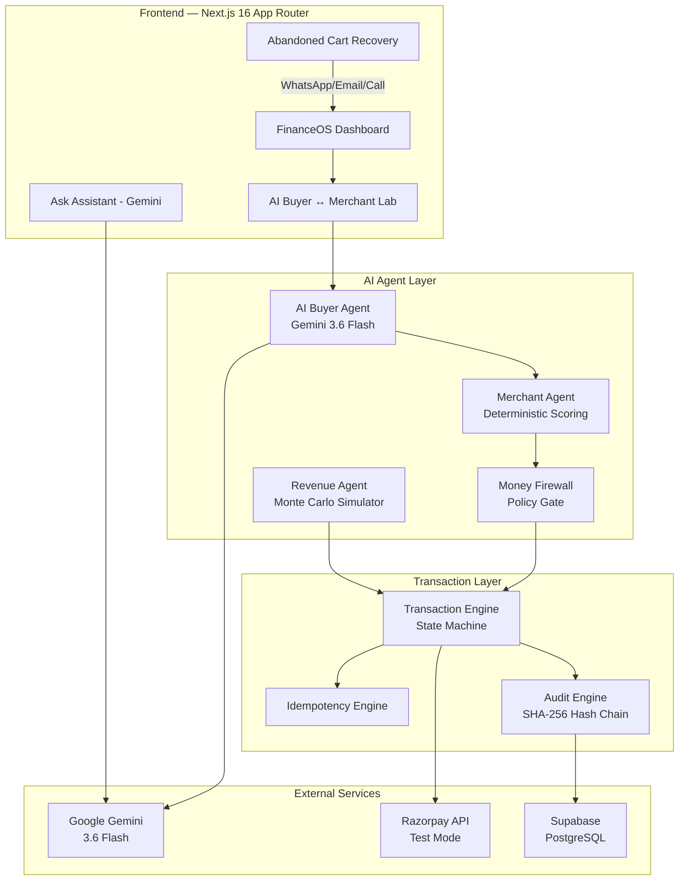
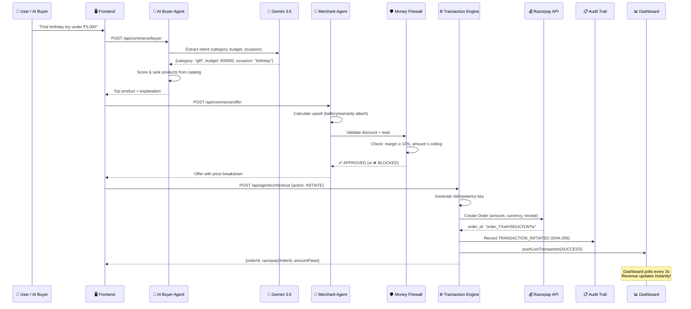
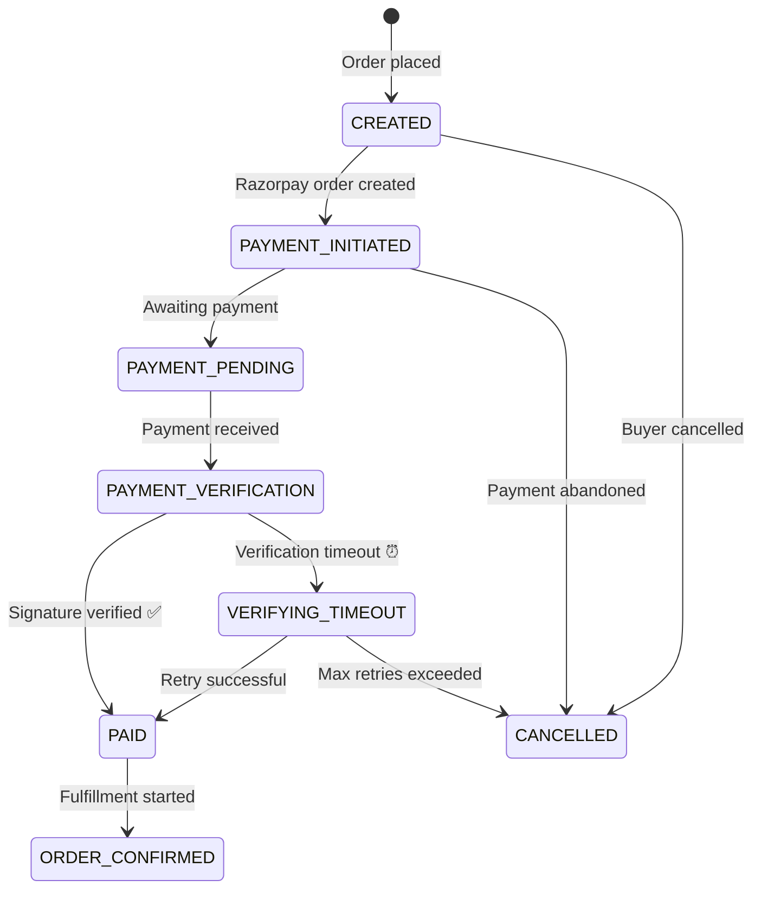
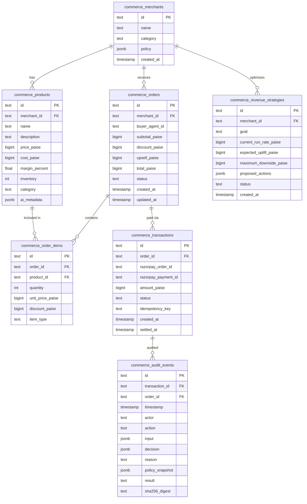

<p align="center">
  <h1 align="center">🤖 FinanceOS — AI Growth & Agentic Commerce Platform</h1>
  <p align="center">
    <strong>Autonomous AI agents that grow merchant revenue, recover failed payments, and make toy shops transactable by AI buyers — end to end.</strong>
  </p>
  <p align="center">
    
    
    
    
    
  </p>
</p>

---

## 📌 Table of Contents

- [Problem Statement](#-problem-statement)
- [Our Solution](#-our-solution)
- [Key Features](#-key-features)
- [Architecture & Workflow](#-architecture--workflow)
- [Database Schema](#-database-schema)
- [Tech Stack](#-tech-stack)
- [Installation & Setup](#-installation--setup)
- [Supabase Backend Setup](#-supabase-backend-setup-optional)
- [Environment Variables](#-environment-variables)
- [API Endpoints](#-api-endpoints)
- [Pages & Dashboard Guide](#-pages--dashboard-guide)
- [How the AI Agents Work](#-how-the-ai-agents-work)
- [Real-Time Transaction Flow](#-real-time-transaction-flow)
- [Future Scope — Agent Manager Mode](#-future-scope--agent-manager-mode)
- [Project Structure](#-project-structure)
- [Track Requirements Mapping](#-track-requirements-mapping)
- [License](#-license)

---

## 🎯 Problem Statement

> ### Track 01 — AI Growth & Agentic Commerce
>
> *"Grow the merchant's revenue, and make them sellable to AI buyers.*
>
> *Build an agent that grows revenue for a merchant on Razorpay test-mode APIs, or that makes a merchant transactable by an AI buyer end to end."*
>
> **Why now:** NPCI's UAP and the global protocol race (ACP, AP2, x402) make agent-to-agent commerce the open problem of the year, and Razorpay's in-app pilots are already live.

### Breaking This Down — The Two Core Challenges

#### Challenge 1: "Grow the merchant's revenue"

Today, Indian merchants lose revenue silently through multiple channels:

| Revenue Leak | Scale | Why It Happens |
|---|---|---|
| **Failed Payments** | ₹14.65 Lakh/day at risk | Gateway timeouts (HDFC +340% latency spikes), insufficient funds, 3DS failures |
| **Cart Abandonment** | 68% drop-off rate | No intelligent recovery — abandoned carts just sit there |
| **Zero Upselling** | 0% attach rate (manual) | Human operators can't calculate optimal upsell bundles per customer in real time |
| **Gateway Outages** | Undetected for hours | No automated rerouting when a payment gateway starts failing |
| **No Campaign Intelligence** | Guesswork marketing | No Monte Carlo simulation to project campaign ROI before spending |

Merchants need an **autonomous AI agent** that monitors, recovers, upsells, and optimizes revenue 24/7 — without human intervention.

#### Challenge 2: "Make them sellable to AI buyers"

The world is moving toward **agent-to-agent commerce** — where AI agents buy products on behalf of users. But today:

- ❌ Merchants have **no agent-readable catalog** — their product data lives in HTML pages that AI agents can't parse
- ❌ There's **no protocol bridge** — UAP, ACP, x402, AP2 protocols exist but no merchant has implemented them
- ❌ There's **no policy enforcement** — if an AI buyer negotiates a 90% discount, who stops it? There's no **Money Firewall**
- ❌ There's **no audit trail** — when machines transact with machines, every money action must be explainable, bounded, and gated
- ❌ There's **no conversational checkout** — AI buyers can't say *"Find me a birthday toy under ₹5,000"* and complete a purchase

---

## 💡 How We Solve It — FinanceOS

**FinanceOS** is a full-stack autonomous commerce platform that solves **both challenges** with a system of cooperating AI agents:

### Solution to Challenge 1: "Grow Revenue" 📈

| Revenue Agent | What It Does | Result |
|---|---|---|
| **Revenue Recovery Agent** | Detects failed payments, auto-retries via alternate gateways, sends WhatsApp/Email/Call nudges for abandoned carts | **₹33.5 Lakh recovered** |
| **Upsell & Cross-Sell Agent** | Deterministic scoring: `intentMatch × attachRate × marginFactor × inventoryFactor` | **78% battery attach rate** on RC car purchases |
| **Campaign Orchestrator** | Monte Carlo simulation to project campaign ROI before execution | **2.01× AI uplift** over manual operations |
| **Weather Radar** | Detects gateway health (HDFC latency spikes), auto-reroutes payments | **Prevents revenue loss** during outages |
| **Abandoned Cart Recovery** | Multi-channel cascade: WhatsApp → Email → Call → UPI QR push | **Real links** — clicking WhatsApp actually opens wa.me |

### Solution to Challenge 2: "Sellable to AI Buyers" 🤖

| Component | What It Does | Hackathon Requirement |
|---|---|---|
| **Agent-Readable Catalog** | `/api/agentic/catalog` serves products in schema.org format with UAP/ACP/x402/AP2 protocol headers | ✅ Agent-readable catalog |
| **AI Buyer Agent** (Gemini 3.6 Flash) | Natural language: *"Find birthday toy under ₹5,000"* → structured intent extraction → product scoring → selection | ✅ Conversational in-app checkout |
| **Merchant Agent** | Receives buyer intent, generates personalized offer with optimal upsell bundle | ✅ Upsell & cross-sell agent |
| **Money Firewall** | Every transaction gated: max discount, margin floor, transaction ceiling. Returns `reason`, `policySnapshot`, `governanceLevel` | ✅ Every money action bounded & gated |
| **Transaction Engine** | Real Razorpay test-mode order → HMAC signature verification → state machine (CREATED → PAID → CONFIRMED) | ✅ Razorpay test-mode APIs |
| **SHA-256 Audit Trail** | Hash-chained audit events with RFC-8785 serialization. Every decision explainable | ✅ Show the audit trail |
| **Failure Recovery** | HDFC rerouting, verification timeout handling, idempotency protection, retry with exponential backoff | ✅ One failure handled gracefully |

### The End-to-End Flow

```
👤 User says: "Find me a birthday gift toy for a 10-year-old under ₹5,000"
                                    ↓
🤖 AI Buyer Agent (Gemini 3.6 Flash) extracts intent:
   {category: "gift/toy", budget: ₹5,000, occasion: "birthday", age: 10}
                                    ↓
📦 Product Scoring: ranks catalog by intentMatch × budgetFit × featureOverlap
   → Selected: "1:10 RC Monster Truck" (₹3,999)
                                    ↓
🏪 Merchant Agent generates offer:
   Base: ₹3,999 + Upsell: LiPo Battery (₹800, 78% attach rate) = ₹4,799
                                    ↓
🛡️ Money Firewall validates:
   ✅ Discount ≤ 15% | ✅ Margin ≥ 10% | ✅ Amount ≤ ₹50,000 ceiling
   → APPROVED (governanceLevel: "STANDARD")
                                    ↓
💰 Razorpay Test-Mode: Creates real order → order_TXeKh5DUCf1WTw
   HMAC-SHA256 signature verification
                                    ↓
📋 SHA-256 Audit: Hash-chained event → "52670148ab02127d"
   {actor: "AI_BUYER", action: "TRANSACTION_INITIATED", result: "APPROVED"}
                                    ↓
📊 Dashboard: Revenue updates in 3 seconds (₹4,799 added to live KPIs)
```

### What Makes This Different

| Traditional Commerce | FinanceOS (Our Solution) |
|---|---|
| Human browsing + manual checkout | AI Buyer agent: *"Find me a birthday toy"* → full purchase in one click |
| Static HTML product pages | Agent-readable catalog with schema.org + UAP/ACP/x402/AP2 protocol support |
| No upselling intelligence | Deterministic upsell engine with per-product attach rates |
| Payment failures = lost revenue | Auto-recovery: gateway rerouting + WhatsApp/Email/Call nudge cascade |
| Manual audit trails (or none) | SHA-256 hash-chained audit with RFC-8785 serialization |
| No spending controls | Money Firewall: every action explainable, bounded, and gated |
| Dashboard shows static reports | Real-time dashboard — AI Buyer transactions reflected within 3 seconds |

---

## ✅ Key Features

### 🤖 AI Buyer ↔ Merchant Lab (Flagship Demo)
Full autonomous transaction in one click:
- Gemini 3.6 Flash extracts buyer intent from natural language
- Product matching with scoring algorithm
- Merchant agent generates personalized offers with upsell
- Money Firewall enforces policy boundaries
- Real Razorpay order creation with HMAC signature verification
- SHA-256 hash-chained audit trail

### 📊 Executive Dashboard
- Real-time revenue KPIs (₹86.4L ingested, ₹14.65L at risk, ₹33.5L recovered)
- Live transaction feed — AI Buyer transactions reflected within 3 seconds
- AI vs Manual revenue comparison chart
- Revenue sparkline and progress tracker

### 🛒 Abandoned Cart Recovery
- 5 live customer sessions with multi-channel nudge system
- **Real WhatsApp** — Opens `wa.me` with pre-filled recovery message
- **Real Email** — Opens `mailto:` with cart items listed
- **Real Phone Call** — Opens `tel:` for concierge calls
- UPI QR code generation for instant payment

### 🤖 Ask Assistant (Gemini AI Chat)
- Context-aware AI assistant in the top bar
- Reads your entire live dashboard and answers with exact numbers
- *"What is my loss today?"* → Shows exact recovery metrics

### 📡 Weather & Revenue Defense
- HDFC latency spike detection (+340%)
- Automatic gateway rerouting
- Revenue impact forecasting

### 🛡️ Audit Trail & Proofs
- Every money action recorded with SHA-256 hash chain
- RFC-8785 compliant JSON canonicalization
- Full audit export functionality

### 🚀 Agent Manager Mode (Future Scope)
- Platform connectors: Shopify, Instagram, Telegram, WhatsApp, WooCommerce, Amazon
- Agent Runners with autonomous wallet management
- AI Content Generation via API
- Cross-platform campaign orchestration

---

## 🏗️ Architecture & Workflow

### High-Level Architecture



### Transaction Workflow (Step by Step)



### Order State Machine



---

## 🗄️ Database Schema

### Supabase PostgreSQL Tables



### In-Memory Live Transaction Store

```typescript
interface LiveTransaction {
  id: string;                    // Unique transaction ID
  type: 'SUCCESS' | 'FAILED' | 'BLOCKED';
  amountPaise: number;           // Transaction amount
  razorpayOrderId: string;       // Razorpay order reference
  productName: string;           // Human-readable product name
  channel: string;               // RAZORPAY_LIVE | RAZORPAY_TEST
  errorReason?: string;          // Why it failed (if applicable)
  timestamp: string;             // ISO 8601
  auditSha256: string;           // SHA-256 hash for audit
}
```

> This store reflects transactions on the dashboard in real-time (within 3 seconds). It runs alongside Supabase/seed data without replacing any existing data.

---

## 🛠️ Tech Stack

| Layer | Technology | Purpose |
|---|---|---|
| **Framework** | Next.js 16.3 (App Router, Turbopack) | Full-stack React with server-side API routes |
| **Language** | TypeScript (strict mode) | Type-safe development |
| **AI Model** | Google Gemini 3.6 Flash | Intent extraction, chat assistant, content generation |
| **Payments** | Razorpay Test-Mode API | Real order creation, HMAC signature verification |
| **Database** | Supabase (PostgreSQL) | Open-source backend with optional local setup |
| **Fallback DB** | In-memory seed data | App works fully without Supabase |
| **Audit** | SHA-256 hash chains | Tamper-proof audit trail |
| **Styling** | CSS Variables + Inline Styles | Zero external CSS dependencies |
| **Crypto** | Node.js `crypto` + Web Crypto API | HMAC-SHA256 for Razorpay, SHA-256 for audit |

---

## 🚀 Installation & Setup

### Prerequisites

- **Node.js** 18 or higher → [Download](https://nodejs.org/)
- **npm** 9 or higher (comes with Node.js)
- **Git** → [Download](https://git-scm.com/)

### Step 1: Clone the Repository

```bash
git clone https://github.com/sarang-sketch/financeos.git
cd financeos
```

### Step 2: Install Dependencies

```bash
npm install
```

### Step 3: Configure Environment Variables

**Option A — Copy the template (recommended):**

```bash
# Linux/macOS
cp .env.example .env.local

# Windows (PowerShell)
Copy-Item .env.example .env.local
```

Then edit `.env.local` and fill in your API keys (see [Environment Variables](#-environment-variables) section).

**Option B — Use the in-app Settings UI:**

Start the app first, then go to **⚙️ Settings → 🔑 API Keys & Credentials** and enter your keys through the web interface. Click **Save** and restart the dev server.

### Step 4: Start the Development Server

```bash
npm run dev
```

Open **http://localhost:3000** in your browser. That's it! 🎉

### Step 5: Production Build (Optional)

```bash
npm run build
npm start
```

### What Works Without Any API Keys

| Feature | Works? | Notes |
|---|---|---|
| 📊 Executive Dashboard | ✅ | Uses seed data |
| 🛒 Abandoned Cart Recovery | ✅ | Seed sessions + real WhatsApp/Email/Call links |
| 📡 Weather Radar | ✅ | Simulated HDFC spike data |
| ⚡ Failed Payments Queue | ✅ | 500 seed failures |
| 🛡️ Audit Trail | ✅ | SHA-256 generated client-side |
| 🚀 Agent Manager (Future Scope) | ✅ | Static roadmap page |
| ⚙️ Settings | ✅ | API key entry UI works |
| 🤖 Ask Assistant | ⚠️ | Needs `GEMINI_API_KEY` — shows friendly setup guide if missing |
| ⚡ AI Buyer Lab | ⚠️ | Needs `GEMINI_API_KEY` — falls back to keyword-based intent |
| 💰 Live Razorpay Payments | ⚠️ | Needs `RAZORPAY_KEY_ID` — falls back to simulated order IDs |

---

## 🗄️ Supabase Backend Setup (Optional)

> **Note:** The app works fully WITHOUT Supabase using in-memory seed data. This section is only needed if you want persistent data storage.

Supabase is a **100% open-source** Firebase alternative built on PostgreSQL.

### Option 1: Supabase Cloud (Easiest — 2 minutes)

1. Go to [supabase.com](https://supabase.com) and create a free account
2. Create a new project (free tier works fine)
3. Go to **Settings → API** and copy:
   - **Project URL** → `SUPABASE_URL`
   - **anon public key** → `SUPABASE_ANON_KEY`
   - **service_role secret** → `SUPABASE_SERVICE_ROLE_KEY`
4. Paste these into your `.env.local` file

### Option 2: Self-Hosted Supabase (Local Docker)

```bash
# Clone Supabase
git clone --depth 1 https://github.com/supabase/supabase.git
cd supabase/docker

# Copy the example env file
cp .env.example .env

# Start Supabase (requires Docker)
docker compose up -d

# Your local Supabase is now at:
# URL: http://localhost:8000
# Anon Key: (check .env file)
# Service Key: (check .env file)
```

### Database Tables

The app auto-creates tables on first use. If you need to create them manually, run this SQL in the Supabase SQL Editor:

```sql
-- Products catalog
CREATE TABLE IF NOT EXISTS commerce_products (
  id TEXT PRIMARY KEY,
  merchant_id TEXT NOT NULL,
  name TEXT NOT NULL,
  description TEXT,
  price_paise BIGINT NOT NULL,
  cost_paise BIGINT NOT NULL,
  margin_percent FLOAT NOT NULL,
  inventory INT DEFAULT 0,
  category TEXT,
  ai_metadata JSONB DEFAULT '{}'::jsonb,
  created_at TIMESTAMPTZ DEFAULT NOW()
);

-- Orders
CREATE TABLE IF NOT EXISTS commerce_orders (
  id TEXT PRIMARY KEY,
  merchant_id TEXT NOT NULL,
  buyer_agent_id TEXT,
  subtotal_paise BIGINT,
  discount_paise BIGINT DEFAULT 0,
  upsell_paise BIGINT DEFAULT 0,
  total_paise BIGINT,
  status TEXT DEFAULT 'CREATED',
  created_at TIMESTAMPTZ DEFAULT NOW(),
  updated_at TIMESTAMPTZ
);

-- Order line items
CREATE TABLE IF NOT EXISTS commerce_order_items (
  id TEXT PRIMARY KEY,
  order_id TEXT REFERENCES commerce_orders(id),
  product_id TEXT REFERENCES commerce_products(id),
  quantity INT DEFAULT 1,
  unit_price_paise BIGINT,
  discount_paise BIGINT DEFAULT 0,
  item_type TEXT DEFAULT 'BASE_PRODUCT'
);

-- Payment transactions
CREATE TABLE IF NOT EXISTS commerce_transactions (
  id TEXT PRIMARY KEY,
  order_id TEXT REFERENCES commerce_orders(id),
  razorpay_order_id TEXT,
  razorpay_payment_id TEXT,
  amount_paise BIGINT,
  status TEXT DEFAULT 'INITIATED',
  idempotency_key TEXT UNIQUE,
  created_at TIMESTAMPTZ DEFAULT NOW(),
  settled_at TIMESTAMPTZ
);

-- SHA-256 hash-chained audit log
CREATE TABLE IF NOT EXISTS commerce_audit_events (
  id TEXT PRIMARY KEY,
  transaction_id TEXT,
  order_id TEXT,
  timestamp TIMESTAMPTZ DEFAULT NOW(),
  actor TEXT NOT NULL,
  action TEXT NOT NULL,
  input JSONB DEFAULT '{}'::jsonb,
  decision JSONB DEFAULT '{}'::jsonb,
  reason TEXT,
  policy_snapshot JSONB DEFAULT '{}'::jsonb,
  result TEXT,
  sha256_digest TEXT
);

-- Revenue optimization strategies
CREATE TABLE IF NOT EXISTS commerce_revenue_strategies (
  id TEXT PRIMARY KEY,
  merchant_id TEXT NOT NULL,
  goal TEXT,
  current_run_rate_paise BIGINT,
  expected_uplift_paise BIGINT,
  maximum_downside_paise BIGINT,
  proposed_actions JSONB DEFAULT '[]'::jsonb,
  status TEXT DEFAULT 'PROPOSED',
  created_at TIMESTAMPTZ DEFAULT NOW()
);

-- Merchants
CREATE TABLE IF NOT EXISTS commerce_merchants (
  id TEXT PRIMARY KEY,
  name TEXT NOT NULL,
  category TEXT,
  policy JSONB DEFAULT '{}'::jsonb,
  created_at TIMESTAMPTZ DEFAULT NOW()
);
```

---

## 🔑 Environment Variables

Create a `.env.local` file in the project root (or use the in-app Settings UI):

```env
# Required — AI Features
GEMINI_API_KEY=your_gemini_api_key_here
# Get from: https://aistudio.google.com/apikey

# Required — Payment Processing
RAZORPAY_KEY_ID=rzp_test_your_key_id
RAZORPAY_KEY_SECRET=your_razorpay_secret
# Get from: https://dashboard.razorpay.com/app/keys (Test Mode)

# Optional — Database (falls back to in-memory seed data)
SUPABASE_URL=https://your-project.supabase.co
SUPABASE_ANON_KEY=your_anon_key
SUPABASE_SERVICE_ROLE_KEY=your_service_role_key

# System (leave as-is)
CREDENTIAL_ENCRYPTION_KEY=9f8e7d6c5b4a3928170e9f8e7d6c5b4a3928170e9f8e7d6c5b4a3928170e9f8e
LOG_LEVEL=info
NODE_ENV=development
```

---

## 📡 API Endpoints

### Agentic Commerce APIs

| Method | Endpoint | Description |
|---|---|---|
| `GET` | `/api/agentic/catalog` | Agent-readable product catalog (schema.org + UAP/ACP/x402) |
| `POST` | `/api/agentic/checkout` | Unified checkout: INITIATE, VERIFY, TIMEOUT, RETRY, TIMELINE |
| `POST` | `/api/agentic/discovery` | AI agent product discovery |
| `POST` | `/api/agentic/nudge` | Multi-channel cart recovery nudge |

### Commerce APIs

| Method | Endpoint | Description |
|---|---|---|
| `POST` | `/api/commerce/buyer` | AI Buyer intent extraction + product matching |
| `POST` | `/api/commerce/offer` | Merchant agent offer generation with upsell |
| `POST` | `/api/commerce/firewall/validate` | Money Firewall policy validation |
| `GET` | `/api/commerce/catalog` | Product catalog |

### Dashboard & Analytics APIs

| Method | Endpoint | Description |
|---|---|---|
| `GET` | `/api/dashboard/commerce` | Real-time commerce metrics (includes live transactions) |
| `GET` | `/api/failed-payments` | Failed payments queue (seed + live failures) |
| `GET` | `/api/audit-logs` | SHA-256 hash-chained audit trail |
| `POST` | `/api/revenue/analyze` | Revenue strategy Monte Carlo simulation |

### Assistant & Settings APIs

| Method | Endpoint | Description |
|---|---|---|
| `POST` | `/api/assistant/commerce` | Gemini AI chat (reads live dashboard data) |
| `GET/POST` | `/api/settings/keys` | API key management (masked GET, save POST) |
| `POST` | `/api/webhooks/razorpay` | Razorpay webhook handler |

---

## 📱 Pages & Dashboard Guide

| # | Sidebar Tab | What It Shows |
|---|---|---|
| 1 | 📊 **Executive Dashboard** | Live KPIs, revenue sparkline, AI vs Manual comparison, agent activity |
| 2 | ⚡ **AI Buyer ↔ Merchant Lab** | Full autonomous transaction demo — enter a natural language query, watch AI complete the entire purchase |
| 3 | 🤖 **AI Growth & Commerce** | Agent-readable catalog, upsell engine, campaign orchestrator |
| 4 | 🛒 **Abandoned Carts & Recovery** | 5 live cart sessions with WhatsApp/Email/Call/UPI QR nudges |
| 5 | 🔬 **Recovery Decision Lab** | Counterfactual simulator & Net-EV optimization |
| 6 | 📡 **Weather & Revenue Defense** | HDFC spike detection, auto-rerouting |
| 7 | ⚡ **Failed Payments & Queue** | Failed transactions with AI recovery proposals |
| 8 | 🛡️ **Audit Trail & Proofs** | SHA-256 hash-chained audit log with export |
| 9 | 🚀 **Agent Manager Mode** | Future Scope: platform connectors, agent wallets |
| 10 | ⚙️ **Settings** | API key onboarding + recovery policy configuration |

---

## 🧠 How the AI Agents Work

### 1. AI Buyer Agent (`src/commerce/ai-buyer.ts`)
- Takes natural language: *"Find a birthday gift for a 10-year-old under ₹5,000"*
- Sends to **Gemini 3.6 Flash** for structured intent extraction
- Scores products using: `intentMatch × budgetFit × featureOverlap`
- Falls back to keyword-based extraction if Gemini is unavailable

### 2. Merchant Agent (`src/commerce/merchant-agent.ts`)
- Receives matched product + buyer intent
- Calculates offer: base price → discount → upsell attachment
- Upsell formula: `attachRate × marginFactor × inventoryFactor`
- Attach rates: Battery/Charger = 0.78, Warranty = 0.35

### 3. Money Firewall (`src/commerce/money-firewall.ts`)
- **Every money action is bounded and gated**
- Checks: `maxDiscountPercent`, `minimumMarginPercent`, `maxTransactionPaise`
- Returns: `APPROVED` / `BLOCKED` with `reason`, `policySnapshot`, `governanceLevel`
- Enforces four-eyes principle for amounts above threshold

### 4. Revenue Agent (`src/commerce/revenue-agent.ts`)
- Monte Carlo simulation for revenue strategy optimization
- Toy Accidental Damage Protection Upsell strategy
- Net-EV calculation: `(probability × upside) - (1 - probability) × downside`

---

## ⚡ Real-Time Transaction Flow

When you run a transaction in the **AI Buyer ↔ Merchant Lab**, it reflects on the dashboard within **3 seconds**:

```
AI Buyer Lab → /api/agentic/checkout → TransactionEngine
                                            ↓
                                   pushLiveTransaction()
                                            ↓
                              live-transaction-store.ts (in-memory singleton)
                                      ↙            ↘
              /api/dashboard/commerce              /api/failed-payments
              (merges seed + live data)            (prepends live failures)
                      ↓                                    ↓
              Dashboard polls every 3s            Failed Payments view
              → Revenue updates instantly!        → New failures at top!
```

- **Successful transactions** → Revenue increases, Orders count goes up
- **Failed transactions** → Firewall Blocks count increases, appears in Failed Payments page
- **All seed/demo data is preserved** — live data adds on top

---

## 🚀 Future Scope — Agent Manager Mode

The **Agent Manager Mode** page (accessible from sidebar) showcases our roadmap:

### Platform Connectors (Upcoming)
- **Shopify** — Full catalog sync + order management
- **Instagram** — Shoppable posts + DM commerce
- **Telegram** — Bot-based checkout flow
- **WhatsApp** — Conversational commerce + payment links
- **WooCommerce** — WordPress integration
- **Amazon** — Marketplace listing agent

### Agent Runners
- Each agent has its own **wallet** for autonomous spending
- P&L tracking per agent
- Cross-platform campaign orchestration
- AI content generation via API (product descriptions, social posts)

---

## 📂 Project Structure

```
financeos/
├── .env.example                     # Template for environment variables
├── README.md                        # This file
├── package.json                     # Dependencies & scripts
├── next.config.ts                   # Next.js configuration
├── tsconfig.json                    # TypeScript configuration
│
├── src/
│   ├── app/
│   │   ├── page.tsx                 # Main app shell (state management, tab routing)
│   │   ├── layout.tsx               # Root layout
│   │   ├── globals.css              # Global styles & CSS variables
│   │   │
│   │   └── api/                     # Server-side API routes
│   │       ├── agentic/
│   │       │   ├── catalog/         # Agent-readable product catalog
│   │       │   ├── checkout/        # Unified checkout (INITIATE/VERIFY/TIMEOUT/RETRY)
│   │       │   ├── discovery/       # AI product discovery
│   │       │   └── nudge/           # Multi-channel cart recovery
│   │       ├── assistant/
│   │       │   └── commerce/        # Gemini AI chat assistant
│   │       ├── commerce/
│   │       │   ├── buyer/           # AI Buyer intent + product matching
│   │       │   ├── catalog/         # Product catalog API
│   │       │   ├── firewall/        # Money Firewall validation
│   │       │   └── offer/           # Merchant offer generation
│   │       ├── dashboard/
│   │       │   └── commerce/        # Real-time dashboard metrics
│   │       ├── failed-payments/     # Failed payments queue
│   │       ├── settings/
│   │       │   └── keys/            # API key management
│   │       └── webhooks/
│   │           └── razorpay/        # Razorpay webhook handler
│   │
│   ├── commerce/                    # Core commerce engine
│   │   ├── ai-buyer.ts              # Gemini-powered buyer agent
│   │   ├── merchant-agent.ts        # Deterministic offer & upsell engine
│   │   ├── money-firewall.ts        # Policy gate (bounded & gated)
│   │   ├── revenue-agent.ts         # Monte Carlo strategy simulator
│   │   ├── transaction-engine.ts    # Full transaction state machine
│   │   ├── commerce-db.ts           # Database layer (Supabase + seed fallback)
│   │   ├── commerce-crypto.ts       # SHA-256, HMAC, audit digests
│   │   └── idempotency.ts           # Idempotency key generation
│   │
│   ├── components/
│   │   ├── Sidebar.tsx              # Left navigation with brand header
│   │   ├── TopBar.tsx               # Top bar with Ask Assistant toggle
│   │   ├── TopBarAskAssistant.tsx   # Gemini AI chat drawer
│   │   └── views/                   # All page view components
│   │       ├── AiBuyerMerchantLabView.tsx    # AI Buyer ↔ Merchant Lab
│   │       ├── AgentManagerView.tsx          # Future Scope page
│   │       ├── SettingsView.tsx              # API keys + policy config
│   │       └── agentic/
│   │           └── BuyerActivityFeed.tsx     # Abandoned cart recovery
│   │
│   ├── services/
│   │   ├── agentic-commerce-service.ts  # Toy catalog, carts, transactions
│   │   ├── live-transaction-store.ts    # Real-time transaction singleton
│   │   ├── seed-data-service.ts         # Dashboard seed data
│   │   └── weather-radar-service.ts     # Gateway health monitoring
│   │
│   ├── policy/                      # Policy & risk engine
│   ├── evidence/                    # Evidence chain builder
│   ├── ledger/                      # Semantic ledger (double-entry)
│   └── ingestion/                   # Razorpay data ingestion
│
└── public/                          # Static assets
```

---

## 📋 Track Requirements Mapping

| # | Requirement | Our Implementation | Status |
|---|---|---|---|
| 1 | **Grow merchant revenue** | ₹33.5 Lakh autonomous recovery, upsell agent, campaign orchestrator | ✅ |
| 2 | **Sellable to AI buyers** | Agent-readable catalog at `/api/agentic/catalog` with UAP/ACP/x402/AP2 | ✅ |
| 3 | **Razorpay test-mode** | Real Razorpay order creation + HMAC signature verification | ✅ |
| 4 | **AI buyer end-to-end** | Full loop: Gemini Intent → Match → Firewall → Pay → Audit | ✅ |
| 5 | **Conversational checkout** | Natural language: *"Find me a birthday toy under ₹5,000"* → full transaction | ✅ |
| 6 | **Agent-readable catalog** | `/api/agentic/catalog` serves schema.org Product data | ✅ |
| 7 | **Upsell & cross-sell** | Deterministic scoring: `intentMatch × attachRate × marginFactor × inventoryFactor` | ✅ |
| 8 | **Campaign orchestrator** | Revenue Agent with Monte Carlo projections | ✅ |
| 9 | **Every money action explainable** | Firewall returns `reason`, `policySnapshot`, `governanceLevel` | ✅ |
| 10 | **Bounded and gated** | Money Firewall enforces max discount, margin floor, transaction ceiling | ✅ |
| 11 | **Audit trail** | SHA-256 hash-chained events with RFC-8785 serialization | ✅ |
| 12 | **Failure handled gracefully** | HDFC rerouting, cart recovery, WhatsApp/Email/Call nudges, retry logic | ✅ |
| 13 | **Repo that actually runs** | One-command setup, in-app API key config, seed data fallback | ✅ |

---

## 👥 Team

**PlayCraft Toys & Robotics Ltd** — Verified Toy Merchant Node

---

## 📝 License

Built for the **Razorpay Hackathon — Track 01: AI Growth & Agentic Commerce**.

MIT License — see [LICENSE](LICENSE) for details.
